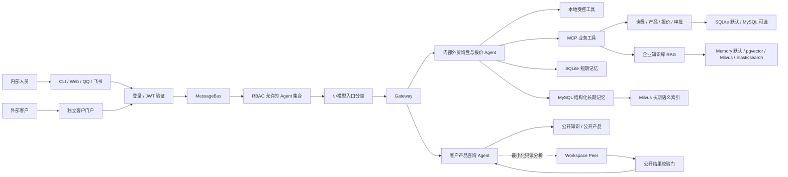

# NanoClaw

> 面向外贸询盘、企业知识检索与客户协作的多入口 AI Agent 工作台。


NanoClaw 把内部工作台、独立客户门户、CLI、QQ 和飞书收到的消息交给不同权限的 Agent，再通过受控工具完成企业知识检索、产品查询、询盘抽取、报价审批、邮件协作与记忆管理。

它不只是一个聊天页面。项目重点解决的是：**怎样让 AI 在真实业务中找到正确资料、调用正确工具、隔离客户与内部数据，并把不确定的对外操作留给人工确认。**

## 目录

- [核心能力](#核心能力)
- [系统架构](#系统架构)
- [快速开始](#快速开始)
- [访问入口](#访问入口)
- [安全设计](#安全设计)
- [项目结构](#项目结构)
- [配置说明](#配置说明)
- [测试](#测试)
- [可选 Docker 服务](#可选-docker-服务)

## 核心能力

### 多入口 Agent 工作台

- 内部工作台、营销首页和独立客户门户
- CLI、WebSocket v2、QQ、飞书等消息入口
- Gateway 统一路由、会话隔离、请求关联与并发控制
- MCP 工具发现与加载，以及项目内 Skills 扩展

### 外贸询盘与报价协作

- 从会话或邮件中提取 RFQ 字段与证据
- 查询产品、MOQ、库存和业务数据
- 生成确定性报价草稿并保存版本
- 对缺失、冲突或不确定字段保持 `pending_confirmation`
- 报价批准、发送入队与真实 SMTP 投递分开控制

### 企业知识库 RAG

- 文本与 PDF 持久导入、去重、撤回和重建
- PDF 页级解析、复杂版面人工复核和 OCR 失败关闭
- Parent/Child 切块、查询改写、语义与关键词混合召回
- RRF 融合、可选重排、Parent 回取与页码引用
- `internal` / `public` 分类和客户侧公开检索门禁
- 本地内存后端默认启用，pgvector、Milvus 和 Elasticsearch 显式可选

### 双 Agent 与记忆隔离

- 内部外贸询盘与报价 Agent 和客户产品咨询 Agent 分别组装身份、工具、会话与记忆
- 内部员工 Agent 使用独立的 LangGraph runtime 编排模型与业务工具，并通过薄适配层接入 NanoClaw
- LangGraph Redis 只保存未完成请求的恢复断点；SQLite 仅用于测试，会话、RFQ、报价、审批和邮件仍由原有存储负责
- 客户 Agent 只拥有产品搜索、产品详情和产品比较三个受控只读工具
- 工作区可按最小化问题读取客户记忆，客户代码不能反向读取工作区记忆
- SQLite 短期工作记忆、MySQL 结构化长期记忆、Milvus 长期语义索引物理分层
- 长期记忆的同意、确认、撤回、删除、索引补偿与访问审计相互分离
- 具体数据流和初始化方式见 [`docs/architecture/三层记忆架构.md`](docs/architecture/三层记忆架构.md)
- 内部 Agent 的框架边界和状态位置见 [`docs/architecture/INTERNAL_EMPLOYEE_AGENT_ARCHITECTURE.md`](docs/architecture/INTERNAL_EMPLOYEE_AGENT_ARCHITECTURE.md)

### 邮件与审批闭环

- IMAP 收件、MIME 安全解析和本地结构化查询
- 托管邮箱轮询、RFQ 审核与报价工作流
- SMTP_SSL 投递 Worker、稳定 Message-ID、租约恢复与发送前复核
- 默认不启用真实收件、远程正文分析或 SMTP 外发

## 系统架构



主处理链路是：

```text
登录 → JWT → 服务端验签 → RBAC → 小模型路由（需要时）→ Gateway → 现有 Agent → 回复
```

客户产品咨询 Agent 不是内部外贸询盘与报价 Agent 的换皮版本。两者之间的权限边界在服务端组装、数据查询和输出校验三个层面同时生效。

入口采用严格账号域映射：客户账号只允许客户产品咨询 Agent，内部员工账号
只允许内部外贸询盘与报价 Agent。其稳定技术路由 ID 仍为 `internal_quote_reply`，
避免破坏已有接口和会话。当前每个账号域只有一个允许的 Agent，因此直接由
RBAC 确定，不额外调用小模型；小模型分类器仅在未来某个角色明确获准使用多个
Agent 时启用。两个 Agent、RAG 和工具的内部实现保持不变。

## 快速开始

### 环境要求

- Python `3.11.9`
- 推荐使用 [uv](https://docs.astral.sh/uv/)
- 一个 OpenAI 兼容模型服务的 API Key
- Windows PowerShell（以下命令以当前开发环境为例）

### 1. 准备配置

```powershell
Copy-Item .env.example .env
```

编辑本机 `.env`，至少填写：

```dotenv
NANOCLAW_API_KEY=your-api-key
```

模型服务地址和模型名称由 [`config.json`](config.json) 配置。不要把真实密钥、邮箱授权码、数据库密码或客户数据提交到 Git。

### 2. 安装依赖

```powershell
$env:UV_CACHE_DIR = "$PWD\.uv-cache"
uv sync --frozen
```

如果项目已经存在可用的 `.venv`，可以跳过这一步。

### 3. 启动 NanoClaw

```powershell
.\.venv\Scripts\python.exe main.py
```

CLI 会在当前终端启动，Web 服务按照 `config.json` 和 `.env` 中的开关同时装配。终端命令包括：

```text
/tools   查看可用工具
/clear   清空当前对话历史
/exit    退出
```

### 4. 可选：启动 Manager

```powershell
.\.venv\Scripts\python.exe manager\launcher.py
```

Manager 默认打开 `http://127.0.0.1:3000/ui/`，用于管理 Gateway 状态、基础配置和 MCP Server。

## 访问入口

| 入口 | 默认地址 | 默认状态 | 用途 |
|---|---|---|---|
| 营销首页 | `http://127.0.0.1:8765/` | 开启 | 产品介绍与入口导航 |
| 内部工作台 | `http://127.0.0.1:8765/workspace` | 开启 | 内部会话、知识库、邮箱和业务协作 |
| 客户门户 | `http://127.0.0.1:8766/` | 开启 | 客户安全对话与公开信息查询 |
| 独立工作台 | `http://127.0.0.1:8767/` | 关闭 | 与营销首页分端口运行的完整工作台 |
| Manager | `http://127.0.0.1:3000/ui/` | 单独启动 | Gateway 与 MCP 管理 |

所有 Web 服务默认只监听回环地址，不直接开放局域网或公网访问。

## 安全设计

NanoClaw 将业务安全规则放在服务端确定性代码中，而不是只依赖模型提示词：

- 客户侧查询经过账号、租户、用途、会话和公开分类过滤。
- Access JWT 使用严格的 HS256、签发方、受众、用途和过期时间校验；刷新令牌只以哈希形式保存并单次轮换。
- 内部工作台启用访问控制后，API 与 WebSocket 都必须携带有效身份令牌。
- Agent 路由先执行确定性 RBAC；客户与内部角色同时出现时失败关闭，不允许跨账号域。
- 小模型只能从 RBAC 给出的 Agent ID 中选择，输出无效或调用失败时只在允许集合内确定性降级。
- 客户 Agent 不挂载 Shell、内部文件、邮件、MCP、内部记忆或原始 SQL 能力。
- 精确库存、内部价格、成本、客户、报价和运营记录不会进入公开产品结果。
- PDF 的 `internal` 分类不代表客户公开授权，也不代表复杂版面已经批准索引。
- 报价、批准、入队和发送是不同状态；不确定操作不会自动外发。
- 外部 Embedding、Rerank 或邮件正文传输必须显式批准，配置不完整时失败关闭。
- RAG 外部后端故障不会静默回退到另一套数据源并继续回答。

## 项目结构

```text
nanoclaw/
├─ main.py                  # 总装入口：渠道、Agent、工具和后台任务
├─ gateway.py               # 消息路由、会话隔离与并发控制
├─ config.py                # 配置模型、环境变量与安全校验
├─ employee_agent/          # 独立 LangGraph 内部员工 Agent runtime
├─ agent/                   # NanoClaw 适配、客户 Agent、工具与记忆运行时
├─ bus/                     # 入站与出站异步消息队列
├─ channels/                # CLI、Web、客户门户、QQ、飞书与邮件渠道
├─ manager/                 # Gateway/MCP 管理服务和管理界面
├─ mcp_servers/             # 正式启用的外贸业务 MCP 服务入口
├─ examples/mcp/            # 不进入正式运行配置的 MCP 示例
├─ providers/               # OpenAI 兼容模型 Provider
├─ prompts/                 # 内部员工与外部客户身份提示词
├─ session/                 # 会话、对话索引与迁移工具
├─ skills/                  # NanoClaw 运行时可加载的业务 Skills
├─ trade_rag/               # 文档导入、切块、检索、生成与向量后端
├─ rag_evaluation/          # RAG 评估实现、阈值配置与运行说明
├─ deploy/docker/           # 隔离数据库和向量服务 Compose 配置
├─ test/                    # 主项目回归与验收测试
├─ docs/                    # 按架构、指南、项目记录和历史稿分类的文档
├─ config.json              # 模型、Web 与 MCP 基础配置
├─ .env.example             # 环境变量模板，不包含真实凭据
└─ pyproject.toml           # Python 项目与 pytest 配置
```

更详细的目录职责和移动边界见 [`docs/project/PROJECT_STRUCTURE.md`](docs/project/PROJECT_STRUCTURE.md)。

## 配置说明

本地开发默认值优先保证隔离和可恢复性：

| 能力 | 默认值 | 说明 |
|---|---|---|
| 业务数据库 | `sqlite` | MySQL 必须显式切换并完成迁移 |
| RAG 向量后端 | `memory` | pgvector 与 Milvus 是可选后端 |
| RAG 关键词后端 | `memory` | Elasticsearch 必须显式选择；失败不静默降级 |
| 独立工作台 | 关闭 | 开启后监听 `127.0.0.1:8767` |
| 客户账号认证 | 关闭 | 启用前需要会话密钥和已批准的密码哈希依赖 |
| JWT 请求鉴权 | 关闭 | 开启前需要 JWT 密钥、客户认证和至少一个内部账号 |
| 多 Agent 入口路由 | 关闭 | 只负责 RBAC 与入口分发，不修改 Agent、RAG 或工具实现 |
| 工作区长期记忆 | 关闭 | 迁移、治理和外部语义检索需分阶段启用 |
| 客户私有长期记忆 | 关闭 | 与公开只读记忆不是同一数据域 |
| 邮箱收取与托管扫描 | 关闭 | 需要单独配置邮箱账户与验收 |
| 真实 SMTP Worker | 关闭 | 仍需人工审批、显式入队和收件人门禁 |

完整模板见 [`.env.example`](.env.example)。

## 测试

根目录 pytest 配置只收集 `test/`，运行主项目回归测试：

```powershell
.\.venv\Scripts\python.exe -m pytest -q
```

检查锁文件是否与项目声明一致：

```powershell
$env:UV_CACHE_DIR = "$PWD\.uv-cache"
uv lock --check
```

测试通过表示对应本地或隔离场景满足断言，不自动代表生产模型质量、真实邮件送达、跨实例高可用或现场安全验收完成。

## 可选 Docker 服务

[`deploy/docker/compose.yaml`](deploy/docker/compose.yaml) 提供隔离的 MySQL、PostgreSQL/pgvector、Milvus、etcd、MinIO 和 Elasticsearch 服务。它们使用 Docker named volumes 与回环端口，不应挂载或迁移本机已有数据库。

### 1. 检查 Docker

```powershell
docker version
docker compose version
docker info
```

`docker info` 必须能够连接 Docker Engine。若 Docker Desktop 尚未启动，后续拉取会失败。

### 2. 准备 Docker 专用环境文件

首次使用时复制模板；如果 `.env` 已存在，不要覆盖，因为其中可能保存已经在使用的数据库密码：

```powershell
if (-not (Test-Path deploy\docker\.env)) {
    Copy-Item deploy\docker\.env.example deploy\docker\.env
}
```

打开 `deploy/docker/.env`，把所有 `replace-with-...` 占位值替换为不同的随机强密码。该文件已被 Git 忽略，不要提交或在日志中打印密码。

### 3. 选择需要的镜像

| Profile | 拉取的主要镜像 | 用途 |
|---|---|---|
| `business` | MySQL 8.4 | 外贸业务数据 |
| `vector-local` | PostgreSQL 16 + pgvector | 本地持久向量检索 |
| `keyword-elasticsearch` | Elasticsearch 8.17.3 | 关键词检索 |
| `vector-milvus` | Milvus 2.5.4、etcd、MinIO | Milvus 向量检索 |
| `all` | 上述全部镜像 | 完整隔离数据服务 |

查看某个 Profile 将使用哪些镜像；`config --images` **只解析配置，不下载镜像，也不启动容器**：

```powershell
docker compose --env-file deploy\docker\.env `
  -f deploy\docker\compose.yaml --profile all config --images
```

### 4. 拉取镜像

第一次使用最省事的方式是一次拉取全部常用镜像：

```powershell
docker compose --env-file deploy\docker\.env `
  -f deploy\docker\compose.yaml --profile all pull
```

也可以只拉取当前需要的一组镜像：

```powershell
# 只拉取 MySQL
docker compose --env-file deploy\docker\.env `
  -f deploy\docker\compose.yaml --profile business pull

# 只拉取 PostgreSQL/pgvector
docker compose --env-file deploy\docker\.env `
  -f deploy\docker\compose.yaml --profile vector-local pull

# 只拉取 Elasticsearch
docker compose --env-file deploy\docker\.env `
  -f deploy\docker\compose.yaml --profile keyword-elasticsearch pull

# 拉取 Milvus、etcd 和 MinIO
docker compose --env-file deploy\docker\.env `
  -f deploy\docker\compose.yaml --profile vector-milvus pull
```

`pull` 只把镜像下载到本机，不创建容器、网络或数据卷。Compose 中的核心数据库/向量镜像使用固定版本，MySQL、pgvector、Milvus、etcd 和 MinIO 还固定了 digest；Elasticsearch 当前固定为 `8.17.3` 标签。

拉取完成后查看本项目镜像：

```powershell
docker compose --env-file deploy\docker\.env `
  -f deploy\docker\compose.yaml --profile all images
```

### 5. 启动并检查状态

`up -d` 才会创建并启动所选服务。例如只启动 MySQL：

```powershell
docker compose --env-file deploy\docker\.env `
  -f deploy\docker\compose.yaml --profile business up -d
```

将 `business` 换成 `vector-local`、`keyword-elasticsearch`、`vector-milvus` 或 `all`，即可启动对应服务。

```powershell
docker compose --env-file deploy\docker\.env `
  -f deploy\docker\compose.yaml --profile all ps

docker compose --env-file deploy\docker\.env `
  -f deploy\docker\compose.yaml --profile all logs --tail 100
```

等待目标服务显示 `healthy` 后，再进行数据库迁移、索引重建或切换 NanoClaw 后端。拉取和启动 Docker 服务本身不会把 NanoClaw 从默认的 SQLite、内存向量或内存关键词后端切换过去。
