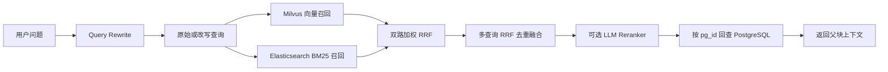

# 双路混合检索设计

## 1. 目标

本设计从现有 `hybrid.py` 中提取混合检索的核心能力，并移除 Neo4j 知识图谱召回，最终形成以下双路检索架构：

- Milvus：语义向量检索
- Elasticsearch：BM25 关键词检索
- PostgreSQL：保存正文、父子块关系及统一主键
- RRF（Reciprocal Rank Fusion）：融合不同检索通道的排名
- 可选 LLM Reranker：对融合候选进行精排

本次“移除 Neo4j”仅表示解除 Neo4j 与 RAG 入库、召回和融合流程的耦合。若项目的长期记忆或 GraphMemory 仍依赖 Neo4j，可以继续保留，不属于本设计的移除范围。

## 2. 总体架构



## 3. 数据职责

### 3.1 PostgreSQL

PostgreSQL 是内容真源，负责保存：

- `pg_id`：跨检索系统使用的统一主键
- `doc_hash`：文档标识
- `chunk_index`：子块序号
- `content`：用于检索的子块正文
- `parent_content`：用于最终生成答案的父块正文
- `embedding`：可选的向量备份或重建依据

Milvus 与 Elasticsearch 只负责索引和召回。检索结束后统一使用 `pg_id` 回查 PostgreSQL，避免多个索引中的正文副本成为数据权威。

### 3.2 Milvus

Milvus 保存子块向量及其 `pg_id`，用于处理：

- 同义表达
- 语义相似问题
- 问题与原文措辞不一致的情况

查询时先调用 Embedding 模型生成查询向量，再按向量相似度召回候选。

### 3.3 Elasticsearch

Elasticsearch 保存子块文本、`pg_id`、`doc_hash` 和 `chunk_index`，使用 BM25 处理：

- 专有名词
- 产品型号
- 数字、代码和缩写
- 必须精确匹配的关键词

## 4. 入库流程

```text
原始文档
  -> 父块切分
  -> 子块切分
  -> 子块向量化
  -> PostgreSQL 写入并生成 pg_id
  -> Elasticsearch 建立文本索引
  -> Milvus 建立向量索引
```

入库原则：

1. PostgreSQL 写入是主流程。
2. 只有 PostgreSQL 成功生成 `pg_id` 的子块才能写入其他索引。
3. Elasticsearch 或 Milvus 写入失败时记录日志，不应破坏已经成功的 PostgreSQL 数据。
4. 向量为空或维度与 `rag_milvus_dim` 不一致时，跳过对应的 Milvus 写入。


## 5. 查询流程

### 5.1 查询改写

Query Rewrite 可以结合对话历史生成多个等价查询。改写失败时必须回退到原始问题，不能让改写模型成为检索的单点故障。

### 5.2 单查询双路召回

每个查询分别从 Milvus 和 Elasticsearch 召回候选：

```text
fetch_k = max(top_k * 2, 10)
```

扩大候选池可以为 RRF 融合和后续 Reranker 保留足够候选。

### 5.3 双路加权 RRF

Milvus 与 Elasticsearch 的原始分数含义和取值范围不同，不应直接相加。融合只使用候选在各自结果列表中的排名：

```text
score(d) =
    semantic_weight / (k + semantic_rank(d))
    + keyword_weight / (k + keyword_rank(d))

keyword_weight = 1 - semantic_weight
```

约束：

- `semantic_weight` 应限制在 `[0, 1]`。
- `keyword_weight` 由 `1 - semantic_weight` 计算。
- `k` 默认使用 `60`，减小排名靠前结果之间的过度分差。
- 排名从 `1` 开始计算。
- 同一个 `pg_id` 出现在两路结果中时累加贡献。

当前推荐配置：

```yaml
rag:
  top_k: 3
  rrf_constant_k: 60
  semantic_weight: 0.7
  enable_hybrid_search: true
```

### 5.4 多查询融合

当 Query Rewrite 返回多个查询时，每个查询先完成一次双路检索，再执行第二层 RRF：

```text
multi_query_score(d) = sum(1 / (k + rank_in_query))
```

优先使用 `pg_id` 作为去重键。只有结果缺少 `pg_id` 时，才使用稳定的内容标识作为兜底，避免不同结果因为临时 ID 或默认值发生碰撞。

### 5.5 可选精排

如果配置了 Reranker：

1. 先保留大于 `top_k` 的融合候选池。
2. 将查询与候选摘要交给 Reranker。
3. 按精排分数重新排序。
4. 截断为最终 `top_k`。

Reranker 不可用或执行失败时，应保留 RRF 的排序结果。

### 5.6 父块回查

检索使用较小的子块以提高命中精度，最终生成答案时使用 `pg_id` 从 PostgreSQL 读取父块：

```text
子块负责召回，父块负责提供完整上下文。
```

返回给 LLM 前还应按内容去重，避免同一个父块因为多个子块命中而重复进入上下文。

## 6. 运行时降级策略

| Milvus | Elasticsearch | 模式 | 行为 |
|---|---|---|---|
| 可用 | 可用 | `hybrid` | 双路召回并执行 RRF |
| 可用 | 不可用 | `semantic` | 仅执行语义检索 |
| 不可用 | 可用 | `keyword` | 仅执行 BM25 检索 |
| 不可用 | 不可用 | `unavailable` | 返回空结果并记录告警 |

每次查询时重新判断基础设施状态，使服务连接恢复后可以自动返回双路模式。

单路检索失败时，应优先复用本次已经成功获取的另一通道结果，避免为了降级再次请求同一个检索服务。


## 7 . 验收标准

至少覆盖以下测试：

1. Milvus 与 Elasticsearch 都可用时，相同 `pg_id` 的两路 RRF 分数正确累加。
2. `semantic_weight=0` 和 `semantic_weight=1` 时行为正确。
3. Milvus 查询失败时自动使用 Elasticsearch 结果。
4. Elasticsearch 查询失败时自动使用 Milvus 结果。
5. 两路都失败时返回空列表，不抛异常。
6. Query Rewrite 生成多个查询时，可以按 `pg_id` 去重并执行第二层 RRF。
7. Reranker 启用时只返回最终 `top_k`。
8. 父块回查和内容去重正确。
9. RAG 入库、检索代码不再导入或调用 KGStore。


