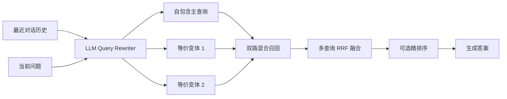

# RAG 查询改写设计

## 1. 目标

查询改写位于用户问题进入检索系统之后、Milvus 和 Elasticsearch 召回之前，主要解决以下问题：

- 当前问题依赖最近对话中的指代，例如“那个怎么实现”。
- 用户问题存在省略，单独拿出来无法理解。
- 用户措辞与知识库文档措辞不同，单一查询可能漏召回。
- 同一个检索意图需要使用同义词、不同语序或不同抽象层级表达。

本设计采用一次 LLM 调用，将当前问题改写为自包含查询，并生成多个语义等价的查询变体。改写失败时必须回退到原始问题，不能阻断 RAG 查询。

## 2. 在 RAG 链路中的位置



查询改写只扩展检索表达，不负责检索、权限判断、结果融合或答案生成。

## 3. 输入与输出契约

### 3.1 输入

改写器接收：

- `query`：用户当前问题
- `history`：最近对话消息列表

历史消息结构：

```python
@dataclass
class HistoryMessage:
    role: str
    content: str
```

`role` 通常是 `user` 或 `assistant`，`content` 是消息正文。

### 3.2 输出

输出是按优先级排列的查询字符串列表：

```python
[
    "图式 Runtime 应该如何实现",
    "DAG Runtime 的实现方法",
    "如何构建基于图的任务运行时",
]
```

约定：

- 第一条应是消除指代、补全省略后的自包含主查询。
- 后续查询应保持相同检索意图，只改变表达方式。
- 返回顺序会影响后续主查询选择和多查询融合。
- 空的当前问题返回空列表。

## 4. 历史感知策略

查询改写只使用最近的有限历史，避免把整个会话发送给模型：

```text
最多保留最近 6 条消息
每条消息最多保留 200 个字符
```

构造出的输入示例：

```text
最近对话历史：
[user] 我们刚刚在讨论图式 Runtime
[assistant] 可以使用 DAG 表示任务依赖关系

当前问题：那个怎么实现
```

如果没有历史，则明确告诉模型直接改写当前问题：

```text
最近对话历史：
（无历史，直接改写当前问题）

当前问题：如何实现混合检索
```

历史只用于消除指代和补足上下文，不应改变用户当前问题的意图。

## 5. 多查询生成策略

模型需要完成两个连续任务：

1. 将当前问题改写成一句独立、完整、可直接检索的查询。
2. 生成若干语义等价但措辞不同的查询变体。

允许的变化包括：

- 同义词替换
- 不同语序
- 专业表达与通俗表达转换
- 在不改变意图的前提下进行抽象或具体化

不允许的变化包括：

- 添加历史中没有出现的人名、机构或产品名
- 添加用户没有提出的限制条件
- 把一个问题扩展成多个不同的业务意图
- 根据模型自身知识假设事实
- 在查询中生成答案

默认生成数量为 `3`，配置示例：

```yaml
rag:
  rewrite:
    enabled: true
    num_queries: 3
```

当 `num_queries <= 0` 时，构造函数回退为默认值 `3`。当 `num_queries <= 1` 或没有注入 LLM 生成函数时，直接返回原始问题。

## 6. LLM 输出协议

模型必须返回严格 JSON：

```json
{
  "queries": [
    "自包含主查询",
    "等价变体 1",
    "等价变体 2"
  ]
}
```

提示词约束：

- 查询总数等于 `num_queries`。
- 每条查询不超过 50 字。
- 第一条必须不依赖历史即可理解。
- 不得编造历史中不存在的实体。
- 不得输出解释文字。
- 不得输出 Markdown 代码块。

虽然提示词要求严格 JSON，解析器仍兼容模型偶尔返回的 JSON 代码块。

## 7. 解析、清洗与去重

解析流程：

```text
模型原始输出
  -> 去除可选的 Markdown JSON 代码块
  -> JSON 解析
  -> 读取 queries 字段
  -> 转为字符串并去除首尾空白
  -> 丢弃空字符串
  -> 追加原始问题
  -> 忽略大小写去重并保持首次出现顺序
  -> 截断为 num_queries
```

去重键使用：

```python
query.strip().lower()
```

因此英文大小写不同但内容相同的查询会被视为重复。中文内容会按去除首尾空白后的原字符串比较。

当前实现会把原始问题追加到模型结果末尾，用于在模型少返回、返回空项或产生重复项时补足候选。但是如果模型已经返回 `num_queries` 条互不重复的查询，最终截断可能使原始问题不被保留。

如果产品要求原始问题始终参与召回，应把它作为固定候选保留，而不是追加后再统一截断。例如：

```text
主查询 + num_queries - 2 个变体 + 原始问题
```

## 8. 失败降级策略

以下情况返回原始问题 `[query]`：

- 没有注入 LLM 生成函数
- `num_queries <= 1`
- LLM 调用抛出异常
- 返回内容不是合法 JSON
- JSON 中没有有效查询
- `queries` 为空或所有条目清洗后为空

以下情况返回空列表：

- 原始问题为空
- 原始问题去除首尾空白后为空

降级必须记录告警，但不能让查询改写失败传播为整个 RAG 请求失败。

## 9. 与混合检索的关系

每个改写查询独立执行一次检索：

```text
查询 1 -> Milvus + Elasticsearch -> 双路 RRF
查询 2 -> Milvus + Elasticsearch -> 双路 RRF
查询 3 -> Milvus + Elasticsearch -> 双路 RRF
```

随后使用第二层 RRF 合并多个查询的结果，并优先使用稳定的 `pg_id` 去重。

查询改写提升的是表达覆盖率，并不保证结果相关性一定提高。因此必须通过检索评测比较：

- 不启用改写的基线
- 只生成自包含查询
- 自包含查询加多个变体
- 不同 `num_queries` 的效果、延迟和成本

## 10. 与精排序的关系

推荐调用顺序：

```text
一次查询改写
  -> 多个查询分别召回
  -> 多查询 RRF 合并和去重
  -> 一次 Listwise 精排序
```

不应为每个查询变体分别调用精排器，否则会显著增加 LLM 调用次数，而且不同精排结果仍需要再次融合。

当前检索链路使用改写结果的第一条作为精排序和答案生成的主查询。因此第一条自包含查询的质量尤其重要；其他查询主要用于扩大召回覆盖率。

## 11. 安全与边界

对话历史和当前问题都属于不可信输入。查询改写器输出只能作为检索表达，不能直接决定：

- 用户的数据访问权限
- 租户、知识库或文档范围
- SQL、文件或外部工具执行参数
- 安全过滤条件

权限范围必须由服务端根据已认证身份单独施加，不能依赖 LLM 在改写结果中保留权限条件。

还应限制历史和查询长度，避免异常长输入造成提示词膨胀。当前实现限制了历史条数与单条历史长度，但尚未限制当前问题的最大长度。

## 12. 当前实现的加固项

提示词约束不能代替服务端校验。当前实现尚未强制检查：

- 模型返回数量是否等于 `num_queries`
- 每条查询是否超过 50 字
- 第一条是否真正自包含
- 查询变体是否与原始意图等价
- 是否引入历史中不存在的新实体
- `queries` 是否确实为数组
- 当前问题和总提示词的最大长度

可分阶段加固：

1. 先增加结构、数量和长度的确定性校验。
2. 对不合格条目丢弃，并用原始问题补位。
3. 对实体敏感场景增加实体集合差异检查。
4. 使用离线查询集评估召回提升和意图漂移率。

## 13. 可观测性

建议记录以下不含敏感正文的指标：

- 查询改写是否启用
- 请求的 `num_queries`
- 实际有效查询数量
- 去重前后数量
- 是否触发原问题回退
- LLM 调用耗时
- JSON 解析失败次数
- 超长、空值和无效条目数量
- 改写前后 Hit@K、MRR 和上下文精度变化
- Token 使用量和估算成本

生产日志不应直接记录完整对话历史、用户问题或改写结果；需要诊断时应使用脱敏、采样或受控追踪。

## 14. 验收标准

至少覆盖以下测试：

1. 能结合历史把指代问题改写为自包含查询。
2. 只使用最近 6 条历史。
3. 每条历史超过 200 字时正确截断。
4. 无历史时可以正常生成查询。
5. 返回查询按原顺序去重。
6. 英文大小写不同的重复查询只保留一条。
7. 空问题返回空列表。
8. 未注入 LLM 或 `num_queries=1` 时返回原问题。
9. 非法 JSON、空数组和 LLM 异常时回退原问题。
10. Markdown JSON 代码块可以正确解析。
11. 返回数量不超过 `num_queries`。
12. 超过 50 字、引入新实体或结构错误的查询被拒绝或规范化。
13. 根据产品约定验证原问题是否必须始终保留。
14. 多查询结果按稳定 `pg_id` 融合去重。
15. 精排序只在多查询融合后执行一次。

## 15. 最终设计边界

```text
输入：当前问题 + 最近对话历史
方法：一次 history-aware LLM multi-query 改写
输出：自包含主查询 + 等价查询变体
历史窗口：最近 6 条，每条最多 200 字
默认数量：3
去重方式：去空白、忽略大小写、保持首次出现顺序
失败策略：回退原始问题，不中断 RAG
下游：多查询召回 -> RRF 融合 -> 一次精排序
权限边界：改写结果不参与授权决策
```

