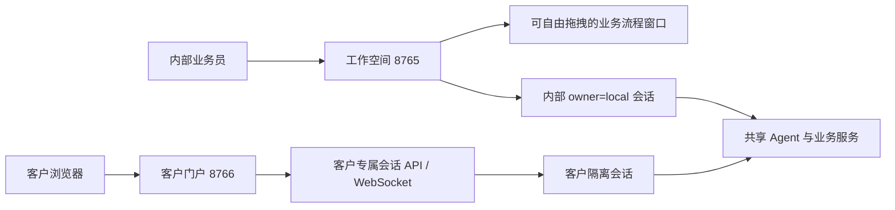

# 业务流程自由拖拽与客户门户工作空间化改造计划

> 制定日期：2026-07-23  
> 适用仓库：`E:\agent\nanoclaw`  
> 文档性质：实施计划，不代表功能已经完成

## 1. 目标

本计划覆盖三项需求：

1. 工作空间中的“业务流程”窗口支持在页面内自由拖动，并继续兼容最小化、停靠、实时更新和多语言。
2. 独立端口客户门户采用与 NanoClaw 工作空间一致的信息架构和交互语言，但使用独立浅蓝色视觉令牌。
3. 客户门户支持客户专属的新建、切换、软删除对话，以及中文、英文、德语语言设置。

客户多对话只有在服务端客户身份、会话授权、删除语义、WebSocket 绑定和负向权限测试全部完成后，才能标记为业务可用；此前只能作为视觉/交互预览。

## 2. 当前实现与差距

| 能力 | 当前状态 | 证据 | 差距 |
|---|---|---|---|
| 业务流程窗口 | 已有浮层、左右停靠、最小化、实时事件和 3 秒补拉 | `channels/web_ui/index.html`、`static/app.css`、`static/app.js` | 没有 Pointer Events 拖拽、坐标约束和位置持久化 |
| 工作空间多对话 | 已有创建、清单、切换、软删除、消息读取 | `channels/web.py`、`session/conversation.py`、`static/app.js` | 当前 `owner_id=local`，不可直接开放给客户 |
| 工作空间语言 | 已有中文、英文、德语和偏好保存 | `channels/web_ui/index.html`、`static/app.js` | 客户门户没有独立语言资源和菜单 |
| 客户门户服务 | 已由 `CustomerPortalChannel` 独立端口托管 | `channels/customer_portal.py`、`config.py` | 只有静态页面、兼容路径和健康检查 |
| 客户门户页面 | 有询盘输入、主题和新咨询预览 | `channels/web_ui/customer.html`、`static/customer-preview.js` | 没有会话清单、删除、持久化、WebSocket 和语言切换 |
| 客户门户视觉 | 当前是共享橙色令牌的居中单列页面 | `static/css/tokens.css`、`common.css`、`customer.css` | 未采用工作空间三段式布局和浅蓝色主题 |

## 3. 总体原则



- 视觉同源不等于身份、会话、接口和浏览器存储共享。
- 客户门户不得直接调用内部 `/api/conversations`，也不得复用 `owner_id=local`。
- 删除采用软删除；没有独立保留策略和授权前不物理删除消息文件。
- 语言只影响界面文案和格式化，不改变报价、金额、审批或业务状态。
- 客户门户不增加报价审批、真实邮件发送或内部流程操作。

## 4. 业务流程窗口自由拖拽

### 4.1 交互规则

- 标题栏作为拖拽手柄，使用 Pointer Events，兼容鼠标、触控笔和触摸屏。
- 停靠、最小化按钮和窗口内下拉框不触发拖拽；按下后使用 `setPointerCapture()`。
- 移动使用 `transform: translate3d(x, y, 0)`，释放或取消时保存最终位置。
- 保留至少 16px 可见安全边距；窗口尺寸变化、侧栏变化或旋转后重新约束位置。
- 开始自由拖动后退出 `docked`；停靠按钮清除自由坐标并恢复左/右定位。
- 最小化不丢失位置；双击标题栏恢复默认位置，并提供键盘可达的“恢复默认位置”操作。
- 位置仅保存有限数值和视口尺寸到 `nanoclaw-workflow-position-v1`，不保存业务数据。

### 4.2 响应式和无障碍

- 宽度大于 680px 支持自由拖动；680px 及以下降级为固定可收起面板/底部抽屉。
- 拖动时增加 `is-dragging` 和 `cursor: grabbing`；遵守 `prefers-reduced-motion`。
- 键盘用户继续使用停靠、最小化、恢复默认位置按钮，不依赖指针操作。

### 4.3 预计文件

- `channels/web_ui/index.html`：拖拽手柄语义、ARIA 文案、恢复位置动作。
- `channels/web_ui/static/app.css`：拖动状态、边界定位、移动端降级样式。
- `channels/web_ui/static/app.js`：Pointer Events、坐标约束、恢复和持久化。
- `test/test_web_file_import.py` 与浏览器 E2E：契约、拖动、越界、刷新恢复、停靠、最小化和窄屏验证。

## 5. 客户门户浅蓝色工作空间布局

采用“品牌轨 + 对话侧栏 + 当前询盘主区”的精简三段式布局：

```text
┌────────┬────────────────────┬────────────────────────────┐
│ 品牌轨 │ 客户对话侧栏       │ 当前询盘对话               │
│ 对话   │ 新建 / 搜索 / 清单 │ 标题、状态、语言           │
│ 语言   │ 切换 / 删除        │ 消息区、输入区             │
└────────┴────────────────────┴────────────────────────────┘
```

客户门户可以展示品牌、对话、语言、主题、询盘编号、消息、审批结果和隐私提示；不得展示业务工作台、知识库、汇率、内部流程、工具参数、业务口令、其他客户信息或真实邮件操作。

建议客户专属浅蓝令牌：

| 令牌 | 建议值 | 用途 |
|---|---|---|
| `--customer-bg` | `#f4f9ff` | 页面背景 |
| `--customer-surface` | `#ffffff` | 卡片和侧栏 |
| `--customer-surface-2` | `#eaf4ff` | 选中、悬停、输入背景 |
| `--customer-rail` | `#17324d` | 导航轨 |
| `--customer-accent` | `#3b82c4` | 主按钮、焦点、当前项 |
| `--customer-accent-2` | `#256aa8` | 悬停和按下 |
| `--customer-accent-soft` | `#e2f1ff` | 气泡和提示 |
| `--customer-line` | `#d5e6f5` | 边框和分隔线 |

实施时检查 WCAG AA 对比度。桌面使用三段式；中等宽度允许侧栏收起；680px 以下使用底部导航和可滑出的对话抽屉，保证 360px 无横向溢出。

## 6. 客户多对话和身份隔离

当前 `/api/conversations` 固定为内部 `owner_id=local`，客户门户不得直接使用。建议增加客户专属 BFF：

| 方法 | 路径 | 用途 |
|---|---|---|
| POST | `/api/customer/conversations` | 创建当前客户对话 |
| GET | `/api/customer/conversations` | 列出当前客户未删除对话 |
| GET | `/api/customer/conversations/{id}/messages` | 读取客户可见消息 |
| DELETE | `/api/customer/conversations/{id}` | 软删除当前客户对话 |
| POST | `/api/customer/conversations/{id}/restore` | 可选恢复，不在首屏暴露 |
| WS | `/ws/customer?conversation_id={id}` | 绑定当前客户对话 |

建议首期演示由服务端签发不可猜测、HttpOnly、SameSite 的匿名客户 Cookie；生产再接入账号或受控邀请链接。所有清单、读取、删除和 WebSocket 绑定必须服务端校验客户身份与对话归属。伪造或跨客户 ID 统一返回 404，避免枚举。

新建由后端生成 ID、询盘编号和时间；删除前显示当前语言确认框，删除后进入最近剩余对话；删除最后一个对话建议进入空状态，等待用户明确点击“新建对话”。已删除对话不接受发送和 WebSocket 绑定，迟到回复必须按 `conversation_id` 隔离。

## 7. 客户门户语言设置

- 首期支持 `zh`、`en`、`de`，使用独立键 `nanoclaw-customer-language`，不读取或覆盖内部 `nanoclaw-language`。
- 翻译覆盖导航、按钮、空状态、删除确认、连接状态、错误、隐私、输入占位符、ARIA 标签和时间格式。
- 切换语言立即更新 DOM、`html[lang]` 和日期格式，不重载、不改变当前对话。
- 后端只返回稳定错误码；前端按当前语言映射安全文案，不显示堆栈或内部异常。

## 8. 文件和模块建议

```text
channels/web_ui/
├─ customer.html
└─ static/
   ├─ css/{tokens,common,customer}.css
   ├─ js/theme.js
   ├─ js/customer-i18n.js
   └─ customer-portal.js
channels/
└─ customer_portal.py       # 页面、客户 API、WS/BFF 挂载
session/
└─ customer_conversation.py # 客户身份与会话边界适配层（推荐）
```

如果复用 `ConversationService`，必须先把 owner 从固定常量改为服务端认证上下文，并补齐跨 owner 负向测试，不能只在前端过滤。

## 9. 分阶段路线

| 阶段 | 目标 | 状态 | 完成标准 |
|---|---|---|---|
| M0 | 冻结拖拽、视觉、身份和 API 契约 | 计划完成 | 明确删除最后对话策略和客户认证方式 |
| M1 | 业务流程窗口自由拖拽 | 未开始 | 桌面可拖动、不可越界、刷新恢复；停靠/最小化兼容；移动端降级 |
| M2 | 客户门户浅蓝工作空间壳层 | 未开始 | 三段布局、浅蓝令牌、响应式和无障碍通过 |
| M3 | 客户门户三语切换 | 未开始 | 中/英/德完整覆盖，独立偏好，切换不重载 |
| M4 | 客户专属多对话 BFF | 未开始 | 创建、清单、切换、消息、软删除、WS 绑定和跨客户拒绝完成 |
| M5 | 前后端整合与恢复 | 未开始 | 刷新恢复、迟到回复隔离、断线重连和删除空状态稳定 |
| M6 | 自动化与浏览器验收 | 未开始 | 单元、契约、安全、桌面/移动用例全部通过，文档同步 |

M1 与 M2/M3 可以并行；M4 完成后才将客户门户从预览数据切到真实会话，禁止临时暴露内部会话 API。

## 10. 验收矩阵

### 业务流程

- 标题栏拖动时窗口跟随指针；按钮和下拉框不拖动。
- 四边快速拖动仍保留安全边距；尺寸变化后回到可见区域。
- 刷新恢复位置；损坏或超范围值回退默认位置。
- 停靠、取消停靠、最小化、恢复默认位置相互兼容。
- 拖动期间流程事件仍实时更新；680px 以下不影响滚动和输入。

### 客户门户

- 页面使用浅蓝令牌和工作空间式布局，不出现内部入口或数据。
- 360px、680px、900px 和桌面宽度无横向溢出。
- 中/英/德覆盖可见文本、占位符、ARIA、错误和时间格式；语言偏好不影响工作空间。
- 同一客户可新建、切换、刷新恢复和软删除多个对话。
- 客户 A 无法通过 URL、请求体或 WS 参数读取、删除或绑定客户 B 的对话。
- 客户无法访问内部 `owner_id=local`、工具消息、业务流程和审批操作。
- 迟到回复、重复事件和断线重连按 `conversation_id` 隔离。

## 11. 发布和边界

- 增加独立开关 `NANOCLAW_CUSTOMER_MULTI_CONVERSATION_ENABLED`；关闭时回到预览或维护提示，不删除数据。
- 拖拽可由前端开关关闭并恢复停靠行为；静态资源使用版本化缓存键。
- 会话迁移前做只读备份；生产明确认证、保留、删除、脱敏、HTTPS、CORS、WSS 和限流策略。
- 不自动扩大客户审批、报价计算、汇率、库存、真实邮件或公网部署范围。

## 12. 实施前产品决策

1. 删除最后一个客户对话后建议显示空状态，等待客户明确新建，避免无意创建空记录。
2. 生产客户身份建议首期使用服务端签名的匿名 HttpOnly Cookie，待客户账号体系明确后再接入真实业务数据。
