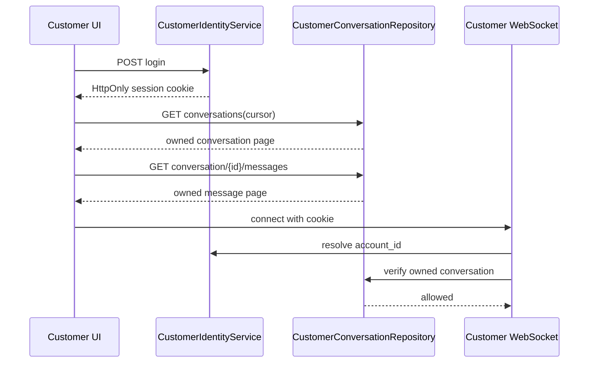
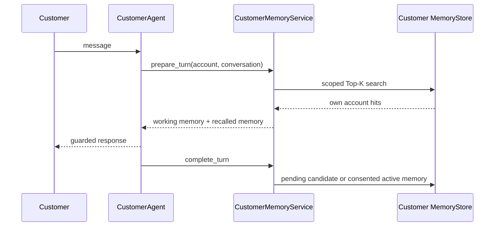
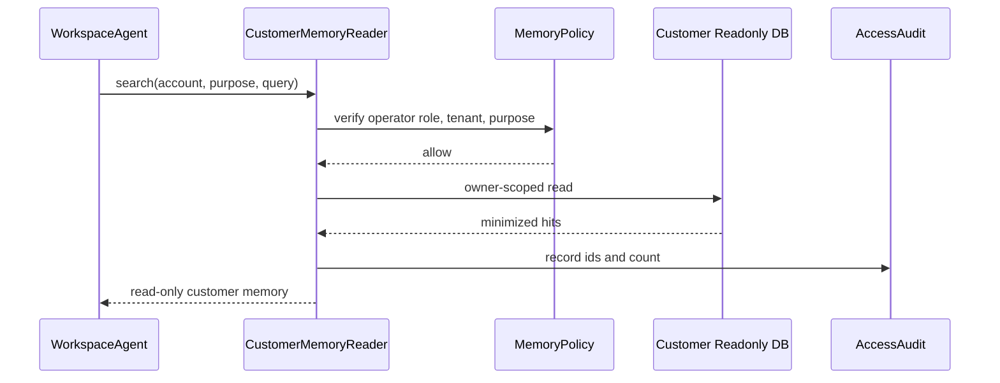

# 双 Agent 记忆管理代码设计

> 文档状态：代码设计完成；M0-M4 已本地实施；M5 本地代码与脱敏验证已完成、真实评估门禁待完成；M6 本地治理核心代码已完成、生产审批与演练待完成  
> 上位设计：`docs/architecture/工作空间与客户Agent记忆管理设计.md`  
> 适用代码：`E:\agent\nanoclaw` 当前检出  
> 最后更新：2026-07-25（Asia/Shanghai）

## 1. 代码设计目标

本设计把上位架构落成可实现的 Python 模块、数据库表、接口、路由、Agent 生命周期和测试合同，完成以下目标：

1. 客户门户具备独立账号、登录会话和按账号恢复历史对话的能力。
2. 客户长期记忆以服务端可信 `account_id` 隔离，不能依赖邮箱、手机号、Cookie 或模型输出确定归属。
3. 工作空间 Agent 可在内部操作者授权、明确用途和审计条件下只读客户记忆。
4. Customer Agent 在代码、工具、存储凭据和召回路径上均不能读取 `workspace_private`。
5. 工作空间会话和客户会话都改为有界活动上下文、冷归档和结构化工作记忆。
6. 继续保留现有 `MemoryConsolidator`、Markdown 记忆和 JSONL 会话的兼容回退，按功能开关灰度迁移。

本文初稿只完成代码设计。2026-07-25 已按迁移顺序完成 M0-M4 本地代码、M5 本地无网络混合检索，以及 M6 本地治理核心代码：显式 TTL 审查、确定性账号合并门禁、可断点恢复的账号删除编排、SQLite 在线备份与校验后分区恢复、从权威主存重建派生索引、默认关闭的治理/备份开关。未启用生产账号或 M4 生产身份，未向外部 Embedding 服务传输客户数据；M5 真实评估集校准仍是未通过的发布门禁，M6 法定保留期、删除 SLA、IdP 合并权威、生产备份加密/存储及恢复演练也未获验收，不声称任何能力已经部署上线。

## 2. 当前代码约束

| 现有位置 | 可复用能力 | 设计时必须解决的问题 |
|---|---|---|
| `agent/memory.py` | Token 估算和摘要调用 | 只压缩当次请求，摘要失败文本可能宣称旧消息丢失；不能作为新主存 |
| `agent/context.py` | 统一 System Prompt 和请求上下文组装 | 当前完整加载 Markdown；需改为可注入的记忆上下文提供器 |
| `agent/loop.py` | 消息保存、工具循环、响应持久化 | 需增加 turn 前准备、turn 后提取和故障安全生命周期钩子 |
| `session/manager.py` | JSONL 持久化 | 需增加消息 ID、有界活动历史、归档、原子替换和作用域删除 |
| `session/conversation.py` | 元数据、分页、原子 JSON 写入、软删除 | 可复用接口形状，但客户版本必须增加 `tenant_id/account_id` 所有权条件 |
| `channels/customer_portal.py` | 独立端口、签名匿名 Cookie、WebSocket v2 | 需拆出认证/对话 Router，所有账号由认证会话解析 |
| `agent/customer_agent.py` | 公开工具 allowlist、输入/输出防泄露 | 需注入客户记忆上下文，不得注册工作空间记忆工具 |
| `agent/peer_coordination.py` | 同级 Agent、公开结果信封 | peer 键改为账号/对话作用域，删除和 TTL 必须可追踪 |
| `main.py` | 双 Agent 装配和路径隔离 | 需采用依赖容器，分别注入不同 Store/数据库角色 |
| `config.py` | JSON + 环境变量配置 | 新增账号、记忆、保留期和只读访问开关；敏感密钥只走环境变量 |

## 3. 目标模块结构

为避免与现有 `agent/memory.py` 文件冲突，新实现放入 `agent/memory_runtime/`；旧文件在迁移完成前保留兼容压缩器。

```text
agent/
├── memory.py                         # 现有 Legacy MemoryConsolidator，迁移期保留
├── memory_runtime/
│   ├── __init__.py
│   ├── models.py                     # MemoryScope/MemoryItem/WorkingMemory/Consent
│   ├── errors.py                     # 稳定错误码
│   ├── policy.py                     # realm、ACL、敏感级别、用途门禁
│   ├── context_provider.py           # Top-K 记忆到模型消息的转换
│   ├── lifecycle.py                  # turn 前召回、turn 后候选提取和写入编排
│   ├── compaction.py                 # 完整轮次裁剪、摘要、归档计划
│   ├── deletion.py                   # 幂等删除任务
│   ├── outbox.py                     # 索引更新/删除重试事件
│   ├── stores/
│   │   ├── base.py                   # Protocol/ABC
│   │   ├── sqlite.py                 # 本地结构化主存
│   │   ├── keyword.py                # 本地关键词召回
│   │   └── vector.py                 # 后续向量适配接口，不绑定产品
│   └── services/
│       ├── workspace_memory.py
│       ├── customer_memory.py
│       ├── public_memory.py
│       └── customer_reader.py        # 工作空间审计式只读客户记忆
├── customer_identity/
│   ├── __init__.py
│   ├── models.py
│   ├── repository.py                 # 账号和认证会话 Repository
│   ├── password.py                   # PasswordHasher 接口
│   ├── service.py                    # 注册/登录/退出/锁定
│   ├── session_cookie.py             # Cookie 签发、哈希和解析
│   └── dependencies.py               # FastAPI 当前客户依赖
├── tools/
│   └── read_customer_memory.py       # 仅工作空间 Agent 注册
session/
├── manager.py                        # 保留兼容接口
├── bounded_manager.py                # 活动/归档/替换/删除
└── customer_conversation.py          # 账号级对话元数据和消息分页
channels/
├── customer_portal.py                # 页面、WS 和 Router 装配
├── customer_auth_api.py              # 注册/登录/退出/当前账号
├── customer_conversation_api.py      # 历史清单、详情、删除、匿名认领
└── customer_memory_api.py            # 客户查看/纠正/删除自己的记忆
test/
├── test_customer_auth.py
├── test_customer_conversation_history.py
├── test_memory_scope_policy.py
├── test_memory_lifecycle.py
├── test_customer_memory.py
├── test_workspace_customer_memory_reader.py
└── test_memory_deletion.py
```

禁止把新账号代码放入现有邮箱账户模块。`ops_email_account` 是工作空间邮箱配置，不是客户身份账号，两者不得复用表或 `account_id` 语义。

## 4. 核心领域模型

### 4.1 可信调用主体

```python
from dataclasses import dataclass
from typing import Literal

@dataclass(frozen=True)
class ActorContext:
    actor_kind: Literal["customer", "workspace_operator", "service"]
    actor_id: str
    tenant_id: str
    roles: frozenset[str]
    authenticated: bool
```

`ActorContext` 只能由认证中间件或进程内服务装配，不接受模型工具参数和客户端 JSON 覆盖。

### 4.2 记忆作用域

```python
@dataclass(frozen=True)
class MemoryScope:
    realm: Literal[
        "workspace_private",
        "customer_private",
        "customer_conversation",
        "public_approved",
    ]
    tenant_id: str
    account_id: str | None = None
    subject_id: str | None = None
    project_id: str | None = None
    conversation_id: str | None = None
    purpose: str = ""

    def validate(self) -> None:
        ...
```

`validate()` 执行确定性不变量：

- `customer_private` 必须有 `account_id`，不能有 `project_id`。
- `customer_conversation` 必须同时有 `account_id` 和 `conversation_id`。
- `workspace_private` 必须有内部 `subject_id` 或 `project_id`，不能有客户 `account_id`。
- `public_approved` 不允许客户主体字段。

### 4.3 记忆条目

```python
@dataclass(frozen=True)
class MemoryItem:
    memory_id: str
    scope: MemoryScope
    memory_type: Literal["semantic", "episodic", "procedural"]
    content: str
    summary: str
    source_refs: tuple[str, ...]
    status: Literal[
        "pending_consent", "active", "superseded", "invalid", "deleted"
    ]
    confidence: float
    importance: float
    sensitivity: Literal["public", "customer_private", "internal", "restricted"]
    consent_record_id: str | None
    version: int
    supersedes: str | None
    created_at: str
    updated_at: str
    valid_from: str
    expires_at: str | None
    content_hash: str
    embedding_model: str | None
```

业务代码不得直接构造 `active` 客户记忆；必须调用 `CustomerMemoryService.activate_candidate()` 完成同意、来源、敏感过滤和冲突校验。

### 4.4 会话与工作记忆

```python
@dataclass
class CustomerConversation:
    conversation_id: str
    tenant_id: str
    account_id: str
    title: str
    status: Literal["active", "archived", "deleted"]
    created_at: str
    updated_at: str
    last_message_at: str | None
    version: int

@dataclass
class CustomerInquiryWorkingMemory:
    account_id: str
    conversation_id: str
    intent: str
    fields: dict[str, "SourcedValue"]
    missing_fields: list[str]
    pending_confirmations: list[str]
    inquiry_record_id: str | None
    version: int
```

`SourcedValue` 必须包含 `value`、`state=pending|confirmed`、`source_message_id` 和更新时间；未经客户确认或权威工具验证的字段不能变成 `confirmed`。

## 5. 存储与数据库设计

### 5.1 本地开发物理边界

| 文件 | 内容 | 连接权限 |
|---|---|---|
| `workspace/customer_auth/customer_auth.db` | 账号、登录标识、认证会话 | 仅认证服务读写 |
| `workspace/customer_data/customer_data.db` | 客户对话、消息、工作记忆、客户长期记忆、同意、删除任务 | CustomerMemoryService 读写；CustomerMemoryReader 只读 |
| `workspace/memory/workspace_memory.db` | 工作空间工作记忆与长期记忆 | 仅工作空间服务读写 |
| `workspace/customer_memory/public_memory.db` | 已批准公开资料 | 发布服务写，Customer Agent 只读 |

生产环境使用独立数据库角色或独立 schema；Customer Agent 的数据库账号不得拥有 `workspace_memory` 的 `SELECT` 权限。

### 5.2 客户账号与认证会话

```sql
CREATE TABLE customer_account (
  account_id TEXT PRIMARY KEY,
  tenant_id TEXT NOT NULL,
  status TEXT NOT NULL CHECK(status IN ('active','locked','disabled','deleted')),
  preferred_locale TEXT NOT NULL DEFAULT 'en',
  created_at TEXT NOT NULL,
  updated_at TEXT NOT NULL,
  last_login_at TEXT,
  deleted_at TEXT
);

CREATE TABLE customer_auth_identity (
  identity_id TEXT PRIMARY KEY,
  account_id TEXT NOT NULL,
  tenant_id TEXT NOT NULL,
  identifier_type TEXT NOT NULL,
  identifier_normalized TEXT NOT NULL,
  credential_hash TEXT NOT NULL,
  failed_attempts INTEGER NOT NULL DEFAULT 0,
  locked_until TEXT,
  created_at TEXT NOT NULL,
  updated_at TEXT NOT NULL,
  UNIQUE(tenant_id, identifier_type, identifier_normalized),
  FOREIGN KEY(account_id) REFERENCES customer_account(account_id)
);

CREATE TABLE customer_auth_session (
  session_id TEXT PRIMARY KEY,
  account_id TEXT NOT NULL,
  tenant_id TEXT NOT NULL,
  token_hash TEXT NOT NULL UNIQUE,
  csrf_hash TEXT NOT NULL,
  created_at TEXT NOT NULL,
  last_seen_at TEXT NOT NULL,
  idle_expires_at TEXT NOT NULL,
  absolute_expires_at TEXT NOT NULL,
  revoked_at TEXT,
  FOREIGN KEY(account_id) REFERENCES customer_account(account_id)
);
```

数据库只保存随机 session token 的哈希。Cookie 中的原始 token 不写日志、不写会话 JSONL、不进入模型。

### 5.3 账号级对话与消息

```sql
CREATE TABLE customer_conversation (
  conversation_id TEXT PRIMARY KEY,
  tenant_id TEXT NOT NULL,
  account_id TEXT NOT NULL,
  title TEXT NOT NULL,
  status TEXT NOT NULL CHECK(status IN ('active','archived','deleted')),
  version INTEGER NOT NULL DEFAULT 1,
  created_at TEXT NOT NULL,
  updated_at TEXT NOT NULL,
  last_message_at TEXT,
  deleted_at TEXT
);

CREATE INDEX idx_customer_conversation_owner
  ON customer_conversation(tenant_id, account_id, status, last_message_at);

CREATE TABLE customer_message (
  message_id TEXT PRIMARY KEY,
  tenant_id TEXT NOT NULL,
  account_id TEXT NOT NULL,
  conversation_id TEXT NOT NULL,
  role TEXT NOT NULL CHECK(role IN ('user','assistant','tool')),
  content_json TEXT NOT NULL,
  tool_group_id TEXT,
  created_at TEXT NOT NULL,
  archived_at TEXT,
  FOREIGN KEY(conversation_id) REFERENCES customer_conversation(conversation_id)
);

CREATE INDEX idx_customer_message_owner_time
  ON customer_message(tenant_id, account_id, conversation_id, created_at, message_id);
```

所有查询必须包含 `tenant_id=? AND account_id=?`。单独按 `conversation_id` 查询即使 UUID 难猜也属于代码缺陷。

### 5.4 工作记忆、长期记忆和同意

```sql
CREATE TABLE customer_working_memory (
  tenant_id TEXT NOT NULL,
  account_id TEXT NOT NULL,
  conversation_id TEXT NOT NULL,
  state_json TEXT NOT NULL,
  version INTEGER NOT NULL,
  updated_at TEXT NOT NULL,
  PRIMARY KEY(tenant_id, account_id, conversation_id)
);

CREATE TABLE customer_memory_consent (
  consent_record_id TEXT PRIMARY KEY,
  tenant_id TEXT NOT NULL,
  account_id TEXT NOT NULL,
  purpose TEXT NOT NULL,
  categories_json TEXT NOT NULL,
  status TEXT NOT NULL CHECK(status IN ('active','withdrawn','expired')),
  granted_at TEXT NOT NULL,
  expires_at TEXT,
  withdrawn_at TEXT
);

CREATE TABLE customer_memory_item (
  memory_id TEXT PRIMARY KEY,
  tenant_id TEXT NOT NULL,
  account_id TEXT NOT NULL,
  conversation_id TEXT,
  memory_type TEXT NOT NULL,
  purpose TEXT NOT NULL,
  content TEXT NOT NULL,
  summary TEXT NOT NULL,
  source_refs_json TEXT NOT NULL,
  status TEXT NOT NULL,
  confidence REAL NOT NULL,
  importance REAL NOT NULL,
  sensitivity TEXT NOT NULL,
  consent_record_id TEXT,
  version INTEGER NOT NULL,
  supersedes TEXT,
  content_hash TEXT NOT NULL,
  embedding_model TEXT,
  created_at TEXT NOT NULL,
  updated_at TEXT NOT NULL,
  valid_from TEXT NOT NULL,
  expires_at TEXT,
  FOREIGN KEY(consent_record_id) REFERENCES customer_memory_consent(consent_record_id)
);

CREATE UNIQUE INDEX uq_customer_memory_active_hash
  ON customer_memory_item(tenant_id, account_id, purpose, content_hash, status);
CREATE INDEX idx_customer_memory_scope
  ON customer_memory_item(tenant_id, account_id, purpose, status, expires_at);
```

工作空间记忆使用独立 `workspace_memory_item` 表和数据库，不在 `customer_memory_item` 增加一个可选 realm 后混存，以便数据库权限从物理层阻断反向读取。

### 5.5 审计、Outbox 和删除任务

```sql
CREATE TABLE customer_memory_access_audit (
  audit_id TEXT PRIMARY KEY,
  tenant_id TEXT NOT NULL,
  operator_id TEXT NOT NULL,
  account_id TEXT NOT NULL,
  purpose TEXT NOT NULL,
  conversation_id TEXT,
  returned_memory_ids_json TEXT NOT NULL,
  result_count INTEGER NOT NULL,
  created_at TEXT NOT NULL
);

CREATE TABLE memory_index_outbox (
  event_id TEXT PRIMARY KEY,
  store_kind TEXT NOT NULL,
  aggregate_id TEXT NOT NULL,
  event_type TEXT NOT NULL,
  payload_json TEXT NOT NULL,
  status TEXT NOT NULL,
  attempt_count INTEGER NOT NULL DEFAULT 0,
  available_at TEXT NOT NULL,
  created_at TEXT NOT NULL,
  updated_at TEXT NOT NULL
);

CREATE TABLE memory_deletion_job (
  job_id TEXT PRIMARY KEY,
  tenant_id TEXT NOT NULL,
  account_id TEXT,
  conversation_id TEXT,
  request_id TEXT NOT NULL UNIQUE,
  status TEXT NOT NULL,
  steps_json TEXT NOT NULL,
  attempt_count INTEGER NOT NULL DEFAULT 0,
  created_at TEXT NOT NULL,
  updated_at TEXT NOT NULL,
  completed_at TEXT
);
```

访问审计只记录 ID、用途和数量，不复制客户记忆原文到普通日志。

## 6. Repository 与 Service 接口

### 6.1 账号和认证

```python
class CustomerAccountRepository(Protocol):
    def create_account(self, account, identity) -> CustomerAccount: ...
    def get_active_by_identifier(self, tenant_id, kind, normalized) -> AuthRecord | None: ...
    def get_active(self, tenant_id, account_id) -> CustomerAccount | None: ...
    def record_login_failure(self, identity_id, now) -> None: ...
    def record_login_success(self, account_id, now) -> None: ...
    def disable(self, tenant_id, account_id, expected_version) -> None: ...

class CustomerAuthSessionRepository(Protocol):
    def create(self, session) -> None: ...
    def resolve_active(self, token_hash, now) -> AuthenticatedCustomer | None: ...
    def rotate(self, old_session_id, replacement) -> None: ...
    def revoke(self, session_id, now) -> None: ...
    def revoke_account(self, tenant_id, account_id, now) -> int: ...
```

`CustomerIdentityService.login()` 采用统一失败响应，避免泄露账号是否存在；失败次数、锁定、session rotation 和退出均在事务内处理。

### 6.2 对话

```python
class CustomerConversationRepository(Protocol):
    def create(self, owner: CustomerOwner, title: str) -> CustomerConversation: ...
    def list_owned(self, owner, cursor, limit) -> Page[CustomerConversation]: ...
    def get_owned(self, owner, conversation_id) -> CustomerConversation: ...
    def append_message(self, owner, conversation_id, message) -> None: ...
    def list_messages(self, owner, conversation_id, cursor, limit) -> Page[Message]: ...
    def claim_anonymous(self, anonymous_subject_id, owner, ids, request_id) -> ClaimResult: ...
    def soft_delete(self, owner, conversation_id, expected_version) -> DeletionJob: ...
```

Repository 的公开方法接收 `CustomerOwner(tenant_id, account_id)`，不给调用方提供“无 owner 查询”重载。

### 6.3 记忆主存

```python
class MemoryStore(Protocol):
    def create_candidate(self, actor, item: MemoryItem) -> MemoryItem: ...
    def activate(self, actor, memory_id, consent_record_id, expected_version) -> MemoryItem: ...
    def search(self, actor, scope, query, top_k) -> list[MemoryHit]: ...
    def supersede(self, actor, old_id, new_item, expected_version) -> MemoryItem: ...
    def invalidate(self, actor, memory_id, reason, expected_version) -> None: ...
    def delete_scope(self, actor, scope, request_id) -> DeletionJob: ...
    def export_scope(self, actor, scope) -> MemoryExport: ...
```

SQLite 是结构化主存，关键词/向量索引只是派生数据。任何 Store 故障不能破坏原始消息或权威业务记录。

### 6.4 工作空间只读客户记忆

```python
class CustomerMemoryReader:
    def search_for_workspace(
        self,
        actor: ActorContext,
        *,
        customer_account_id: str,
        purpose: str,
        query: str,
        conversation_id: str | None,
        top_k: int,
    ) -> list[CustomerMemoryReadModel]:
        self.policy.require_workspace_customer_read(actor, purpose)
        hits = self.readonly_store.search_owned(
            tenant_id=actor.tenant_id,
            account_id=customer_account_id,
            conversation_id=conversation_id,
            purpose=purpose,
            query=query,
            top_k=min(top_k, self.max_top_k),
        )
        self.audit.record(actor, customer_account_id, purpose, hits)
        return self.redactor.minimize(hits)
```

只读接口的 `operator_id` 来自 `ActorContext`，不出现在模型可控参数中。数据库连接必须以只读模式打开；工具只能查询，不能复用 `MemoryStore` 的写接口。

## 7. 权限策略代码

### 7.1 ACL 决策

```python
class MemoryPolicy:
    CUSTOMER_READ_PURPOSES = frozenset({
        "customer_support", "rfq_review", "complaint_resolution",
    })

    def require_search(self, actor: ActorContext, scope: MemoryScope) -> None:
        if actor.tenant_id != scope.tenant_id:
            raise MemoryAccessDenied("memory_scope_denied")
        if actor.actor_kind == "customer":
            if scope.realm == "workspace_private":
                raise MemoryAccessDenied("memory_scope_denied")
            if scope.realm in {"customer_private", "customer_conversation"}:
                if not actor.authenticated or actor.actor_id != scope.account_id:
                    raise MemoryAccessDenied("memory_scope_denied")
        elif actor.actor_kind == "workspace_operator":
            self._require_internal_role(actor, scope)
        else:
            self._require_service_role(actor, scope)
```

所有拒绝统一使用不含目标存在性的错误码，防止账号和对话枚举。

### 7.2 工具注册边界

- `build_customer_agent()`：只注册现有两个公开只读工具；注入 `CustomerMemoryContextProvider`，但不注册任何记忆管理工具或工作空间 Store。
- `build_agent()`：仅当 `customer_memory_read_enabled=true` 且存在可信内部操作者上下文时注册 `ReadCustomerMemoryTool`。
- `build_workspace_peer_agent()`：使用服务角色和限定 purpose；可以读目标客户当前作用域，但输出仍必须经过公开结果信封。
- `SpawnSubagentTool`：默认不继承 `ReadCustomerMemoryTool`，除非父任务显式下发不可伪造的最小 capability；首版建议完全禁止继承。

### 7.3 缓存键

所有召回缓存键至少包含：

```text
realm | tenant_id | account_id | subject_id | project_id |
conversation_id | purpose | memory_index_version | normalized_query_hash
```

缺少任一适用作用域字段时拒绝缓存，不以空字段共享结果。

## 8. Agent 生命周期集成

### 8.1 `AgentLoop` 扩展

避免在通用循环中硬编码客户逻辑，注入可选生命周期对象：

```python
class AgentMemoryLifecycle(Protocol):
    async def prepare_turn(self, request: TurnRequest) -> PreparedMemory: ...
    async def observe_tool_result(self, event: ToolResultEvent) -> None: ...
    async def complete_turn(self, event: TurnCompletedEvent) -> None: ...
    async def abort_turn(self, event: TurnAbortedEvent) -> None: ...
```

`AgentLoop.run()` 目标顺序：

1. 从可信请求上下文取得 actor/scope；模型看不到 Cookie/token。
2. `prepare_turn()` 加载工作记忆、Top-K 长期记忆和有界历史。
3. `ContextBuilder` 组装 System、安全规则、工作状态、召回、历史和当前消息。
4. 原始用户消息落主会话存储后进入工具循环。
5. 工具结果先持久化，再由 `observe_tool_result()` 更新工作状态候选。
6. 最终响应通过 CustomerDataGuard 后持久化。
7. `complete_turn()` 提取长期记忆候选；写入失败进入 outbox，不回滚已保存对话。
8. 异常调用 `abort_turn()`；不得把部分结果升级为已确认事实。

### 8.2 `ContextBuilder` 扩展

```python
class MemoryContextProvider(Protocol):
    def build_context_messages(self, prepared: PreparedMemory) -> list[dict]: ...
```

`ContextBuilder` 新增 provider 参数。迁移期行为：

- 新 provider 启用：只注入结构化工作记忆和筛选后的 Top-K。
- 新 provider 关闭：继续使用现有 `MEMORY.md`/`PUBLIC_MEMORY.md`。
- 同一请求不能同时注入完整 Markdown 与结构化长期记忆，避免重复和冲突。

### 8.3 完整轮次裁剪

`BoundedSessionManager.prepare_active_history()` 从最后 N 个 `role=user` 起点保留完整消息组，并验证所有 `tool_call_id` 都有配对结果。裁剪事务：

```text
读取活动消息 → 计算完整轮次边界 → 生成摘要 → 写冷归档 →
fsync/commit 归档 → 临时写活动历史 → 原子替换 → 写压缩审计
```

摘要、归档或替换任何一步失败都返回原历史；禁止写“旧消息已丢弃”后继续。

## 9. 客户账号和历史 API

### 9.1 HTTP 路由

| 方法 | 路径 | 认证 | 用途 |
|---|---|---|---|
| `POST` | `/api/customer/auth/register` | 匿名 + CSRF/限速 | 建立客户账号；是否开放由配置决定 |
| `POST` | `/api/customer/auth/login` | 匿名 + CSRF/限速 | 建立/轮换认证会话 |
| `POST` | `/api/customer/auth/logout` | 客户 | 撤销当前服务端会话并清 Cookie |
| `GET` | `/api/customer/auth/session` | 可选客户 | 返回最小登录状态，不含认证秘密 |
| `GET` | `/api/customer/conversations` | 客户 | 分页返回本账号对话 |
| `POST` | `/api/customer/conversations` | 客户 | 新建账号对话 |
| `GET` | `/api/customer/conversations/{id}/messages` | 客户 | 分页返回本账号消息 |
| `PATCH` | `/api/customer/conversations/{id}` | 客户 + CSRF | 重命名/归档，带版本 |
| `DELETE` | `/api/customer/conversations/{id}` | 客户 + CSRF | 创建级联删除任务 |
| `POST` | `/api/customer/conversations/claim-anonymous` | 客户 + 匿名证明 + CSRF | 显式认领本设备匿名对话 |
| `GET` | `/api/customer/memories` | 客户 | 查看本账号活动记忆 |
| `PATCH` | `/api/customer/memories/{id}` | 客户 + CSRF | 提交纠正并创建新版本 |
| `DELETE` | `/api/customer/memories/{id}` | 客户 + CSRF | 启动单条删除 |

分页采用不透明 cursor，cursor 签名或服务端保存；限制 `limit` 上限。404/403 对越权资源统一返回 `customer_resource_not_found`。

### 9.2 WebSocket 合同

保持现有 protocol v2 外形，但身份来源改变：

```json
{
  "type": "chat.message",
  "protocol_version": 2,
  "conversation_id": "uuid",
  "request_id": "uuid",
  "language": "zh",
  "content": "..."
}
```

服务端处理顺序：认证 Cookie → 得到 `tenant_id/account_id` → 校验对话所有权 → 幂等 request → 构造可信 `CustomerRequestContext` → 发布消息。客户端负载不增加 `account_id` 字段。

### 9.3 错误码

| 错误码 | HTTP/WS | 对外含义 |
|---|---:|---|
| `customer_auth_required` | 401/4401 | 需要登录 |
| `customer_auth_failed` | 401 | 凭据无效，不区分账号不存在 |
| `customer_account_locked` | 423 | 暂时锁定，不透露内部阈值 |
| `customer_csrf_invalid` | 403 | 状态变更请求无效 |
| `customer_resource_not_found` | 404 | 不存在或无权访问 |
| `customer_version_conflict` | 409 | 客户端版本过期 |
| `customer_claim_conflict` | 409 | 匿名对话已认领或状态变化 |
| `memory_scope_denied` | 403 | 记忆作用域拒绝；不透露目标存在性 |
| `memory_deletion_pending` | 202 | 删除任务已创建但未完全结束 |

## 10. 关键交互时序

### 10.1 登录并恢复历史



### 10.2 客户消息与记忆



### 10.3 工作空间只读客户记忆



没有任何从 CustomerAgent 到 Workspace MemoryStore 的调用路径。

## 11. 配置和依赖

### 11.1 配置字段

在 `NanoClawConfig` 中增加非敏感字段，环境变量覆盖敏感密钥和发布开关：

```python
customer_auth_enabled: bool = False
customer_registration_enabled: bool = False
customer_auth_database_path: str = "workspace/customer_auth/customer_auth.db"
customer_data_database_path: str = "workspace/customer_data/customer_data.db"
customer_auth_idle_minutes: int = 30
customer_auth_absolute_hours: int = 12
customer_anonymous_claim_enabled: bool = True
workspace_memory_enabled: bool = False
customer_long_term_memory_enabled: bool = False
workspace_customer_memory_read_enabled: bool = False
memory_max_turns: int = 10
memory_recall_top_k: int = 3
```

Cookie 签名/加密密钥仅从环境变量或 Secret Store 获取。生产启用账号时若密钥缺失必须 fail closed，不能像当前匿名预览一样进程启动时随机生成导致重启失效。

### 11.2 当前锁定依赖

| 依赖 | `uv.lock` 版本 | 用途 |
|---|---:|---|
| Python | `==3.11.9` | 项目解释器合同 |
| `fastapi` | `==0.136.1` | 账号、对话、记忆 API |
| `starlette` | `==1.3.1` | Cookie/WebSocket 基础 |
| `pydantic` | `==2.13.4` | API 请求/响应模型 |
| `uvicorn` | `==0.46.0` | 客户门户服务 |
| `httpx` | `==0.28.1` | API 测试 |
| `websockets` | `==15.0.1` | WebSocket 客户端测试 |
| `cryptography` | `==49.0.0` | 已锁定的密码学基础库；不直接替代密码哈希方案 |

密码哈希推荐 Argon2id，但当前 `argon2-cffi`、`passlib`、`bcrypt` 均未锁定。实施前必须明确选择并通过 `uv` 固定精确版本；本设计不虚构版本，也不使用普通 SHA-256 保存密码。若暂不增加依赖，只能将注册/密码登录保持关闭并接入已批准的外部 IdP。

## 12. 装配变更

### 12.1 依赖容器

```python
@dataclass
class MemoryRuntime:
    workspace_service: WorkspaceMemoryService | None
    customer_service: CustomerMemoryService | None
    public_service: PublicMemoryService
    customer_reader: CustomerMemoryReader | None
    deletion_service: MemoryDeletionService | None

@dataclass
class CustomerPortalRuntime:
    identity_service: CustomerIdentityService
    conversation_service: CustomerConversationService
    memory_service: CustomerMemoryService
```

`main()` 启动时创建一次 Repository/Service，传给 Portal、Gateway 和 agent factory；不能每个 Agent 新建 SQLite 连接和 schema。

### 12.2 `build_customer_agent()`

- 接收可信 `CustomerAgentScope(tenant_id, account_id, conversation_id)`，不再从字符串自行解析身份。
- SessionManager 使用 `CustomerConversationRepository` 适配器。
- ContextBuilder 使用 `CustomerMemoryContextProvider`。
- Agent lifecycle 使用 `CustomerAgentMemoryLifecycle`。
- 工具仍只有公开知识和公开产品目录。
- `memory_management_guidance=False`，客户模型不能直接写文件或 Store。

### 12.3 `build_agent()`

- 工作空间自身使用 `WorkspaceMemoryService`。
- 只有 `ActorContext` 具备 `customer_memory_reader` 角色且功能开关开启时注册 `ReadCustomerMemoryTool`。
- 工具 schema 只包含 `customer_account_id`、`purpose`、`query`、可选 `conversation_id`；不包含 `operator_id`、`tenant_id` 或数据库过滤字段。
- 工具结果标记为 `internal_only`，不能被 CustomerAgent 直接消费。

## 13. 前端代码设计

`customer-preview.js` 当前有硬编码示例对话和仅 DOM 删除。目标拆分：

```text
channels/web_ui/static/customer/
├── api.js                 # same-origin fetch、CSRF、统一错误
├── auth-store.js          # 仅保存最小登录 UI 状态，不保存 token
├── conversation-store.js # 服务端分页、选择、创建、归档、删除
├── memory-settings.js     # 查看、纠正、删除和同意管理
├── websocket.js           # 认证 WS、重连、request_id 幂等
└── app.js                 # 视图编排
```

前端规则：

- 首次加载先请求 `/api/customer/auth/session`，已登录再加载历史。
- 对话标题和消息只从服务端响应渲染；移除硬编码历史作为真实状态的行为。
- 删除按钮等待服务端返回删除任务/完成状态后再更新 UI；失败时恢复条目。
- `localStorage` 只可保存主题和语言，不能保存 token、账号 ID、消息正文或长期记忆。
- 登录前创建的对话在登录后显示明确认领提示，不静默绑定。

## 14. 测试设计

### 14.1 单元测试

- `MemoryScope.validate()` 的四个 realm 不变量。
- Customer Agent 对 `workspace_private` 永久拒绝。
- 工作空间读客户记忆必须满足角色、租户、用途和账号归属。
- 密码规范化、哈希校验、统一登录失败、锁定和 session 轮换。
- 完整用户轮次和 tool-call 组不被裁剪拆分。
- 同意撤回后记忆立即不可召回。

### 14.2 Repository 测试

- 每个客户查询都包含 owner 条件；A 的 UUID 即使已知也不能由 B 获取。
- 并发更新通过 `version` 返回 409，不静默覆盖。
- 匿名认领幂等且只能成功一次。
- 主存与 outbox 同事务；索引失败可重试。
- 账号删除、对话删除和单条记忆删除的步骤可断点重试。

### 14.3 API/WebSocket 测试

- 注册、登录、退出、Cookie 属性、CSRF、限速和通用错误。
- 登录后分页出现本账号历史；退出后 HTTP/WS 均失效。
- 修改请求体中的虚假 `account_id` 不改变服务端身份。
- 越权对话统一 404，不能区分存在/不存在。
- WebSocket 重放 `request_id` 不重复写消息或候选记忆。
- 客户输出防泄露仍覆盖客户记忆和 peer 结果。

### 14.4 单向 ACL 安全矩阵

| 用例 | 期望 |
|---|---|
| Customer Agent 请求工作空间记忆 ID | `memory_scope_denied` |
| Customer Agent 通过提示注入要求调用内部工具 | 不调用模型可控内部工具或确定性拒绝 |
| 客户 A 搜索客户 B 的语义近邻 | 0 条且无存在性差异 |
| 工作空间无角色读取客户 A | 拒绝并记录安全事件 |
| 工作空间有角色、错误租户 | 拒绝 |
| 工作空间有角色、合法用途 | 返回最小只读结果并生成审计 |
| Workspace peer 将内部记忆回传客户 | 公开门禁替换为人工确认 |
| 缓存命中使用错误账号键 | 必须 miss，禁止返回旧值 |

### 14.5 故障测试

- 摘要、归档、SQLite、索引、Embedding、outbox、删除任务任一步故障。
- 认证数据库重启、session 过期、密钥轮换和账号锁定。
- 主存成功/向量失败、删除主存成功/缓存清理失败。
- 进程在匿名认领事务和活动历史替换过程中崩溃。

### 14.6 建议验证命令

主项目测试继续使用 `pyproject.toml` 的 `testpaths = ["test"]`：

```powershell
.venv\Scripts\python.exe -m pytest test -q
.venv\Scripts\python.exe -m compileall agent session channels main.py config.py
```

`test2/rag_knowledge_base` 继续单独运行，避免与根测试入口发生重复模块收集冲突。代码设计阶段不执行上述未来实现测试。

## 15. 迁移与发布顺序

### M0：合同和空实现

- 添加领域模型、错误码、Policy、Protocol 和 no-op lifecycle。
- 保持所有新功能关闭，现有测试必须不变。
- 增加跨 realm/租户/账号负向测试。

实施状态（2026-07-24）：已完成并通过主项目回归。证据为 `agent/memory_runtime/`、`test/test_memory_scope_policy.py`、`test/test_memory_lifecycle.py` 和 `test/test_memory_runtime_config.py`；新能力默认关闭，尚未接入 `AgentLoop`。

### M1：客户账号和服务端历史

- 新增认证库、账号/会话 Repository、认证 Router。
- 新增账号级对话 Repository、列表/消息 API 和前端加载。
- WebSocket 从认证会话取得账号并校验所有权。
- 此阶段仍不启用长期记忆。

实施状态（2026-07-24）：已完成本地后端、门户加载和安全测试。生产装配在 `customer_auth_enabled=false` 时不创建数据库或认证服务；启用本地密码必须同时提供至少 32 字符会话密钥并安装已批准、精确锁定的 Argon2id 依赖。当前仓库仍未锁定 `argon2-cffi`，因此默认配置不可启用本地密码认证。

### M2：有界会话和工作记忆

- 实现 `BoundedSessionManager`、完整轮次裁剪、冷归档和原子替换。
- 分别实现工作空间与客户工作记忆。
- 删除对话级联 peer 状态和缓存。

实施状态（2026-07-24）：已完成本地代码和故障测试。`BoundedSessionManager` 仅按完整 user turn 裁剪，摘要、归档、原子替换或审计失败时保持活动历史不变；客户与工作空间工作记忆使用物理分离 SQLite 表，客户字段只有明确客户确认或权威工具来源才能进入 `confirmed`。删除账号对话会同步删除其工作记忆、清理请求缓存并通知 Gateway 清理对应 Customer/peer Agent。两类 M2 开关默认关闭；M3 已在其独立开关下继续实施。

### M3：结构化长期记忆主存

- 工作空间和客户使用物理分离 SQLite。
- 客户记忆实现候选、同意、版本、纠正、导出和删除。
- `PUBLIC_MEMORY.md` 迁为批准公开 Store 的只读兼容视图。

实施状态（2026-07-24）：已完成本地代码与回归验证。客户 SQLite 主存实现显式候选、按用途/类别同意、激活、Top-K 作用域召回、版本冲突、纠正/替代链、同意撤回、拥有者导出、单条逻辑删除和幂等作用域删除；工作空间长期记忆及批准公开记忆分别位于不含客户 `account_id` 的独立 SQLite 表/数据库。启用结构化 provider 时完整 `MEMORY.md`/`PUBLIC_MEMORY.md` 不再进入 prompt，客户长期记忆仅以筛选后的结构化 Top-K 注入；批准公开 Markdown 条目幂等导入公开 Store，并通过现有公开知识工具按需读取。M3 不从模型输出自动建候选，不包含 M4 工作空间读取客户记忆，也不包含 M5 向量、Embedding、混合检索或索引 outbox；所有开关仍默认关闭。

### M4：单向客户记忆读取

- 增加内部操作者身份、只读数据库角色、CustomerMemoryReader 和审计。
- 仅在工作空间 Agent 注册工具；Customer Agent 负向测试必须通过。

实施状态（2026-07-24）：已完成本地代码与安全矩阵测试。`ReadonlyCustomerMemoryStore` 通过 SQLite `mode=ro` 和 `PRAGMA query_only=ON` 打开客户主存，只提供按 `tenant_id/account_id/purpose/conversation_id` 过滤的查询；`CustomerMemoryReader` 从可信 `ActorContext` 取得操作者和租户，执行角色/用途门禁、最小化结果并把允许与拒绝事件写入工作空间独立审计库，审计不复制查询文本或记忆正文。`ReadCustomerMemoryTool` 只注册到主工作空间 Agent，schema 不含 `operator_id`、`tenant_id` 或 `top_k`，结果标记 `internal_only` 和 `supporting_memory_only`，且明确禁止继承给子 Agent；Customer Agent 仍只有公开知识/产品工具。M4 开关要求 M3 已启用，并要求进程环境提供明确操作者/租户，缺失时 fail closed。当前仅验证本地进程身份合同；生产 SSO/IdP、岗位映射和独立数据库账号部署仍待现场配置。M5 已在默认关闭的独立开关下继续实施。

### M5：混合检索

- 增加关键词索引、向量适配器、索引版本和 outbox。
- 使用真实评估集校准 Top-K/阈值；跨账号泄漏率必须为 0。

实施状态（2026-07-24）：客户私有记忆的 M5 本地代码和脱敏测试已完成，但真实评估集校准门禁尚未完成。新增独立 SQLite 关键词索引、`EmbeddingAdapter`/向量 Store、模型 ID/维度校验、索引版本、RRF 融合与可解释分数；所有关键词和向量查询都先做 realm/tenant/account/purpose/conversation 精确过滤，再由结构化主存重新校验 active、同意和有效期，派生索引污染或延迟删除不能绕过权限。激活、纠正、撤回和删除与无正文的 outbox 事件同事务，Worker 幂等更新或删除两类索引；Embedding/索引失败进入退避重试，不回滚已经提交的主存业务状态。M4 读取和 Customer Agent 召回均以只读索引连接使用融合结果，写索引只由启动时单例 Worker 执行。由于外部数据传输尚未批准，当前只提供无网络 `local-hash-v1` 适配器用于链路与隔离验证，任何外部 backend 配置都会 fail closed；它不被宣称为生产语义模型。真实客户评估集、阈值/权重校准和生产向量后端仍待批准，因此 M5 尚不能标记为生产验收完成。

### M6：治理和受控发布

- 完成 TTL、账号合并/注销、删除 SLA、备份恢复和索引重建。
- 按开关依次灰度账号、历史、客户长期记忆、工作空间只读客户记忆。
- 每一步都可关闭新读取路径并回退，但不能因回退恢复已删除数据。

实施状态（2026-07-25）：M6 本地治理核心代码与脱敏临时库测试已完成。`CustomerMemoryGovernance` 只按显式 `expires_at` 或同意失效使记忆立即不可召回，不按年龄静默删除无 TTL 的稳定语义/程序记忆；账号合并仅接受确定性 `identity_service` 调用、拒绝跨租户和冲突并写审计。`CustomerDeletionCoordinator` 以幂等 `request_id` 保存每一步状态，级联消息/对话、工作记忆、长期记忆、关键词/向量索引及外部缓存/peer 回调，任何索引 outbox 或外部清理未确认时只返回 `retry_wait`，不会提前报告完成。备份使用 SQLite online backup，manifest 记录版本、时间、源标识、schema 与 SHA-256；恢复先完整校验并写入新 staging 目录，不覆盖在线库。索引重建只扫描权威主存中 active、同意有效、TTL 有效的行，在新文件验证 ID/版本集合后替换。治理、备份及其上游读取开关彼此独立且默认关闭，关闭读取路径不会改写删除墓碑或恢复正文。

本地代码完成不等于生产验收：30 天匿名保留、24 小时 peer TTL 和 72 小时删除 SLA 只是默认关闭的本地占位值，仍需法务/业务批准；生产 SSO/IdP 合并权威、备份加密与异地存储、真实恢复演练、数据库角色、生产向量后端仍未完成。M5 真实评估/阈值校准门禁未因实施 M6 而被视为通过。

## 16. 关键代码审查门禁

实现 PR 必须逐项确认：

- 是否有任何客户查询只按 `conversation_id` 或 `memory_id`，没有账号/租户条件。
- 是否把 `account_id`、`operator_id`、`tenant_id` 交给模型或客户端决定。
- Customer Agent 是否意外注册文件、命令、MCP、workspace memory 或只读客户管理工具。
- 工作空间读取客户记忆是否绕过角色、用途或审计。
- 是否把密码、Cookie、session token、完整邮件正文写入消息/记忆/日志。
- 是否把全部历史对话或全部长期记忆无条件注入模型。
- 是否在索引写入成功前错误删除主存，或在删除未完成时声称完成。
- 是否用当前 `PUBLIC_MEMORY.md` 代替客户账号长期记忆。
- 是否将正式询盘、报价、库存或审批状态错误地以记忆作为权威来源。

## 17. 待实现前确认

1. 客户账号使用本地密码、企业 SSO 还是外部 IdP；若使用本地密码，需批准并锁定 Argon2id 依赖。
2. 客户注册是否公开、自助邀请还是由内部业务创建；是否要求邮箱验证和 MFA。
3. 本地 M4 使用进程环境注入的明确 operator/tenant 并 fail closed；生产工作空间操作者仍需接入已批准的 SSO/IdP 身份合同。
4. 本地代码只给显式启用的主工作空间 Agent 授予 `customer_memory_reader`，并限制三个初始 purpose；生产岗位映射和用途集合仍需业务/安全批准。
5. 客户同意采用逐条记忆确认还是分类同意，以及默认有效期。
6. SQLite 到生产数据库的目标、备份/加密/删除 SLA 和外部 Embedding 数据边界。
