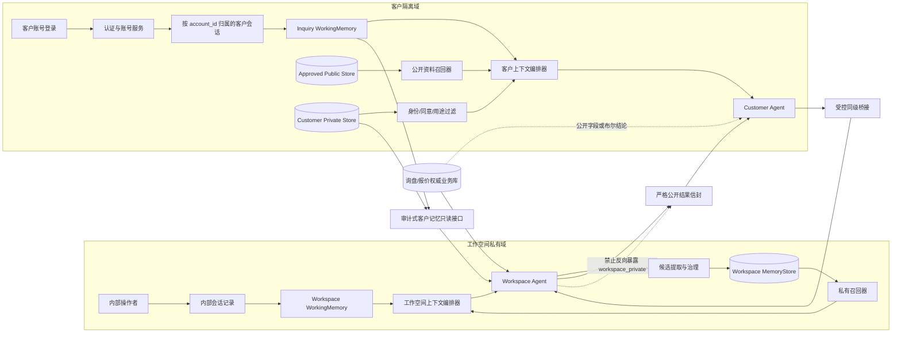

# 工作空间 Agent 与客户 Agent 记忆管理设计

> 文档状态：设计完成，运行代码尚未按本文升级  
> 设计依据：`docs/archive/记忆管理更新.md` 的三层记忆、作用域、版本、召回与治理原则  
> 适用范围：内部工作空间 Agent、具备账号登录的客户 Agent，以及二者之间的受控单向记忆访问与同级协作  
> 最后更新：2026-07-24（Asia/Shanghai）

> 代码级模块、表结构、接口、路由、装配和测试设计见 `docs/architecture/双Agent记忆管理代码设计.md`。

## 1. 设计结论

工作空间 Agent 与客户 Agent 可以复用同一组记忆接口，但不能共用数据、索引命名空间、默认召回策略或保留策略。

- **工作空间 Agent** 面向内部操作者，记忆服务于项目执行、跨会话复用和可审计协作。
- **客户 Agent** 面向外部客户。目标系统为客户门户建立账号，以服务端可信 `account_id` 归属历史对话和客户长期记忆；客户登录后从服务端恢复该账号自己的历史对话。
- `workspace/customer_memory/PUBLIC_MEMORY.md` 是经人工批准、对所有客户可公开的组织级参考资料，不是客户个人长期记忆。
- 产品、数量、目的地、贸易术语等字段进入结构化询盘草稿；正式询盘、报价、库存和审批仍以业务数据库为权威来源。
- 记忆权限是**单向的**：经内部授权和审计的工作空间 Agent 可以只读客户 Agent 的对话记忆和长期记忆；客户 Agent 永远不能读取、搜索或推断工作空间 Agent 的私有记忆。
- 工作空间 Agent 可以协助分析客户需求，但只向客户 Agent 返回经过公开门禁的最小结论；内部记忆、来源原文和检索分数永不进入客户上下文。

## 2. 当前代码基线

| 对象 | 当前实现 | 代码证据 | 结论/缺口 |
|---|---|---|---|
| 工作空间会话 | `workspace/sessions/*.jsonl` 按 `session_key` 保存并完整加载 | `session/manager.py`、`main.py` | 已持久化，但上下文随会话增长 |
| 工作空间共享记忆 | 完整注入 `workspace/memory/MEMORY.md` | `agent/context.py` | 是共享提示文本，不是结构化长期记忆库 |
| 工作空间压缩 | 超过 16000 Token 时只压缩当次消息并追加 `HISTORY.md` | `agent/memory.py`、`agent/loop.py` | 不替换持久活动历史；下次仍完整加载 |
| 客户会话 | 独立保存到 `workspace/customer_sessions` | `main.py`、`config.py` | 已与内部目录隔离 |
| 客户公开记忆 | 可选完整注入 `PUBLIC_MEMORY.md`，模型不能自行写入 | `main.py`、`agent/context.py` | 是全局公开资料，不是每客户记忆 |
| 客户历史裁剪 | 客户 Agent 复用 `AgentLoop`，但未挂载压缩器 | `agent/customer_agent.py`、`main.py` | 未实现；客户 JSONL 完整回放 |
| 客户身份 | 服务端签名匿名 Cookie + 浏览器 `conversation_id` | `channels/customer_portal.py` | 不是生产客户账户，不能安全支撑跨设备个人记忆 |
| 客户账号/登录 | 当前没有客户账号 Repository、登录 API、认证会话或账号级对话查询 | `channels/customer_portal.py`、`customer-preview.js` | 待设计实施；不能把当前匿名 Cookie 描述为客户账号 |
| 登录后历史恢复 | 当前对话列表来自前端状态，没有按账号从服务端读取历史 | `customer-preview.js` | 待实现账号归属、列表/详情 API 与所有权校验 |
| 客户删除 | 前端只删除当前 DOM 中的对话 | `customer-preview.js` | 不删除服务端客户/peer 会话 |
| 同级协作历史 | 客户会话键哈希后持久化到 `workspace/peer_sessions` | `agent/peer_coordination.py` | 保存客户原文但缺少 TTL 与级联删除合同 |

当前尚无客户账号系统、结构化 `WorkingMemory`、完整轮次裁剪、冷归档、结构化 `MemoryItem`、强作用域召回，以及客户查看/纠正/导出/删除闭环。因此本文均为目标设计，不代表代码已实现。

## 3. 数据域与强制作用域

### 3.1 四个数据域

| 数据域 | 用途 | 典型内容 | 客户可见性 |
|---|---|---|---|
| `workspace_private` | 内部任务执行与经验复用 | 项目约束、内部偏好、已验证故障原因 | 不可见 |
| `customer_private` | 已认证客户的服务连续性 | 客户明确同意保存的语言和稳定偏好 | 仅同一客户 |
| `customer_conversation` | 当前询盘执行 | 目标、已确认字段、缺失字段、待确认项 | 仅当前客户当前对话 |
| `public_approved` | 全体客户可用的批准资料 | 公开产品说明、公开政策 | 所有客户只读 |

`trade_rag` 企业知识库是第五个独立数据域。它可复用检索接口，但不能与用户长期记忆共用存储、索引、ACL 或删除策略。

### 3.2 服务器可信作用域

```python
@dataclass(frozen=True)
class MemoryScope:
    realm: Literal[
        "workspace_private", "customer_private",
        "customer_conversation", "public_approved",
    ]
    tenant_id: str
    account_id: str | None
    subject_id: str | None
    project_id: str | None
    conversation_id: str | None
    purpose: str
```

`account_id` 是客户账号的稳定内部 UUID；不得使用邮箱、手机号或用户名直接充当记忆主键。模型不得提交或覆盖这些字段。查询必须先按 realm、租户、账号/主体、项目、对话、用途、状态和有效期做完全相等过滤，再进行关键词或向量检索；禁止先跨域召回再过滤。

## 4. 双 Agent 目标架构



两类 Agent 的上下文顺序均为：安全规则 → 结构化工作状态 → 通过过滤的 Top-K 记忆 → 最近完整轮次 → 当前消息。但两类 Agent 使用不同 Store、不同身份合同和不同写入政策。工作空间 Agent 对客户记忆的访问只经过专用只读接口；客户 Agent 的工具和召回器中不存在任何 `workspace_private` 入口。

## 5. 工作空间 Agent 设计

### 5.1 会话与短期工作记忆

- 每条原始消息增加 `message_id`、`conversation_id`、`actor_id`、时间与完整性字段。
- 活动历史只保留最近 N 个完整用户轮次；`assistant.tool_calls` 与对应 `tool` 消息不可拆分。
- 移出的原文进入冷归档，活动文件通过临时文件和原子替换更新。
- 摘要、归档或替换失败时不裁剪原历史，并暴露可观测的降级状态。

```python
@dataclass
class WorkspaceWorkingMemory:
    goal: str
    constraints: list[EvidenceItem]
    confirmed_facts: list[EvidenceItem]
    hypotheses: list[EvidenceItem]
    pending_actions: list[ActionItem]
    completed_actions: list[ActionItem]
    important_tool_results: list[EvidenceItem]
    approvals_required: list[ApprovalItem]
```

工具结果必须经结构或权威来源校验后才能进入 `confirmed_facts`。报价、库存、审批、邮件投递等动态事实只引用业务记录 ID 和版本；`pending_confirmation` 不得被记忆提升为确定事实。

### 5.2 长期记忆

允许保存内部操作者明确表达的稳定偏好、经文件/测试/权威数据库验证的项目约束、有复用价值的重要事件结论和已验证程序方法。

默认禁止保存凭据、Cookie、邮箱授权码、完整邮件正文、未经授权的第三方个人数据、模型推断、临时工具原文、未批准报价和动态库存快照。

检索按 `tenant_id + actor_id/project_id + purpose` 强过滤。项目记忆不能自动提升为操作者全局记忆，其他项目记忆也不能只因语义相似而串入当前项目。

## 6. 客户 Agent 设计

### 6.1 客户账号与认证

客户门户新增独立账号域。账号、认证凭据、业务资料和 Agent 记忆分库存储，记忆系统只接收认证服务签发的内部 `account_id`，不处理密码。

```python
@dataclass
class CustomerAccount:
    account_id: str                 # 服务端 UUID，不可枚举
    tenant_id: str
    login_identifier_normalized: str
    credential_ref: str             # 密码哈希或外部 IdP subject 的引用
    status: Literal["active", "locked", "disabled", "deleted"]
    preferred_locale: str
    created_at: str
    last_login_at: str | None
```

认证合同：

- 密码只以现代自适应算法哈希保存在认证库，明文密码、验证码、刷新令牌和 Cookie 永不进入会话历史或长期记忆。
- 登录成功后签发服务端认证会话；Cookie 使用 `HttpOnly`、`Secure`、合适的 `SameSite`，状态变更接口同时执行 CSRF 防护和速率限制。
- WebSocket 建连时由服务端认证会话解析 `account_id`；不接受浏览器在消息体中自报账号。
- 每次读取对话或记忆都重新校验账号状态、租户和资源所有权；禁用/删除账号立即阻止召回。
- 客户 Agent 的稳定会话键建议为 `customer_portal:account:<account_id>:<conversation_id>`；文件名或日志中不写邮箱、手机号和用户名。

### 6.2 登录后恢复历史对话

历史对话是独立的会话记录，不等同于长期记忆。目标会话元数据至少包含：

```python
@dataclass
class CustomerConversation:
    conversation_id: str
    tenant_id: str
    account_id: str
    title: str
    created_at: str
    updated_at: str
    last_message_at: str | None
    status: Literal["active", "archived", "deleted"]
```

登录后的恢复流程：

1. 客户提交登录凭据，认证服务返回服务端会话，前端不持久化访问令牌。
2. 前端调用 `GET /api/customer/conversations?cursor=...`；服务端只按认证得到的 `tenant_id + account_id` 分页返回元数据。
3. 客户选择某个对话后调用 `GET /api/customer/conversations/{conversation_id}/messages?cursor=...`；服务端再次校验所有权并分页返回历史消息。
4. WebSocket 发送消息时只接受属于当前账号的 `conversation_id`；不存在或越权统一返回资源不可用，避免枚举其他账号。
5. Gateway 按账号和对话构造 `session_key`，Customer Agent 只加载该对话最近的有界活动历史，并按 `account_id` 召回该客户已获同意的长期记忆。

“登录后出现历史对话”必须来自服务端会话清单和消息接口，不能依赖浏览器内置示例、`localStorage` 或把全部历史消息注入长期记忆。列表默认按 `last_message_at` 倒序并分页；归档对话可查看但不自动注入当前模型上下文。

### 6.3 匿名对话归属

未登录客户仍只使用匿名 Cookie 范围的短期对话和询盘工作记忆，不创建 `customer_private` 长期记忆。客户登录后可以显式选择“将本设备当前匿名对话保存到账号”：

- 服务端必须同时验证当前匿名签名会话和已登录账号。
- 通过事务把选中的对话从 `anonymous_subject_id` 绑定到 `account_id`，生成不可变审计记录并更新 peer bridge 关联。
- 同一个匿名对话只能认领一次；已属于其他账号时 fail closed，模型无权执行合并。
- 未选择认领的匿名对话按短期保留策略清理；不得通过 IP、User-Agent、邮箱相似度或对话内容推断归属。

匿名会话建议默认保留 30 天，最终期限由法务和业务确认。到期同时清理客户活动历史、冷归档、工作记忆、peer 历史和派生索引。

### 6.4 询盘工作记忆

```python
@dataclass
class CustomerInquiryWorkingMemory:
    intent: str
    product_refs: list[EvidenceItem]
    quantity: PendingValue | ConfirmedValue | None
    destination: PendingValue | ConfirmedValue | None
    incoterm: PendingValue | ConfirmedValue | None
    requested_delivery_date: PendingValue | ConfirmedValue | None
    contact_fields: dict[str, PendingValue | ConfirmedValue]
    missing_fields: list[str]
    customer_confirmed_at: str | None
    inquiry_record_id: str | None
```

- 只保存客户自己提供的字段、公开工具结果和通过公开门禁的 peer 结论，并保留来源消息 ID。
- 数量、单位、目的地、贸易术语、交期、价格、库存和批准状态不得猜测。
- 联系信息属于本次询盘业务数据，不因出现过就自动变成长期偏好。
- 创建正式询盘后只保留 `inquiry_record_id` 与必要版本，后续状态从业务库读取。

### 6.5 账号级长期记忆

客户通过生产身份系统获得稳定内部 `account_id`，且页面说明保存内容、用途、期限和撤回方式并取得显式同意后，才允许创建 `customer_private` 记忆。每条必须具备 `tenant_id`、`account_id`、`consent_record_id`、`purpose`、`expires_at` 和来源引用。

可保存的最小集合限定为界面语言、沟通偏好和客户明确要求记住的稳定产品偏好。公司法定信息、地址、联系人和历史询盘优先从 CRM/业务库读取，不在向量记忆中复制。

每次完整交互后只生成候选记忆，经敏感过滤、去重和同意门禁后写入该账号命名空间。客户 Agent 只能按当前认证账号召回 Top-K；历史对话仍由会话服务加载，不把整个账号的聊天记录向量化后无条件注入。

账号合并和主体转移必须由确定性身份服务执行并审计，不能由模型决定。账号注销时启动账号级删除任务，清理其会话、工作状态、长期记忆、索引和缓存；依法必须保留的正式询盘进入业务库的独立保留合同，不继续作为 Agent 记忆召回。

### 6.6 公开组织记忆

将现有 `PUBLIC_MEMORY.md` 定义为 `public_approved` 的兼容只读视图：

- 来源具备版本、发布人、发布时间和撤回状态。
- 客户 Agent 只读；模型建议更新只能形成内部审核任务。
- 只召回相关 Top-K，不再完整注入所有公开资料。
- 撤回后同步失效结构化记录、关键词索引、向量索引和缓存。

## 7. 单向记忆访问权限

权限方向固定为“工作空间可按授权只读客户记忆，客户永远不可读工作空间记忆”。这不是两个 Store 的互相信任，也不能只依赖 System Prompt；必须由服务端身份、独立接口和数据库权限共同保证。

| 调用主体 | `workspace_private` | 本账号 `customer_private` | 本账号 `customer_conversation` | 其他客户数据 | `public_approved` |
|---|---|---|---|---|---|
| 客户 Agent | 禁止 | 只读；可提交候选写入 | 读写当前对话状态 | 禁止 | 只读 |
| 工作空间 Agent | 按内部权限读写 | 经授权、带用途、审计式只读 | 经授权、带用途、审计式只读 | 仅在操作者具备该客户服务权限时只读 | 只读 |
| 客户记忆治理服务 | 禁止 | 按同意执行写入/纠正/删除 | 按生命周期维护 | 按账号逐一隔离 | 禁止 |
| 公开资料发布服务 | 禁止 | 禁止 | 禁止 | 禁止 | 审批后写入/撤回 |

工作空间 Agent 读取客户记忆时使用专用合同：

```python
@dataclass(frozen=True)
class CustomerMemoryReadRequest:
    operator_id: str
    tenant_id: str
    customer_account_id: str
    purpose: Literal["customer_support", "rfq_review", "complaint_resolution"]
    conversation_id: str | None
    query: str
    top_k: int
```

- 服务端先验证内部操作者角色、租户、客户归属和用途，再按 `account_id` 搜索；每次读取记录操作者、客户账号、用途、时间、返回条目 ID 和结果数量，但不在普通日志复制记忆原文。
- 工作空间 Agent 默认只读，不得通过该接口修改客户记忆。纠正、删除或合并必须进入客户记忆治理服务并遵循客户同意/业务审计。
- 返回内容只能留在工作空间私有上下文。若要回复客户，必须重新经过 `status/public_answer/basis` 公开信封和现有防泄露门禁。
- Customer Agent 的进程身份、数据库角色、工具注册表、配置和召回器均不包含工作空间 Store 的连接凭据或读取 API；即使客户提示词要求读取也应得到确定性拒绝。
- 权限测试必须覆盖直接 ID 枚举、篡改 `account_id`/`conversation_id`、跨租户访问、向量近邻跨账号串读、提示注入和缓存键污染。

## 8. 同级协作的记忆边界

当前 peer 会话会持久化客户原文。目标合同如下：

1. 桥接请求携带不可逆 `bridge_id`、客户会话引用、用途、到期时间和最小化需求文本。
2. peer 默认使用单请求临时上下文；确需连续分析时，只保存 `customer_conversation` 范围工作状态，不能写入工作空间长期记忆。
3. 客户原文、联系方式和询盘细节不得被工作空间候选提取器吸收为操作者或项目长期记忆。
4. peer 仍只返回 `status/public_answer/basis` 信封，不返回 `memory_id`、内部来源、相似度、内部价格、精确库存或推理文本。
5. 删除客户对话时按 `bridge_id` 级联删除 peer 活动历史、工作状态、冷归档和缓存；最小审计不保留原文。
6. 需要长期保留的询盘必须先进入确定性业务流程，不能用 peer 会话代替 CRM/询盘库。

## 9. 统一数据模型与接口

```json
{
  "memory_id": "mem_01...",
  "memory_type": "semantic",
  "realm": "workspace_private",
  "tenant_id": "tenant_01...",
  "account_id": null,
  "subject_id": "actor_01...",
  "project_id": "project_nanoclaw",
  "conversation_id": null,
  "purpose": "project_assistance",
  "visibility": "internal_only",
  "content": "修改中文 Markdown 时使用 UTF-8 读取。",
  "source_refs": ["message:01...", "file:doc/example.md@sha256:..."],
  "status": "active",
  "confidence": 0.95,
  "importance": 0.8,
  "sensitivity": "internal",
  "consent_record_id": "consent_01...",
  "valid_from": "2026-07-24T18:00:00+08:00",
  "expires_at": null,
  "version": 1,
  "supersedes": null,
  "content_hash": "sha256:...",
  "embedding_model": "provider/model@version"
}
```

工作空间项目事实的 `consent_record_id` 可指向内部政策依据；客户私有记忆必须指向客户显式同意。缺少必要依据时拒绝写入。

```python
class ScopedMemoryStore:
    def upsert(self, actor, scope, item): ...
    def search(self, actor, scope, query, top_k): ...
    def supersede(self, actor, scope, old_id, new_item): ...
    def invalidate(self, actor, scope, memory_id, reason): ...
    def delete_scope(self, actor, scope, request_id): ...
    def export_scope(self, actor, scope): ...

class CustomerMemoryReader:
    def search_for_workspace(self, request: CustomerMemoryReadRequest): ...
```

接口内部必须重新计算 ACL，不能只信任调用方传入的 `scope`。`CustomerMemoryReader` 使用客户存储的只读数据库角色，且不向客户 Agent 注册。

## 10. 目标存储隔离

| 数据 | 开发目标 | 生产建议 |
|---|---|---|
| 客户账号与认证会话 | 独立 `customer_auth.sqlite`（仅本地开发） | 专用身份服务/认证数据库；密码哈希和会话令牌不进记忆库 |
| 工作空间活动/归档历史 | `workspace/sessions/{active,archive}/` | 独立保留策略的加密存储 |
| 工作空间长期记忆 | `workspace/memory/private.sqlite` | PostgreSQL + 私有向量命名空间 |
| 客户活动/归档历史 | `workspace/customer_sessions/{active,archive}/` | 按租户/主体隔离的客户会话库 |
| 客户私有长期记忆 | `workspace/customer_memory/private.sqlite` | 单独数据库角色和向量命名空间 |
| 批准公开资料 | `workspace/customer_memory/public.sqlite` | 公开发布库 + 只读索引 |
| peer 临时状态 | `workspace/peer_sessions/active/` | 带 TTL 的隔离存储，禁止长期索引 |

目录隔离只是第一层；生产还需不同数据库角色、加密密钥、备份集合、访问日志和删除任务。

## 11. 生命周期

### 11.1 写入

候选提取 → 来源校验 → 主体/用途校验 → 敏感过滤 → 同意校验 → 去重/冲突 → 结构化主存 → 派生索引。主存成功但索引失败时写可重试 outbox；主存失败时不得只写向量。冲突创建新版本，无法判断时保持 `pending_confirmation`。

### 11.2 召回

可信主体 → realm/tenant/account/subject/project/conversation/purpose/状态/有效期过滤 → 关键词与向量召回 → 去重重排 → 可见性过滤 → Top-K 注入。客户侧在注入前和输出后都执行防泄露门禁；工作空间读取客户记忆还要执行内部操作者授权和用途审计。

### 11.3 删除

删除是幂等任务，依次清理活动历史、冷归档、工作记忆、结构化长期记忆、关键词索引、向量索引和缓存。部分失败时保持可重试，在完全成功前不返回“已完全删除”。

## 12. 配置建议

配置按 agent 类型拆分，禁止一个全局开关同时控制内外部记忆：

```json
{
  "customer_auth": {
    "enabled": false,
    "session_idle_minutes": 30,
    "session_absolute_hours": 12,
    "allow_anonymous_claim": true
  },
  "memory": {
    "workspace": {
      "enabled": false,
      "max_turns": 10,
      "recall_top_k": 3,
      "auto_write": false,
      "customer_memory_read_enabled": false,
      "customer_memory_allowed_purposes": ["customer_support", "rfq_review", "complaint_resolution"]
    },
    "customer": {
      "conversation_memory_enabled": false,
      "authenticated_long_term_enabled": false,
      "anonymous_retention_days": 30,
      "recall_top_k": 2,
      "auto_write": false
    },
    "public_approved": {"enabled": true, "recall_top_k": 3},
    "peer_bridge": {"persist_history": false, "ttl_hours": 24}
  }
}
```

数值仅为初始建议，需真实任务、隐私和容量评审后确定；首次发布默认关闭自动长期写入。

## 13. 实施计划

| 阶段 | 工作空间 Agent | 客户 Agent | 完成定义 |
|---|---|---|---|
| M0 身份与 ACL 契约 | 固定内部操作者角色和客户记忆只读用途 | 固定账号、认证会话、资源所有权和禁止反向读取合同 | 直接/跨租户/跨账号负向测试齐全 |
| M1 客户账号与历史 | 接入受控客户支持角色 | 账号 Repository、登录/登出、认证 Cookie、对话列表/详情、匿名认领 | 登录后只出现本账号服务端历史 |
| M2 有界会话 | 完整轮次裁剪、归档、原子替换 | 按账号和对话实施相同边界 | 重启后上下文有界且工具链完整 |
| M3 工作记忆 | 目标/约束/事实/待办/审批 | 询盘字段/缺失项/确认状态 | 裁剪后仍能继续任务/询盘 |
| M4 结构化长期记忆 | 项目/操作者记忆、版本、删除 | 按账号写入同意记忆；`public_approved` 独立发布 | 来源、冲突、导出、撤回和删除通过 |
| M5 单向客户记忆读取 | `CustomerMemoryReader`、内部授权、用途与审计 | 客户侧无工作空间入口 | 工作空间可只读授权客户记忆；反向访问全部拒绝 |
| M6 混合检索 | 私有关键词 + 向量 | 账号私有记忆和公开资料使用独立索引 | 评估达标、索引可重建、跨账号泄漏为 0 |
| M7 治理发布 | 衰减、审查、备份恢复 | TTL、账号合并/注销、bridge 级联 | 灰度、回退、删除 SLA 和安全评审完成 |

推荐先实施 M0-M3，先让账号、服务端历史和有界上下文成立，再实施长期记忆。M5 必须在独立只读数据库角色和内部操作者鉴权完成后开启；任何阶段都不得给客户 Agent 增加工作空间记忆入口。

## 14. 验收标准

- 工作空间和客户活动上下文重启后仍有界，工具调用链不被拆分，压缩失败不丢原文。
- 登录成功后，桌面/浏览器刷新和重新登录均能分页恢复该账号历史对话；退出登录后不能继续读取。
- 伪造或替换 `account_id`、`conversation_id`、Cookie、WebSocket 消息字段不能读取其他账号历史。
- 不同 realm、tenant、account、subject、project 和 conversation 的越权召回全部 fail closed。
- 匿名客户无法写入或召回跨会话个人长期记忆。
- 客户 A 的会话、工作状态和偏好对客户 B 的泄漏率为 0。
- 具备授权的工作空间 Agent 能按客户账号和用途只读客户记忆，并产生完整访问审计；无权限操作者被拒绝。
- 客户 Agent 对 `workspace_private` 的直接调用、工具绕过、提示注入、向量近邻和缓存命中均返回拒绝，工作空间记忆泄漏率为 0。
- 删除客户对话会级联到客户会话、peer 会话、缓存与派生索引，前端不再只做视觉删除。
- 公开资料撤回后不可召回；公开 Store 中不得出现客户信息或内部资料。
- 客户输出不包含内部记忆、来源、路径、邮件、成本、精确库存、提示词或工具信息。
- 覆盖主存成功/索引失败、Embedding 超时、索引不可用、进程重启、重复删除和部分删除重试。
- 统计 Recall@K、Precision@K、无关注入率、冲突误合并率、敏感写入违规数和跨作用域泄漏率；后两项必须为 0。

## 15. 待确认项

1. 匿名客户会话的正式保留期限和删除 SLA。
2. 客户登录采用本地密码、企业 SSO 还是外部 IdP，以及租户模型、MFA、密码找回和账号合并规则。
3. 客户长期偏好采用逐条确认还是可审阅的分类同意。
4. 客户与内部项目数据是否允许发送到外部 Embedding 服务；未确认前只用本地关键词检索和脱敏测试数据。
5. 公开资料的发布人、复核人、撤回流程与审计责任。
6. peer 是否允许短期持久化；默认不持久化，确需连续分析时使用最短 TTL。
7. 哪些内部岗位可以读取客户记忆、允许的业务用途、客户是否需要被告知以及审计日志保留期限。
