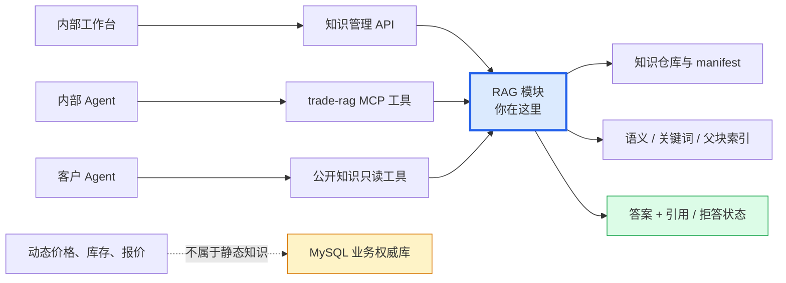
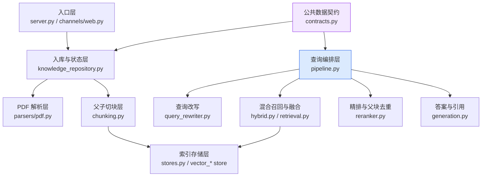
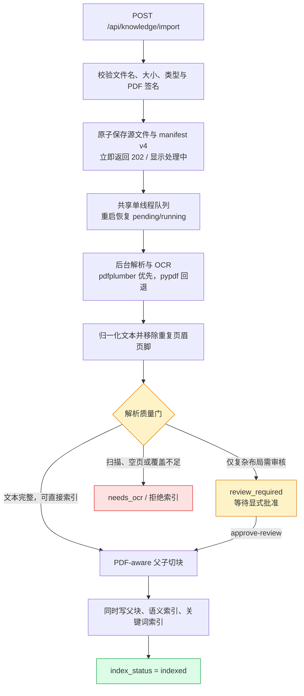
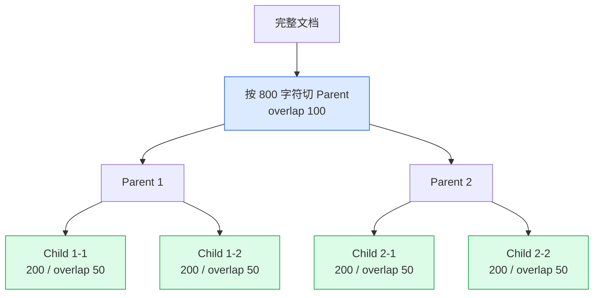
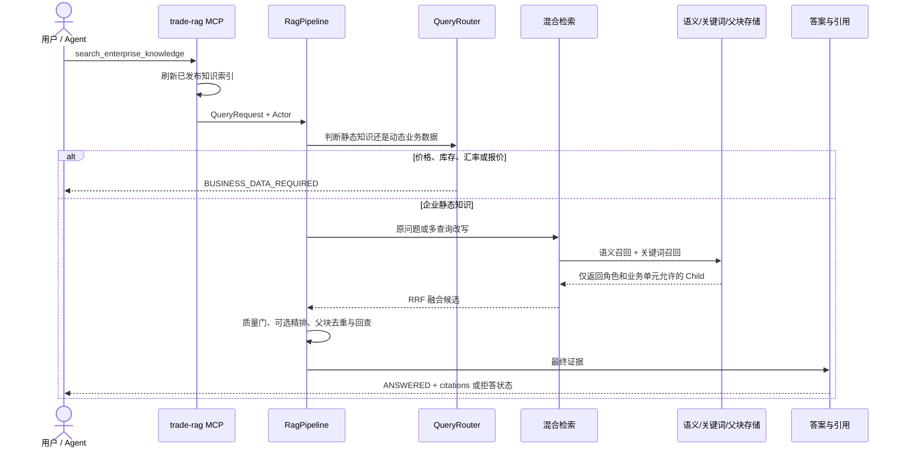
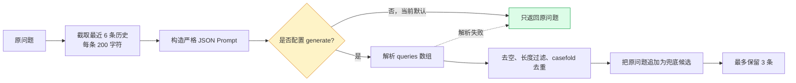

# NanoClaw RAG 实习生介绍

> 适合对象：第一次接触 RAG、需要阅读或修改 `trade_rag/` 的实习生。  
> 阅读目标：先理解 RAG 为什么存在，再能顺着“文档入库”和“用户查询”两条主链找到代码。  
> 当前代码基线：`E:\agent\nanoclaw`，2026-07-26。

## 一句话结论

NanoClaw 的 **RAG**（先从已批准资料中找证据，再依据证据回答）模块，是企业知识的受控图书馆：它负责安全导入文本和 PDF、保留页码来源、建立父子块索引、按权限混合检索，并返回有引用的答案或明确拒答。

## 为什么需要 RAG

语言模型知道的是训练时学到的通用知识，不知道企业刚更新的产品手册、操作规范和内部制度。如果把整份文档都塞给模型，成本高、上下文容易超限，也很难说明答案来自哪一页。

RAG 解决的是三个问题：

1. 找得到：把大文档拆成可检索的小块，先找到与问题相关的证据。
2. 答得稳：没有足够证据时返回“无法确定”，而不是让模型猜。
3. 查得到来源：答案附带文档、版本、页码和 chunk 标识，便于复核。

你可以把它理解为图书馆：导入是收书和编目，切块是制作目录卡，Embedding 是按含义摆书，关键词索引是按书名查目录，Rerank 是馆员把候选资料重新排队，Citation 是借阅单上的书名和页码。

## 它在项目中的位置



⭐ RAG 处理相对稳定的企业知识。价格、库存、汇率、报价等动态业务数据会返回 `BUSINESS_DATA_REQUIRED`，要求上层改查 MySQL；RAG 自己不会代替业务数据库。

## 内部结构



这里的架构是“模块化单体”：RAG 代码与主应用在同一个仓库中，但通过 Web API、MCP 工具和明确的数据契约隔开职责。

## 核心术语速查

| 术语 | 大白话 | 本项目中的位置 |
|---|---|---|
| Canonical Document | 统一格式的知识文档 | `contracts.py::CanonicalDocument` |
| Chunk | 从大文档切出来的一段文字 | `ParentChunk`、`ChildChunk` |
| Parent/Child | 小块负责精确命中，大块负责补全上下文 | `ParentChildSplitter`、`PdfAwareParentChildSplitter` |
| Embedding | 把文字变成一串代表含义的数字 | `embeddings.py` |
| Semantic Search | 不只匹配原词，还按语义相近程度搜索 | VectorStore |
| Keyword Search | 按实际出现的词搜索 | `InMemoryKeywordStore` |
| Hybrid Retrieval | 同时走语义和关键词两条路再合并 | `HybridRetriever` |
| RRF | 按各路排名融合结果，不直接硬比不同分数 | `reciprocal_rank_fusion()` |
| Rerank | 对召回候选做第二次精细排序 | `ListwiseReranker` |
| ACL | 服务端检查“谁能看这份资料” | `business_unit_id`、`allowed_roles` |
| Citation | 答案的出处凭证 | 文档 ID、版本、位置、Child ID |
| manifest | 知识库的总登记表 | `workspace/knowledge_base/manifest.json` |

## 主链一：一份 PDF 怎么进入知识库

> 用户故事：作为内部运营人员，我想上传一份 PDF 产品手册，以便 Agent 后续能引用手册中的准确内容回答问题。



逐跳对应代码：

1. `channels/web.py::import_knowledge()` 接收原始文件；PDF 先由 `stage_pdf()` 原子保存并立即返回 HTTP 202。
2. `PdfIngestionCoordinator` 由两个本地 Web 端口共享，一次只处理一个 PDF，并在启动时恢复 pending/running 记录。
3. `KnowledgeRepository.process_staged_pdf()` 持久更新 parse/chunk/index 阶段、次数、时间和安全错误码。
4. `parsers/pdf.py::parse_pdf_bytes()` 在可终止的子进程里解析，避免坏 PDF 长时间卡住主服务。
5. `pdfplumber` 是主解析器；失败或提取效果更差时尝试 `pypdf`，同时记录 fallback warning。
6. `ParseResult.route` 根据 OCR、文本覆盖和复杂布局告警决定 `index`、`review_required` 或 `needs_ocr`。
7. `PdfAwareParentChildSplitter.split()` 保留一页或多页的准确来源位置，生成稳定 Parent/Child ID。
7. `KnowledgeRepository.index_pdf()` 调用 `RagPipeline.index_prepared()`，要求父块、语义索引和关键词索引数量全部吻合；任一步失败就删除这次索引并标记失败。

### PDF 状态该怎么理解

| 情况 | 状态/路由 | 能否直接索引 | 怎么处理 |
|---|---|---|---|
| 文本完整、布局普通 | `published` + `index` | 可以 | 自动切块并索引 |
| 文本完整，但检测到复杂布局 | `review_required` | 不可以 | 人工确认后调用 `approve-review` |
| 扫描件、连续空白或文本太少 | `needs_ocr` | 不可以 | 当前没有 OCR，需换文件或补充 OCR 流程 |
| 混合页或部分页面无文本 | `review_required` | 不可以 | 当前保持 fail-closed，不能强行批准 |
| 文件签名、页数、大小或文本量不合法 | 稳定错误码 | 不可以 | 修正输入，不能绕过门禁 |

⚠️ `classification=internal` 或 `classification=public` 只说明披露范围，不代表 PDF 已通过解析质量审核。改变分类不能替代 `approve-review`。

⚠️ 只有“完整提取且唯一告警是复杂布局”的 PDF 才允许人工批准。扫描件、混合页、部分覆盖和空白页不能用批准按钮绕过。

## 为什么要使用父子块

如果 chunk 太小，容易命中精准，但上下文不完整；如果 chunk 太大，上下文完整，却很难准确搜索。父子块把这两个目标拆开：

```text
PDF 第 5 页的一段说明（父块，约 800 字）
├─ 子块 A（约 200 字）← 用于搜索
├─ 子块 B（约 200 字）← 用于搜索
└─ 子块 C（约 200 字）← 用于搜索

命中子块 B → 回查整个父块 → 给答案提供更完整证据
```

当前普通文本和 PDF 都采用父子策略；PDF 专用 splitter 还会保存 `page:5` 或 `pages:5-6` 等位置，让最终引用能回到原页。

## Chunk 到底怎么切：算法与参数详解

### 1. 先看默认参数

| 场景 | Parent 大小 | Parent overlap | Child 大小 | Child overlap | 计量单位 |
|---|---:|---:|---:|---:|---|
| 普通文本 | 800 | 100 | 200 | 50 | Python 字符数，不是 Token |
| PDF | 800 | 0 | 200 | 50 | Python 字符数，不是 Token |

参数来自 `ParentChildSplitter()` 与 `PdfAwareParentChildSplitter()` 的构造函数。普通文本先用 `RecursiveSplitter(800, 100)` 切 Parent，再在每个 Parent 内用 `RecursiveSplitter(200, 50)` 切 Child。PDF 需要精确保留页码和结构，因此采用另一套分组逻辑，Parent 不做跨组 overlap。

⚠️ 这里的 `200`、`800` 都是字符数。中文一个汉字通常计 1 个字符，英文单词由多个字符组成；它们不能直接当成模型 Token 数。

### 2. 普通文本的 RecursiveSplitter

`RecursiveSplitter` 会按以下分隔符从“最自然”到“最不得已”逐级尝试：

```text
段落空行 \n\n
  → 单换行 \n
    → 中文句号 。
      → 中文感叹号 ！
        → 中文问号 ？
          → 中文分号 ；
            → 空格
              → 按字符硬切
```

实际步骤如下：

1. 保护 Markdown 围栏代码块：从三个反引号或波浪号开始到对应结束标记，整体视为原子片段。
2. 如果文本长度不超过 `chunk_size`，直接保留。
3. 如果超长，使用当前层分隔符拆分，并把分隔符保留到后一个片段开头。
4. 某个片段仍然超长时，递归尝试下一种分隔符；所有分隔符都失败后按字符硬切。
5. 相邻小片段只要合并后不超过大小上限，就重新合并。
6. 如果一个 Markdown 标题后面还有正文块，把标题与紧邻正文粘在一起。
7. 从第二个块开始，把前一个块末尾的 `chunk_overlap` 个字符加到当前块开头。

例如 `chunk_size=10`、`overlap=3`：

```text
原始块 1：abcdefghij
原始块 2： klmnopqrs

最终块 1：abcdefghij
最终块 2：hij klmnopqrs
           ^^^ 来自前一个块的尾部
```

需要知道的边界：

- 围栏代码块为了不破坏语义，可以整体超过 `chunk_size`。
- 标题与正文粘合、增加 overlap 后，最终块也可能略大于配置大小。
- overlap 是复制文本，不是移动文本，因此相邻块之间会有内容重复。
- Chunk 的顺序 ID 从 0 开始；业务 Parent/Child ID 则由文档 ID、版本、内容等字段计算 SHA-256 后截取 20 位，保证同一输入重复切分结果稳定。

### 3. 普通文本如何生成 Parent 和 Child



每个 Child 都保存自己的 `parent_id`。索引阶段只对 Child 生成 Embedding 和关键词索引；Parent 单独放入 Parent Store，命中 Child 后再回查 Parent。

### 4. PDF 为什么不能照搬普通文本切法

PDF 的 `PdfAwareParentChildSplitter` 先把解析结果中的 `ParsedBlock` 转成结构单元。每个单元带有页码、章节路径和类型：`heading`、`paragraph`、`table` 或 `list`。

它的 Parent 分组在遇到以下任一条件时立即结束当前 Parent：

- 加入新单元后会超过 `parent_chars=800`。
- 章节路径发生变化，而且新单元带有章节路径。
- 页码出现跨页跳跃，例如上一块在第 2 页、新块从第 4 页开始。
- 当前单元或上一个单元是表格；表格独立成 Parent，避免与普通段落混在一起。

PDF Child 的特殊处理：

- 标题本身先记住，不单独生成普通 Child；后续正文 Child 会带上最多 80 字符的标题前缀。
- 加标题后如果超过 `child_chars=200`，正文会被截到剩余空间。
- 长表格按行切分，每个表格 Child 都重复列标题，避免检索到某一行却不知道各列含义。
- `Page 3`、`3 / 10`、`Copyright 2026` 等纯页码或版权伪内容会被过滤。
- 每个 Parent/Child 保存 `page_start`、`page_end`、`section_path`、`block_type`、ACL、分类、source hash 和 splitter version。
- 如果一个分组只有标题、没有正文，系统仍生成一个 heading-only Child，避免整段知识消失。

### 5. 调整 Chunk 参数会影响什么

| 调整 | 可能收益 | 主要风险 |
|---|---|---|
| 减小 Child | 命中更精准 | 语义不完整、Child 数和索引成本增加 |
| 增大 Child | 单块信息更完整 | 不相关内容混入，召回定位变粗 |
| 增大 overlap | 减少答案跨边界丢失 | 重复召回、存储和 Embedding 成本增加 |
| 增大 Parent | 回查上下文更完整 | 最终上下文噪声和 Token 消耗增加 |
| 修改 PDF 分组规则 | 更适配特殊版式 | 稳定 ID、页码引用、重建结果和回归测试都会变化 |

修改时至少要同步检查 `test_chunking.py`、`test_pdf_m3_chunking.py`、索引重建和引用结果，不要只看块数量。

## 主链二：用户问题怎么变成带引用答案

> 用户故事：作为内部运营人员，我想询问产品手册中的操作要求，并看到答案来自哪份文档、哪一页。



`RagPipeline.query()` 的执行顺序是：

1. 路由：动态业务词返回 `BUSINESS_DATA_REQUIRED`。
2. 改写：可按最近对话生成多个自包含问题；失败时使用原问题。
3. 召回：语义检索与关键词检索分别找候选，并按加权 RRF 融合。
4. 多查询融合：再次按 Child ID 做 RRF，避免重复候选膨胀。
5. 质量门：无结果是 `NO_EVIDENCE`；低分或前两名过近是 `AMBIGUOUS`。
6. 精排：只有高置信度、请求允许且配置了生成函数时才真正精排；失败保持原顺序。
7. 去重与扩展：每个父块只保留一条结果，再用 Parent 补全上下文。
8. 生成：有充分证据时返回 `ANSWERED` 与 citations，否则明确拒答。

## Query 怎么改写：历史、参数与回退

查询改写的目标不是“写得更漂亮”，而是解决两类检索问题：

- 指代消解：把“它怎么配置？”变成“Milvus 怎么配置？”。
- 同义表达：把同一意图换成检索更容易命中的表达方式。

### 默认参数

| 参数 | 默认值 | 含义 |
|---|---:|---|
| `num_queries` | 3 | 最多保留 3 个查询 |
| `max_history` | 6 | 只看最近 6 条历史消息 |
| `max_history_chars` | 200 | 每条历史最多进入 Prompt 200 字符 |
| `max_query_chars` | 50 | 每个改写结果最多 50 字符 |
| `max_input_chars` | 1000 | 当前原问题进入 Prompt 的最大长度 |

### 改写步骤



生成器被要求只返回：

```json
{"queries":["自包含主查询","等价表达 1","等价表达 2"]}
```

Prompt 约束第一条必须自包含，历史只能用于消除指代，不能改变用户意图或编造实体。解析后：

1. 只接受字符串数组。
2. 去除首尾空白和空字符串。
3. 丢弃超过 50 字符的候选。
4. 使用 `casefold()` 做不区分大小写的有序去重。
5. 在生成候选末尾追加原问题。
6. 从前向后最多取 3 条；如果生成器已经给出 3 条有效且不重复的查询，原问题可能不会进入最终列表。
7. JSON 错误、结构错误、调用异常或无有效结果时，都回退为 `[原问题]`。

示例：

```text
最近历史：用户正在讨论 DAG Runtime
当前问题：那个怎么实现

生成结果：
1. DAG Runtime 如何实现
2. dag runtime 如何实现
3. 图式运行时实现方法

去重并追加原问题后：
1. DAG Runtime 如何实现
2. 图式运行时实现方法
3. 那个怎么实现
```

⭐ 当前 `RagPipeline()` 默认构造的是 `QueryRewriter(generate=None)`，所以默认运行时不会调用模型改写，`query_count` 通常是 1。只有显式注入生成函数后，上述多查询逻辑才会真正启用。

## 双路召回怎么实现：语义、关键词与两级 RRF

### 1. 语义召回

语义路先把问题变成向量，再从 Vector Store 中搜索 Child：

- 本地默认 Embedding：`MockEmbeddingProvider`。
- 本地相似度：余弦相似度 `cos(document_vector, query_vector)`。
- 向量后端：默认 memory，可选择 pgvector 或 Milvus。
- 搜索前先按文档状态、过期时间、`business_unit_id` 和 `allowed_roles` 过滤。
- 同分时本地内存实现按 `child_id` 排序，保证结果稳定。

余弦相似度公式：

```text
cos(A, B) = (A · B) / (||A|| × ||B||)
```

它只比较方向是否接近，因此适合判断两段文字的“含义方向”是否相似。

### 2. 关键词召回

当前本地 `InMemoryKeywordStore` 的注释称其为 BM25 近似，但实际算法比 BM25 更轻量：

```text
terms = 从 query 中提取 [\w\u4e00-\u9fff]+ 片段
score = 每个 term 在 Child 文本中的出现次数之和
```

例如查询包含 `SKU-100`，某个 Child 中 `SKU` 和 `100` 出现次数更多，它的关键词分数就更高。分数为 0 的 Child 不进入关键词结果。

⚠️ 当前实现没有 BM25 的 IDF、文档长度归一化和真实中文分词，因此文档中应称为“关键词出现次数召回”或“BM25 近似”，不能宣称已经接入生产级 Elasticsearch BM25。

### 3. 第一级融合：同一个 Query 的双路加权 RRF

语义路和关键词路的原始分数量纲不同：余弦可能是 `0.82`，关键词次数可能是 `10`。系统不直接相加，而是根据排名做 **加权 RRF**：

```text
hybrid_score(d)
  = 0.7 / (60 + semantic_rank(d))
  + 0.3 / (60 + keyword_rank(d))
```

默认参数：

| 参数 | 默认值 |
|---|---:|
| `semantic_weight` | 0.7 |
| `keyword_weight` | `1 - semantic_weight = 0.3` |
| `rrf_k` | 60 |
| 单路默认 limit | 30；Pipeline 会按候选池动态放大 |

一个可手算的例子：

| Child | 语义排名 | 关键词排名 | 加权 RRF |
|---|---:|---:|---:|
| C0 | 1 | 未命中 | `0.7/61 = 0.01148` |
| C1 | 2 | 1 | `0.7/62 + 0.3/61 = 0.01621` |
| C2 | 未命中 | 2 | `0.3/62 = 0.00484` |

所以 C1 虽然语义只排第 2，但两条路都认可它，最终排到第 1。

单路异常不会让整个搜索立即失败：

- 两路都有结果：`retrieval_mode=hybrid`。
- 只有语义路成功：`semantic`。
- 只有关键词路成功：`keyword`。
- 两路都失败或无结果：`unavailable`。

### 4. 第二级融合：多个改写 Query 再做一次 RRF

如果 Query Rewriter 产生了多个查询，每个查询都会独立完成一次双路召回。随后 `reciprocal_rank_fusion()` 按稳定 `child_id` 再融合：

```text
multi_query_score(d) = Σ 1 / (60 + rank_q(d))
```

第二级 RRF 不再区分语义/关键词权重，因为每个查询内部已经完成 0.7/0.3 融合。一个 Child 被多个改写查询共同召回时，会自然获得更高累计分。

### 5. 候选池到底有多大

`QueryRequest` 的默认值是：

| 参数 | 默认值 | 作用 |
|---|---:|---|
| `top_n` | 30 | 最低召回深度 |
| `top_k` | 8 | 父块去重后的最大结果数 |
| `rerank` | `True` | 是否允许进入精排阶段 |

Pipeline 的候选计算：

```text
pool = max(top_k × (4 if rerank else 2), 10)
recall_limit = max(top_n, pool)
```

默认 `top_k=8`、`rerank=True` 时：

```text
pool = max(8 × 4, 10) = 32
recall_limit = max(30, 32) = 32
```

因此每个改写 Query 的语义路和关键词路最多各取 32 条，第一级融合保留 32 条；多个 Query 的第二级融合也最终截到 32 条，交给质量门和精排。

### 6. 当前质量门的判断细节

| 条件 | 状态 |
|---|---|
| 没有候选 | `NO_EVIDENCE` |
| 第一名 `score < 0.15` | `AMBIGUOUS` |
| 前两名 `score` 差值 `< 0.02` | `AMBIGUOUS` |
| 其他情况 | `HIGH_CONFIDENCE` |

需要特别注意：质量门检查的是结果对象中的 `score`，不是最终 RRF 分。双路都命中时，结果对象通常保留语义路的原始相似度；只有关键词命中时可能保留关键词次数。多查询融合会保存各查询中最大的原始 `score`。

⚠️ 这意味着当前 `0.15` 和 `0.02` 阈值会面对不同分数量纲，是本地基线的已知局限。生产调优前应把质量分数统一校准，并用标注集测量 Hit@K、MRR、拒答准确率和引用正确率，不能只凭经验改阈值。

## 精排序怎么实现：一次 Listwise 调用

### 1. 什么时候会精排

必须同时满足：

1. 质量门是 `HIGH_CONFIDENCE`。
2. `QueryRequest.rerank=True`。
3. 融合后候选数量大于 1。

Pipeline 会把融合后的候选池整体交给 `ListwiseReranker.rerank()`。默认参数下最多可能是 32 条，不是只精排最终 8 条。

### 2. Listwise Prompt

**Listwise**（一次把整个候选列表交给排序器比较）与逐条打分不同，它让生成器在同一个上下文中比较所有候选：

```text
用户问题：{query}
候选段落：
[0] 候选 0 的前 200 字符...
[1] 候选 1 的前 200 字符...
...
```

默认 `preview_len=200`。Prompt 明确要求：

- 只能依据候选段落的相关性和信息密度，不能引入外部知识。
- 每个候选恰好出现一次。
- 输出严格 JSON。
- `idx` 是候选下标。
- `score` 必须是 0 到 10 的整数。

期望输出：

```json
{
  "scores": [
    {"idx": 0, "score": 4},
    {"idx": 1, "score": 9}
  ]
}
```

### 3. 解析、排序和回退

解析器支持裸 JSON 和 Markdown JSON 围栏。每个评分项还会检查：

- `idx` 必须是有效整数、不能重复、不能越界。
- `score` 必须是 0—10 的整数；布尔值、浮点数、负数和大于 10 的值都无效。
- 缺少有效评分的候选按 0 分处理。

排序键从高到低依次是：

```text
1. rerank 整数分
2. 原始 RRF 分
3. 原始候选顺序
```

最终 `score` 和 `rerank_score` 都保存为 `整数分 / 10`，例如 9 分变成 `0.9`；原始融合分继续保存在 `rrf_score` 中，`retrieval_source` 追加 `+rerank`。

如果没有生成器、候选不足、调用报错、JSON 错误或没有任何有效评分：

- `last_status=fallback`。
- 完整保留原候选顺序。
- 不因精排失败中断 RAG 查询。

### 4. 精排后还会做什么

1. `unique_parent_results()` 按 `parent_id` 去重，同一 Parent 最多保留得分最高的一个 Child。
2. 默认最多保留 `top_k=8` 个不同 Parent。
3. 使用带 ACL 的 Parent Store 回查完整父块。
4. `answer_with_citations()` 最终只选择前 3 条结果拼接为答案，并为每条生成 Citation。

⭐ 当前默认 `ListwiseReranker(generate=None)`，因此虽然 `rerank=True`，实际状态仍是 `fallback`，不会发生模型精排。只有显式注入安全、受控的生成函数后，Listwise 评分才会执行。

## 四个核心算法的默认运行状态

| 环节 | 代码是否存在 | 当前默认是否真实启用 | 默认行为 |
|---|---|---|---|
| Parent/Child 切块 | 是 | 是 | 普通文本 800/200，PDF 结构感知 800/200 |
| Query 多查询改写 | 是 | 否 | `generate=None`，只使用原问题 |
| 双路召回 | 是 | 是 | Mock 语义向量 + 本地关键词次数 + 加权 RRF |
| Listwise 精排 | 是 | 否 | `generate=None`，保持融合排序 |

这张表是理解当前 RAG 的关键：不要把“类已经实现”与“默认运行时已经连接真实模型”混为一谈。

## 权限是在哪里生效的

权限过滤发生在存储搜索阶段，而不是等模型读完资料后才删答案：

- 文档必须处于 `approved` 或 `published`，并且未过期。
- `business_unit_id` 必须与当前 Actor 相同。
- 如果文档配置了 `allowed_roles`，Actor 至少要拥有其中一个角色。
- 客户检索还必须经过独立的公开分类与客户安全边界，不能直接复用内部查询结果。

⭐ 正确原则是“先过滤证据，再交给模型”，不能把全部私有资料交给模型后仅靠 Prompt 要求保密。

## 对外入口

| 入口 | 谁调用 | 作用 | 关键边界 |
|---|---|---|---|
| `POST /api/knowledge/import` | 内部工作台 | 持久导入文本或 PDF | 受大小、类型、解析和审核门禁保护 |
| `GET /api/knowledge/documents` | 内部工作台 | 查看文档与处理状态 | 返回脱敏后的管理字段 |
| `GET .../chunks-preview` | 内部工作台 | 有界预览 PDF 父子块 | 不导出完整文档和内部存储路径 |
| `POST .../approve-review` | 内部审核人员 | 批准合格的复杂布局 PDF | 不适用于 OCR、空页或部分覆盖 |
| `PATCH .../classification` | 内部审核人员 | 设置 internal/public | 是披露决定，不是解析批准 |
| `DELETE .../{document_id}` | 内部工作台 | 撤销文档并删除索引 | 失败会保留可重试状态 |
| `POST .../retry-index` | 内部工作台 | 重试索引或撤销 | 只允许特定失败状态 |
| MCP `search_enterprise_knowledge` | 内部 Agent | 检索企业知识 | 服务端 ACL、动态数据路由、异常闭合 |
| `search_public_knowledge` | 客户 Agent | 查询明确公开的知识 | 独立客户安全过滤，只读 |

`/api/files/read` 不是知识入库接口。它只让当前会话临时读取文件；需要跨会话检索时必须使用 `/api/knowledge/import`。

## 当前实现与可选部署能力

| 能力 | 当前安全默认 | 可选能力/边界 |
|---|---|---|
| Embedding | `MockEmbeddingProvider`，本地确定性向量 | 远程 API 有配置契约，但必须显式批准数据传输并接入适配器 |
| 语义向量存储 | `RAG_VECTOR_BACKEND=memory` | 可显式选择 `pgvector` 或 `milvus`，一次只选一个 |
| 关键词与父块存储 | 当前默认进程内 | 不能把远程向量库可用等同于所有索引都已共享持久化 |
| 查询改写 | 默认无生成器，直接返回原问题 | 接入生成器后才会产生多查询 |
| 精排 | 默认无生成器，稳定回退原顺序 | 接入 Listwise 生成器后才会真正评分 |
| 答案生成 | 当前拼接最多 3 个父块/子块证据 | 不是完整生产级生成模型 |
| OCR | 未实现 | `needs_ocr` 文档保持不可索引 |
| PDF 解析 | 本地 `pdfplumber`，失败时 `pypdf` | 无外部 OCR 或版面模型 |
| 发布保障 | 本地测试、性能门和受控发布脚本 | 不等于真实生产流量、质量 KPI 或多实例验收 |

这里是重点：当前 RAG 是具备完整安全主链的离线/本地基线，但不能仅凭功能测试就宣称达到生产级回答质量。

## 关键代码速览

### `trade_rag/pipeline.py::RagPipeline.index_prepared()`

它像“三联记账”：先写 Parent，再写语义索引和关键词索引，三边数量必须一致。如果中途任何一步失败，就按文档与版本清理三类索引，避免出现“搜索得到 Child，却找不到 Parent”的半成品。

### `trade_rag/pipeline.py::RagPipeline.query()`

它是查询总导演：路由、改写、召回、融合、质量判断、精排、父块扩展和引用生成都从这里串起来。阅读 RAG 查询链时应先读它，再下钻具体实现。

### `trade_rag/knowledge_repository.py::KnowledgeRepository.import_bytes()`

它是入库总入口：负责文本/PDF 分流、文件安全、去重、原件与解析产物持久化、manifest 状态和后续切块准备。

## 新手易踩坑

1. ⚠️ 不要把 `docs/guides/RAG中pdf处理流程说明.md` 当成当前源码说明。它包含旧技术路线；现行事实应以 `trade_rag/` 和测试为准。
2. ⚠️ “文件已上传”不等于“已经可检索”。要同时看 `parse_status`、`chunk_status`、`index_status` 和 `ingestion_route`。
3. ⚠️ “文档是 internal”不等于“审核通过”；分类、解析状态与索引状态是不同维度。
4. ⚠️ `needs_ocr` 不是低质量结果警告，而是当前明确不可索引的状态。
5. ⚠️ pgvector 和 Milvus 是语义向量后端选项，不是默认同时运行的两套必需服务。
6. 💡 查不到内容时先看 `retrieval_mode`、质量门状态和 Actor 权限，不要第一时间调大 `top_k`。
7. 💡 修改 chunk 规则会影响稳定 ID、索引重建、页码引用和已有测试，不能只改一个数字。
8. 💡 修改远程 Embedding/Rerank 前先确认数据是否允许离开本机，并保持 `RAG_REMOTE_DATA_TRANSFER_APPROVED` fail-closed。

## 相关文件与推荐阅读顺序

| 顺序 | 文件 | 为什么先看它 | 预计耗时 |
|---|---|---|---|
| 1 | `trade_rag/contracts.py` | 先认识文档、状态、块、查询和引用的数据形状 | 15 分钟 |
| 2 | `trade_rag/pipeline.py` | 一页看懂索引与查询两条总主线 | 15 分钟 |
| 3 | `trade_rag/knowledge_repository.py` | 理解入库、manifest、审核、索引和撤销状态 | 30 分钟 |
| 4 | `trade_rag/parsers/pdf.py` | 理解 PDF 安全门、解析回退和 OCR 判定 | 25 分钟 |
| 5 | `trade_rag/chunking.py` | 看普通文本与 PDF 的 Parent/Child 差异 | 25 分钟 |
| 6 | `trade_rag/hybrid.py` + `retrieval.py` | 理解语义/关键词召回与 RRF 融合 | 20 分钟 |
| 7 | `trade_rag/query_rewriter.py` + `reranker.py` | 理解可选增强和失败回退 | 20 分钟 |
| 8 | `channels/web.py` 的知识 API + `trade_rag/server.py` | 看 Web 和 MCP 如何接入 RAG | 20 分钟 |
| 9 | `test/trade_rag/` | 用测试确认真实行为和边界 | 按任务阅读 |

这里可以先跳过：`migration_rehearsal.py`、`m6_release.py`、`milvus_admin.py` 和部署文档属于迁移/发布专题，新人第一次阅读无需展开。

## 动手试试（可选）

### 任务 A：追踪一份 PDF

1. 从 `channels/web.py::import_knowledge()` 开始。
2. 跟到 `KnowledgeRepository._import_pdf()`。
3. 找出 `ParseResult.route` 的三个主要分支。
4. 找到复杂布局 PDF 被批准后写入 `review_approved_at` 的位置。
5. 找到 `index_pdf()` 检查三类索引数量的代码。

### 任务 B：追踪一个问题

1. 从 `trade_rag/server.py::search_enterprise_knowledge()` 开始。
2. 跟到 `RagPipeline.query()`。
3. 观察问题包含“库存”时为什么不会进入 RAG 召回。
4. 找到 ACL 过滤发生在各 Store 的哪几行逻辑中。
5. 找到 Citation 如何保留页码位置。

## 验证理解（可选）

一份 PDF 已经标记为 `classification=public`，但 `needs_ocr=true`。它能否出现在客户检索结果中？

正确方向：不能。公开分类只解决“允许向谁披露”，`needs_ocr` 表示当前没有可靠文本证据，文档仍不可切块和索引。

## 下一步学习路线

1. 深入 PDF：解析质量门、复杂布局审核与页码引用。
2. 深入检索：Embedding、关键词召回、RRF、精排和质量评估。
3. 深入部署：memory、pgvector、Milvus 的边界与迁移发布流程。
