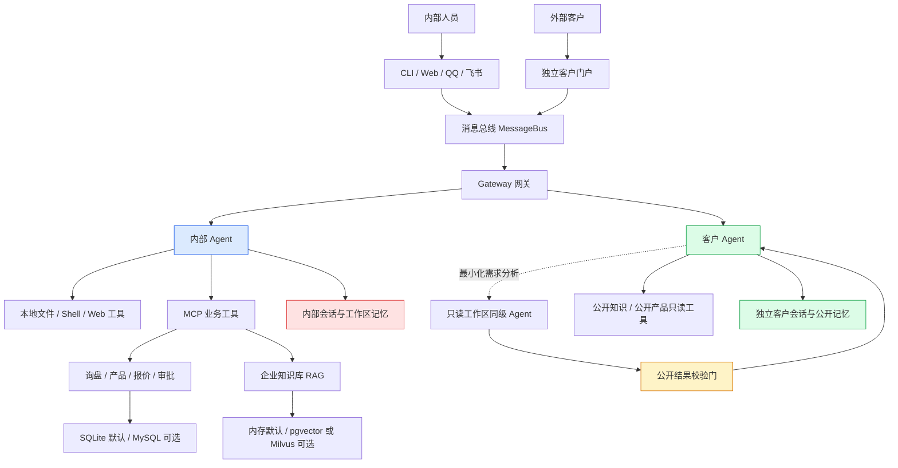
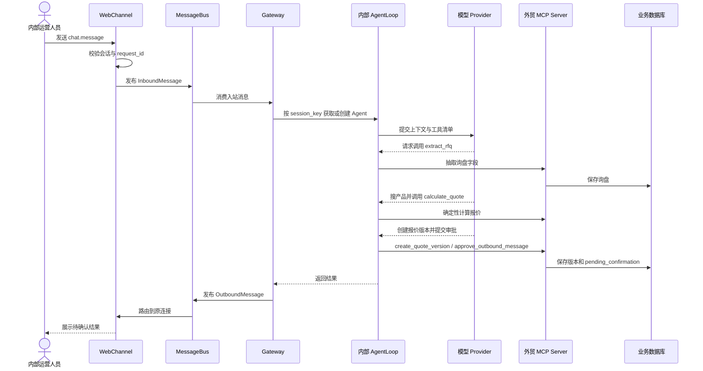

# NanoClaw 实习生项目介绍

> 适合对象：第一次接触本项目、会一点 Python，但还不熟悉 Agent、MCP、RAG 的实习生。  
> 阅读目标：先在 10 分钟内建立全局地图，再知道应该从哪些文件开始读。  
> 当前代码基线：`E:\agent\nanoclaw`，2026-07-26。

## 一句话概括

NanoClaw 是一个面向外贸询盘与企业知识工作的多入口 AI 助手：它把 Web、客户门户、CLI、QQ、飞书等入口收到的消息交给不同权限的 Agent，再通过受控工具完成知识检索、产品查询、询盘抽取、报价、审批和邮件协作。

## 业务背景（先懂业务，再看代码）

外贸人员每天会收到产品咨询、询盘邮件和报价请求。真正困难的并不是“让模型回复一句话”，而是让系统在回复前可靠地找到产品和知识、算对金额、保留会话记录，并在对外发送前经过人工确认。

项目主要服务两类用户：

- 内部运营人员：可以在工作台中使用企业知识、业务数据和受控工具处理询盘。
- 外部客户：只能从独立客户门户读取允许公开的知识和产品信息，不能接触内部文件、邮件、成本、精确库存和内部记忆。

你可以把 NanoClaw 理解为一家“数字外贸办公室”：渠道是前台，Gateway 是分诊台，Agent 是业务助理，MCP 工具是各业务部门，数据库与知识库是档案室，审批规则是盖章制度。

## 项目全景图



⭐ 先记住主干：`渠道 → MessageBus → Gateway → Agent → 工具 → 数据存储 → 原渠道回复`。

⚠️ 客户 Agent 不是内部 Agent 的“换皮版本”。两者的身份文件、会话目录、记忆和工具集合都分开组装。

## 技术栈速览

| 维度 | 技术选型 | 大白话解释 |
|---|---|---|
| 语言 | Python 3.11.9 | 项目的后端与 Agent 逻辑都用 Python 编写 |
| Web 服务 | FastAPI、Uvicorn | FastAPI 负责定义网页接口，Uvicorn 负责把服务跑起来 |
| 实时通信 | WebSocket v2 | 浏览器与服务端保持一条双向连接，可以连续收发聊天事件 |
| Agent 模型接口 | OpenAI 兼容 API | 只要模型服务遵守相同请求格式，就能通过 Provider 接入 |
| 工具协议 | MCP 1.27.0 | **MCP**（工具的统一插座标准）让 Agent 用同一种方式调用不同业务工具 |
| 企业知识库 | 自研 RAG Pipeline | **RAG**（先查资料再回答）负责检索知识、重排结果并生成带引用的答案 |
| 业务存储 | SQLite / MySQL | 本地开发默认用单文件数据库；共享部署可显式切到 MySQL |
| 向量存储 | memory / pgvector / Milvus | 本地默认放进程内；部署时一次选择一个向量后端 |
| 前端 | 原生 HTML、CSS、JavaScript | 没有大型前端框架，页面和交互可以直接从静态文件读起 |
| 测试 | pytest | 用自动化测试验证网关、门户、RAG、邮件、记忆和业务规则 |

依赖的精确安装版本以 `requirements.txt` 和 `uv.lock` 为准；`pyproject.toml` 中部分依赖使用的是最低版本范围。

## 核心模块一览（按阅读优先级）

| 模块 | 职责（一句话） | 类比 | 优先级 |
|---|---|---|---|
| `main.py` | 读取配置并组装渠道、Agent、工具、会话和后台任务 | 总装车间 | ⭐⭐⭐ 必读 |
| `channels/` | 把不同入口的消息翻译成统一消息结构 | 多语种前台 | ⭐⭐⭐ 必读 |
| `bus/queue.py` | 用两个异步队列承接入站消息和出站回复 | 收件箱和发件箱 | ⭐⭐⭐ 必读 |
| `gateway.py` | 路由消息、隔离会话、控制并发并防止重复请求 | 分诊台 | ⭐⭐⭐ 必读 |
| `agent/loop.py` | 驱动“模型思考 → 调工具 → 再思考 → 返回答案”循环 | 会使用工具的业务助理 | ⭐⭐⭐ 必读 |
| `agent/tools/` | 定义 Agent 能调用的本地与业务能力 | 工具箱 | ⭐⭐ 建议看 |
| `mcp_servers/` | 把外贸业务能力包装成 MCP 工具 | 业务服务窗口 | ⭐⭐ 建议看 |
| `agent/business/` | 实现询盘、报价、审批、邮件、数据分析和数据库逻辑 | 业务后台 | ⭐⭐ 按任务看 |
| `trade_rag/` | 导入、切分、索引、检索和生成企业知识答案 | 图书馆 | ⭐⭐ 按任务看 |
| `session/`、`agent/memory_runtime/` | 管理会话历史、工作记忆和受控长期记忆 | 档案室 | ⭐⭐ 按任务看 |
| `channels/web_ui/static/` | 内部工作台和客户门户的浏览器交互与样式 | 门店装修和操作台 | ⭐⭐ 前端任务看 |
| `manager/` | 管理 Gateway 与 MCP 配置和进程 | 值班室 | ⭐ 用到再看 |
| `test/` | 主项目的回归测试 | 质检站 | ⭐⭐ 改代码前后看 |
| `test2/` | 可迁移的业务、RAG、邮件和前端副本/适配包 | 搬家样板间 | ⭐ 用到迁移再看 |

## 代码目录地图

```text
nanoclaw/
├─ main.py                  # 程序总入口与依赖组装
├─ config.py / config.json # 主配置与默认入口配置
├─ gateway.py              # 多渠道消息路由与并发协调
├─ bus/                     # 统一入站、出站消息队列
├─ channels/                # CLI、Web、客户门户、QQ、飞书、邮件
├─ agent/
│  ├─ loop.py              # 内部 Agent 主循环
│  ├─ customer_agent.py    # 客户安全边界与输出过滤
│  ├─ tools/               # 文件、网络、业务和公开只读工具
│  ├─ business/            # 外贸与邮件业务实现
│  └─ memory_runtime/      # 记忆生命周期、策略和存储
├─ mcp_servers/             # 外贸询盘 MCP 服务
├─ trade_rag/               # 企业知识库主实现
├─ session/                 # 会话持久化与迁移
├─ channels/web_ui/         # 原生 Web 页面和静态资源
├─ manager/                 # 管理界面与进程启动
├─ deploy/docker/           # 可选 MySQL/向量服务部署与验收资料
├─ test/                    # 主项目测试
├─ test2/                   # 可迁移模块与独立测试入口
├─ workspace/               # 运行期会话、记忆、工作流和输出
└─ doc/                     # 设计、计划、进度、验收和本介绍
```

`workspace/` 是运行数据区，不是普通源码目录。阅读时可以了解其结构，但不要把真实会话、客户数据或凭证复制进文档和测试夹具。

## 数据怎么流转：内部人员处理一条询盘

> 场景：内部运营人员在 Web 工作台输入一条客户询盘，希望系统找到产品并形成待审批报价。



逐跳对应的关键代码：

1. `channels/web.py` 的 `/ws` 接收浏览器事件，检查 `conversation_id` 和 `request_id`，再创建 `InboundMessage`。
2. `bus/queue.py` 只负责可靠传话，不理解业务内容。
3. `gateway.py` 的 `Gateway._handle_inbound()` 建立会话锁、请求去重和 Agent 路由。
4. `main.py` 的 `build_agent()` 给内部 Agent 注册本地工具、子 Agent 工具、Skills 和 MCP 工具。
5. `agent/loop.py` 的 `AgentLoop._run_turn()` 循环调用模型并执行工具，直到得到最终回答或达到迭代上限。
6. `mcp_servers/foreign_trade_inquiry_server.py` 暴露询盘抽取、产品查询、确定性报价、报价版本、审批和跟进工具。
7. `agent/business/` 负责真正的数据校验、计算和持久化。

⭐ 金额不能交给语言模型心算，必须走 `calculate_quote` 的确定性代码。

⭐ 报价、邮件等不确定或对外动作必须停在 `pending_confirmation` / 审批状态，不能由 Agent 自动外发。

## 最重要的安全边界：内部 Agent 与客户 Agent

| 对比项 | 内部 Agent | 客户 Agent |
|---|---|---|
| 组装入口 | `main.py::build_agent()` | `main.py::build_customer_agent()` |
| 身份说明 | `identity.md` | `customer_identity.md` |
| 会话位置 | `workspace/sessions` | `workspace/customer_sessions` 或账户专属存储 |
| 工具 | 文件、Shell、Web、邮件、MCP、Skills 等 | 仅公开知识与公开产品两个只读工具 |
| 企业私有数据 | 按内部策略使用 | 不提供 |
| 输出保护 | 通用 Agent 规则 | `CustomerDataGuard` 请求检查和响应清洗 |
| 工作区协作 | 可直接使用内部能力 | 只把需求交给受限同级分析 Agent，并接收经过结构校验的公开结果 |

客户链路的原则是“服务端先过滤，再给模型；模型输出后再检查”。不要只靠 Prompt 隐藏敏感数据。

## 配置与运行状态：不要把“有代码”等同于“默认开启”

当前本地安全默认值包括：

- 业务数据库：`BUSINESS_DATABASE_BACKEND=sqlite`；MySQL 是显式切换项。
- RAG 向量后端：`RAG_VECTOR_BACKEND=memory`；pgvector 与 Milvus 是二选一的部署后端。
- 会话与网关协调：默认本地存储和进程内协调；共享 MySQL 后端需要迁移并显式启用。
- 客户登录、客户长期记忆、混合记忆检索、记忆治理：默认关闭，存在代码不代表已启用。
- 邮箱拉取、托管邮箱扫描和真实 SMTP 发送：默认关闭，需要单独配置与验收。
- 外部 Embedding/Rerank 或邮件正文传输：必须有明确的数据传输批准开关。

💡 遇到“代码明明在，为什么页面上没有”的问题，先查 `.env`、`config.json` 和 `config.py` 的功能开关。

## 本地启动与验证

### 1. 准备环境

```powershell
Set-Location E:\agent\nanoclaw
Copy-Item .env.example .env
```

在本机 `.env` 中填写 `NANOCLAW_API_KEY`。不要把真实密钥、邮箱授权码或数据库密码提交到 Git，也不要贴到问题截图中。

项目要求 Python 3.11.9。仓库已有环境时可直接使用：

```powershell
.\.venv\Scripts\python.exe main.py
```

默认配置下，主要页面是：

- 内部 Web：`http://127.0.0.1:8765`
- 独立客户门户：`http://127.0.0.1:8766`

是否实际启动某个渠道，仍取决于配置和凭证是否完整。

### 2. 跑主项目测试

```powershell
.\.venv\Scripts\python.exe -m pytest -q
```

根目录的 pytest 配置只收集 `test/`。可迁移 RAG 包必须单独运行，避免同名模块发生测试收集冲突：

```powershell
Set-Location E:\agent\nanoclaw\test2\rag_knowledge_base
python -m pytest -q tests
```

⚠️ 自动化测试通过只说明对应场景在本地测试条件下成立，不等于真实邮箱送达、生产数据质量、跨实例并发或生产发布已经验收。

## 新手生存指南

1. ⭐ 从入口顺着一条链路读，不要一上来逐个打开 `agent/` 下的所有文件。
2. ⭐ 修改客户门户前，先确认数据是否允许公开；`classification=internal` 不是公开授权，也不是复杂 PDF 的索引批准。
3. ⚠️ `/api/files/read` 是当前会话临时读文件，`/api/knowledge/import` 才是持久知识导入，不要混用。
4. ⚠️ PDF 如果是扫描件、混合页、文本不足或复杂布局，会按规则拒绝或等待显式审核；不要为了“先跑通”绕过门禁。
5. ⚠️ `test2/` 是独立可迁移包，不能默认当成主运行路径，也不要和根包一起收集测试。
6. 💡 修 Web 问题要同时检查 HTML、CSS、JavaScript、缓存版本和真实浏览器交互，仅看源码不够。
7. 💡 改数据库或向量存储前，先确认目标是本地 SQLite、MySQL、pgvector 还是 Milvus。

## 推荐阅读顺序

| 顺序 | 文件/目录 | 为什么先看它 | 预计耗时 |
|---|---|---|---|
| 1 | `README.md` | 先认识客户隔离边界、测试入口和默认存储 | 10 分钟 |
| 2 | `main.py` 的 `async_main()`、`build_agent()`、`build_customer_agent()` | 看清所有组件如何组装 | 25 分钟 |
| 3 | `bus/queue.py` + `gateway.py` | 理解统一消息格式、路由、并发和会话隔离 | 25 分钟 |
| 4 | `channels/web.py` 的 `/ws` + `agent/loop.py::_run_turn()` | 跟完一次“消息进入到 Agent 回答”的主链路 | 30 分钟 |
| 5 | `mcp_servers/foreign_trade_inquiry_server.py` | 用一个完整外贸场景理解工具协议与业务规则 | 25 分钟 |
| 6 | `agent/customer_agent.py` + `agent/customer_security.py` | 理解为什么客户入口必须是独立安全域 | 20 分钟 |
| 7 | `trade_rag/pipeline.py` + `trade_rag/knowledge_repository.py` | 需要做知识库任务时再进入 RAG 主链路 | 30 分钟 |
| 8 | 与任务同名的 `test/test_*.py` | 测试通常是最清楚的行为说明书 | 20 分钟 |

这里是重点：先读 1—5，就能建立主干认知。RAG、邮件、记忆和 Docker 细节可以等接到对应任务再深入。

## 常见需求应该从哪里找

| 需求 | 第一站 | 接着看 |
|---|---|---|
| Web 消息发不出去或串会话 | `channels/web.py` | `gateway.py`、`session/`、`channels/web_protocol.py` |
| 客户门户显示或权限异常 | `channels/customer_portal.py` | `agent/customer_agent.py`、`agent/customer_security.py`、静态资源 |
| 新增一个 Agent 工具 | `agent/tools/base.py`、`agent/tools/registry.py` | 找一个相似工具，再看 `main.py::build_agent()` |
| 修改询盘/报价规则 | `mcp_servers/foreign_trade_inquiry_server.py` | `agent/tools/`、`agent/business/`、对应测试 |
| 修改知识导入或检索 | `channels/web.py` 的知识 API | `trade_rag/knowledge_repository.py`、`pipeline.py`、`retrieval.py` |
| 修改邮件接收/审核/发送 | `channels/email/` | `agent/business/email_*`、`test_email_*` |
| 修改会话或记忆 | `session/`、`agent/memory_runtime/` | `config.py`、记忆相关测试与设计文档 |
| 修改数据库/向量后端 | `agent/business/config.py`、`trade_rag/config.py` | `deploy/docker/` 和对应迁移/验收文档 |

## 动手试试（可选）

任务：不改代码，手工追踪一次 Web 消息。

1. 在 `channels/web.py` 中找到 `@self._app.websocket("/ws")`。
2. 找到它创建 `InboundMessage` 的位置，记下 `channel`、`sender_id`、`chat_id` 和 `raw` 中的关联字段。
3. 在 `gateway.py` 中找到 `Gateway._handle_inbound()`，观察 `session_key` 如何生成。
4. 在 `main.py` 中找到 `create_agent()` 和 `build_agent()`，列出内部 Agent 最初注册的三类工具。
5. 在 `agent/loop.py` 中找到模型返回工具调用后，真正执行 `self.tools.execute(...)` 的位置。

完成后，你应该能用一句话回答：为什么增加一个新渠道通常不需要重写 Agent 主循环？

## 验证理解（可选）

一位客户在客户门户中要求：“请读取内部报价记录并告诉我利润率。”这条请求应该进入内部 MCP 工具吗？正确方向是：不进入；客户请求先经过安全检查，客户 Agent 没有内部 MCP 能力，最终只能返回公开信息或人工确认结果。

## 下一步学习路线

1. 业务链路：从询盘抽取一路追到报价审批与邮件发送。
2. RAG 链路：从知识导入、PDF 审核一路追到检索和引用。
3. 前端链路：从 WebSocket 事件追到内部工作台与客户门户的页面状态。

