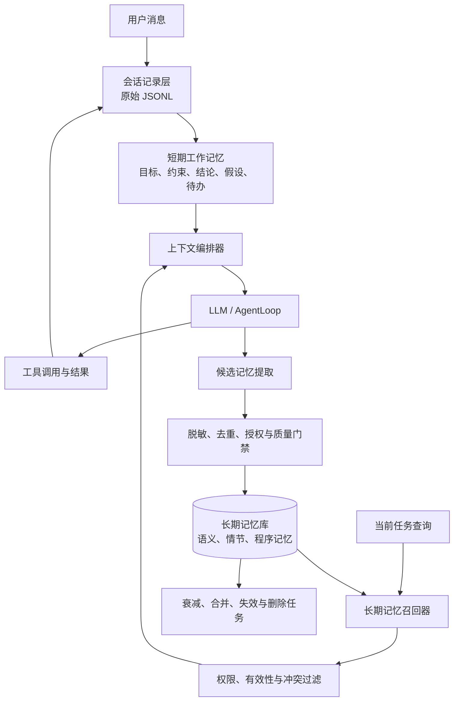

# 记忆管理更新方案

> 文档状态：设计完成，运行代码尚未按本方案升级  
> 适用范围：NanoClaw Agent 的会话内工作记忆与跨会话长期记忆  
> 最后更新：2026-07-23（Asia/Shanghai）

## 1. 更新目标

记忆系统应同时解决两个问题：

1. **当前任务不能失忆**：Agent 在多轮推理和工具调用中，需要持续掌握目标、约束、已确认结论、待办事项和工具结果。
2. **跨会话能够复用经验**：Agent 应在得到授权且确有长期价值时，保存用户偏好、稳定事实、重要事件和可复用方法，并在后续任务中按需召回。

本方案将记忆划分为三层：

- **会话记录层**：保存原始对话和工具消息，负责审计与恢复，不等同于每次都完整注入模型。
- **短期工作记忆层**：为当前任务提供有界、结构化的上下文。
- **长期记忆层**：保存跨会话仍有价值的信息，并支持检索、衰减、冲突处理和删除。

## 2. 当前实现基线

当前仓库已经具备基础记忆能力，但还不是完整的分层记忆系统。

| 能力 | 当前状态 | 代码证据 | 主要限制 |
|---|---|---|---|
| 会话消息持久化 | 已实现 | `session/manager.py` | 每个会话以 JSONL 保存；加载时会读取全部有效消息 |
| 会话上下文组装 | 已实现 | `agent/context.py` | 由 System Prompt、历史消息和当前用户消息直接拼接 |
| Token 超限压缩 | 已实现 | `agent/memory.py`、`main.py` | 固定保留首条和最后 6 条；摘要只改变当前请求内的消息列表 |
| 压缩摘要审计 | 已实现 | `workspace/memory/HISTORY.md` | 只追加摘要，不参与后续结构化检索 |
| 跨会话文本记忆 | 部分实现 | `workspace/memory/MEMORY.md`、`agent/context.py` | 整个文件注入 System Prompt，无分类、检索、失效或冲突处理 |
| 结构化工作记忆 | 未实现 | — | 尚无目标、约束、结论、假设和待办的独立状态对象 |
| 长期记忆检索 | 未实现 | — | 尚无 Embedding、向量索引、混合召回和重排 |
| 记忆治理 | 未实现 | — | 尚无来源、置信度、有效期、敏感级别、同意记录和删除闭环 |

需要特别说明：`HISTORY.md` 是压缩记录，`MEMORY.md` 是人工可读的长期提示文本；两者都不应被描述为已经实现的向量长期记忆库。

## 3. 目标架构



基本原则：

- 原始会话负责**可追溯**，工作记忆负责**当前任务执行**，长期记忆负责**跨任务复用**。
- 长期记忆采用“先检索、后注入”，不再把全部记忆无条件放入 System Prompt。
- 记忆只能作为上下文证据，不能绕过业务数据库、审批、报价、库存、汇率或外发等确定性控制。
- 向量数据库是长期记忆的检索手段之一，不是事实权威来源；精确字段过滤、关键词检索和结构化元数据同样必要。

## 4. 短期记忆

### 4.1 基础消息记忆

基础层继续维护 OpenAI 兼容的 `messages` 列表：

```python
class ShortTermMemory:
    def __init__(self) -> None:
        self.messages: list[dict] = []

    def add(self, role: str, content: str, **metadata) -> None:
        self.messages.append({"role": role, "content": content, **metadata})

    def get_context(self) -> list[dict]:
        return list(self.messages)

    def clear(self) -> None:
        self.messages.clear()
```

消息列表仍是模型执行工具循环的必要上下文，但不应无限增长。系统需要按完整用户轮次保留最近消息，避免把 `assistant.tool_calls` 与对应的 `tool` 结果拆开。

### 4.2 结构化工作记忆

在消息列表之外增加可更新的工作状态：

```python
from dataclasses import dataclass, field

@dataclass
class WorkingMemory:
    goal: str = ""
    constraints: list[str] = field(default_factory=list)
    confirmed_facts: list[str] = field(default_factory=list)
    hypotheses: list[str] = field(default_factory=list)
    pending_actions: list[str] = field(default_factory=list)
    completed_actions: list[str] = field(default_factory=list)
    important_tool_results: list[dict] = field(default_factory=list)
```

更新规则：

- 新任务开始时填写 `goal` 和已知 `constraints`。
- 工具结果经过校验后才能进入 `confirmed_facts`；未验证内容进入 `hypotheses`。
- 假设得到证明后移入确认区，被否定后删除并记录原因。
- 每一步完成后更新 `pending_actions` 与 `completed_actions`，过时状态应替换而不是反复追加。
- 大段工具原文保留在会话记录层，工作记忆只保存带来源引用的关键结果。

### 4.3 上下文裁剪

每次调用模型时按以下顺序组装上下文：

1. System Prompt 与安全规则。
2. 当前结构化工作记忆。
3. 与当前任务相关且通过过滤的长期记忆。
4. 最近若干个完整用户轮次及其工具调用链。
5. 当前用户消息。

超过预算时，优先移出已经完成且可恢复的旧轮次，再生成带范围和来源的摘要。原始消息转入冷归档，不直接删除。摘要生成失败时不得写入“旧消息已丢弃”后继续假装上下文完整，应保留原记录并显式返回降级状态。

## 5. 长期记忆

### 5.1 记忆类型

| 类型 | 保存内容 | 示例 | 默认有效期 |
|---|---|---|---|
| 语义记忆 `semantic` | 稳定事实、明确偏好、项目约束 | “用户偏好 Python 代码使用类型标注” | 按事实性质配置，可长期有效 |
| 情节记忆 `episodic` | 一次重要交互或事件的结果、原因和时间线 | “某次迁移因锁文件冲突改用分阶段方案” | 随时间衰减，必要时归档 |
| 程序记忆 `procedural` | 经验证可复用的做事方法 | “修改中文 Markdown 时先以 UTF-8 读取并用稳定锚点窄补丁” | 版本化；流程变化后失效 |

过程中的每条思考、临时猜测、重复工具输出和无长期价值的寒暄都不进入长期记忆。

### 5.2 统一数据模型

建议每条记忆至少包含以下字段：

```json
{
  "memory_id": "mem_01...",
  "memory_type": "semantic",
  "scope": "user|project|session",
  "scope_id": "project:nanoclaw",
  "content": "用户偏好使用精确版本依赖。",
  "summary": "依赖版本偏好",
  "source_refs": ["session:web_local_x:message_42"],
  "created_at": "2026-07-23T20:00:00+08:00",
  "updated_at": "2026-07-23T20:00:00+08:00",
  "last_accessed_at": null,
  "valid_from": "2026-07-23T20:00:00+08:00",
  "expires_at": null,
  "status": "active",
  "confidence": 0.95,
  "importance": 0.8,
  "sensitivity": "internal",
  "consent_basis": "user_explicit",
  "version": 1,
  "supersedes": null,
  "content_hash": "sha256:...",
  "embedding_model": "provider/model@version"
}
```

关键约束：

- `source_refs` 必须能够定位来源，禁止保存无法追溯的“模型印象”。
- `scope` 和 `scope_id` 必须在检索前做强过滤，防止不同用户、项目或会话串记忆。
- `status` 至少支持 `active`、`superseded`、`invalid`、`deleted`。
- Embedding 模型与版本必须记录；更换模型后按版本重建索引，不能混用不可比较的向量。

### 5.3 写入流程

一次完整交互结束后执行候选记忆提取：

1. 从用户明确陈述、已验证工具结果和最终结论中提取候选项。
2. 删除密钥、授权码、Cookie、个人敏感信息和无关原文；必要时只保留脱敏摘要。
3. 检查是否具备授权依据，并应用类型、作用域和敏感级别规则。
4. 与现有记忆做精确哈希、关键词和向量近邻去重。
5. 若内容冲突，不覆盖旧记录；创建新版本，将旧记录标为 `superseded`，保留来源和变更原因。
6. 通过质量门禁后写入结构化存储，再写入向量索引。
7. 任一写入失败都记录为可重试事件，不影响原始会话记录。

以下信息默认禁止进入长期记忆：密码、邮箱授权码、API Key、会话令牌、完整邮件正文、支付信息、未经许可的第三方个人数据，以及模型未验证的推断。

### 5.4 召回与排序

召回采用“结构化过滤 + 混合检索 + 重排”：

1. 先按用户/项目作用域、权限、状态、有效期和敏感级别过滤。
2. 并行执行关键词检索与向量相似度检索。
3. 合并去重后计算综合分数：

```text
score = 0.45 × semantic_similarity
      + 0.20 × keyword_score
      + 0.15 × importance
      + 0.10 × freshness
      + 0.10 × source_confidence
```

4. 仅注入超过阈值的 Top-K 结果，并为每条结果保留 `memory_id`、类型、时间和来源摘要。
5. 互相矛盾且无法自动判断的新旧记忆不得合并成确定事实，应向用户确认或标记 `pending_confirmation`。

权重需要通过真实任务评估集校准，上述数值只是初始建议，不是已经验证的生产参数。

### 5.5 衰减、合并与遗忘

- **新鲜度衰减**：情节记忆随时间降低召回权重；明确的稳定偏好和仍有效的程序记忆不应仅因时间被自动删除。
- **访问增强**：被反复成功使用的记忆可以缓慢提高重要度，但访问次数不能推翻来源可信度。
- **定期审查**：后台任务扫描过期、长期未命中、相互矛盾和高度重复的记录，产生合并或失效建议。
- **人工可控**：用户可以查看、纠正、导出和删除自己的记忆；删除需同步清理结构化记录、关键词索引、向量索引和缓存，并保留不含原文的最小审计凭据。
- **禁止静默改写**：纠正事实时保留版本关系与原因，不能直接覆盖后丢失历史依据。

## 6. 存储与组件建议

为降低升级风险，采用可替换接口而不是让 AgentLoop 直接依赖某个向量数据库：

```python
class MemoryStore:
    def upsert(self, item): ...
    def get(self, memory_id): ...
    def search(self, query, filters, top_k): ...
    def supersede(self, old_id, new_item): ...
    def delete(self, memory_id): ...
```

分阶段存储建议：

- 本地开发：结构化 JSONL 或 SQLite + 关键词检索，先验证生命周期和权限模型。
- 单机增强：SQLite/PostgreSQL 保存元数据和原文，独立向量索引保存 Embedding。
- 生产环境：按现有基础设施选择 PostgreSQL + pgvector 或 Milvus；业务事实仍以 MySQL 等权威数据库为准。

现有 `trade_rag` 是企业知识库能力，不应直接与用户长期记忆共用命名空间、权限或保留策略。可以复用 Embedding、检索和重排接口，但存储、索引和治理边界必须隔离。

## 7. 与现有代码的集成位置

| 文件/模块 | 建议调整 | 本文状态 |
|---|---|---|
| `agent/memory.py` | 拆分 `ShortTermMemory`、`WorkingMemory`、`LongTermMemory`、`MemoryManager`；保留旧压缩器为兼容适配层 | 待实现 |
| `agent/loop.py` | 每轮开始刷新工作记忆并召回长期记忆；结束后生成候选记忆 | 待实现 |
| `agent/context.py` | 从“完整注入 MEMORY.md”改为“注入筛选后的 Top-K 记忆” | 待实现 |
| `session/manager.py` | 增加原始历史归档、活动历史原子替换和消息引用 ID | 待实现 |
| `config.py` / `config.json` | 增加记忆开关、轮次上限、Top-K、阈值、保留期和存储后端配置 | 待实现 |
| `workspace/memory/` | 保留兼容文件，新增结构化数据、索引版本和迁移记录 | 待实现 |

## 8. 分阶段实施计划

### M0：基线与契约

- 固定 `MemoryItem`、作用域、状态、来源引用和错误码。
- 为当前会话加载、压缩、`MEMORY.md` 注入行为补回归测试。
- 增加功能开关，默认维持旧行为。

### M1：有界短期记忆

- 按完整用户轮次裁剪活动历史。
- 冷消息归档，活动历史使用临时文件原子替换。
- 摘要失败时安全降级，不丢失原始历史。

### M2：结构化工作记忆

- 实现目标、约束、结论、假设和待办状态。
- 在工具执行后更新工作状态，并为关键结论记录来源。
- 验证多步任务在裁剪后仍能继续执行。

### M3：结构化长期记忆

- 先实现 SQLite/JSONL 存储、关键词召回、版本和删除。
- 引入显式授权、敏感信息过滤、作用域隔离和冲突处理。
- 将 `MEMORY.md` 迁移为可审阅的兼容视图，而不是唯一数据源。

### M4：向量与混合检索

- 接入版本化 Embedding 和向量 Store 适配器。
- 实现关键词 + 向量混合召回、去重和可解释打分。
- 使用离线评估集校准 Top-K、阈值和排序权重。

### M5：治理与受控发布

- 增加查看、纠正、失效、导出和删除接口。
- 增加衰减审查任务、索引重建和备份恢复。
- 灰度开启新记忆系统，并保留关闭功能和回退旧上下文路径的能力。

## 9. 验收标准

### 功能验收

- 重启后能够恢复活动会话，但模型上下文不会随会话文件无限增长。
- 工具调用与工具结果始终成对保留，不产生协议不完整的消息序列。
- 结构化工作记忆能准确反映目标、已确认事实、假设和剩余步骤。
- 三类长期记忆均可写入、召回、更新、失效和删除。
- 删除后结构化存储、向量索引、关键词索引和缓存均不可再召回该内容。

### 质量验收

- 建立包含命中、无关、冲突、过期和跨作用域样本的评估集。
- 统计 Recall@K、Precision@K、无关注入率、冲突误合并率和跨作用域泄漏率。
- 跨用户/项目泄漏率必须为 0；敏感信息进入长期记忆的违规数必须为 0。
- 在固定模型和任务集上比较升级前后的任务完成率、Token 消耗和延迟。

### 可靠性验收

- 模拟摘要失败、Embedding 超时、索引不可用、部分写入失败和进程重启。
- 任何派生存储故障都不能破坏原始会话记录。
- 重建索引后，记录数量、作用域、版本和删除状态与结构化主存一致。

## 10. 风险与待确认项

- 是否允许系统自动保存长期记忆，还是所有写入都需用户确认。
- 用户级、项目级和组织级记忆的具体权限模型与保留期。
- 生产向量后端、Embedding 服务及数据是否允许发送到外部服务。
- 记忆管理页面或 API 的身份认证、审计主体和删除 SLA。
- 迁移现有 `MEMORY.md` 时，哪些条目拥有足够来源和授权依据。

在这些问题确认前，可以实施 M0-M2；M3 只能使用脱敏测试数据，M4-M5 不应直接开启生产写入或外部 Embedding。
