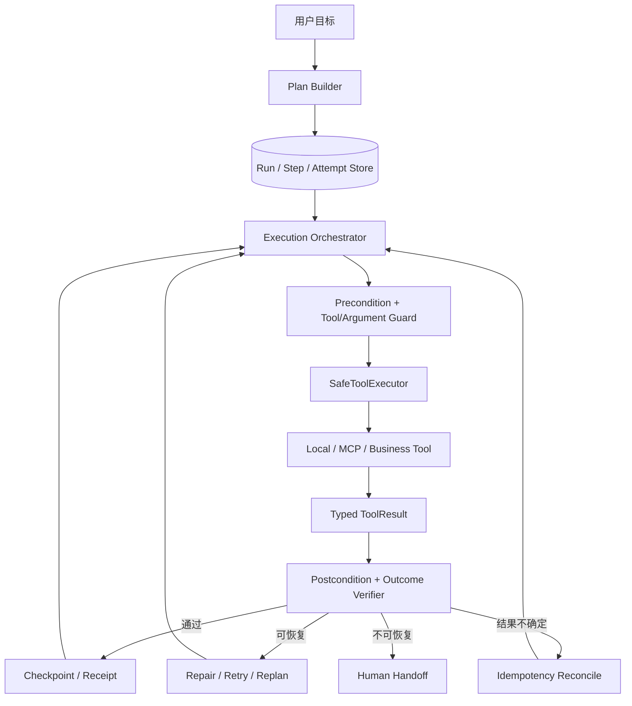
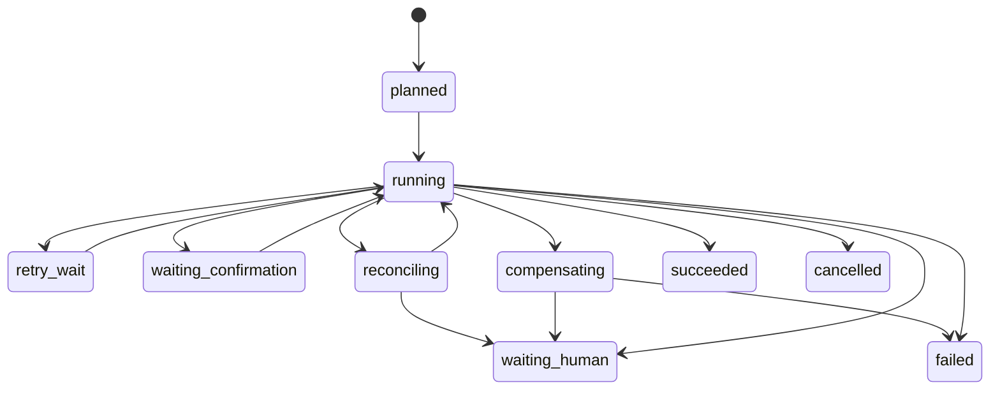
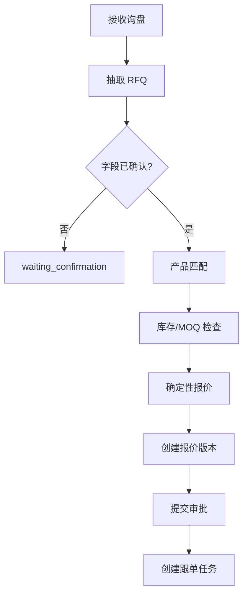

# NanoClaw Agent 多步任务失败处理详细实施计划

> 性质：基于当前代码和原始处理办法形成的实施计划，不代表多步容错已经实现或验证。  
> 基线：2026-07-22 20:51:47 +08:00。  
> 范围：`AgentLoop`、本地/MCP 工具和外贸询盘—报价—审批—跟单流程。  
> 本轮只更新文档，不改运行代码、不安装依赖、不操作生产系统。

## 1. 结论与顺序

当前已有完全相同工具/参数的重复检测、32 轮上限、16,000 Token 上下文压缩、MCP 连接超时；邮件询盘还有事务、租约、3 次重试、人工重开和 outbox。但通用 `AgentLoop` 仍把异常压成普通字符串，没有参数服务端校验、单工具超时、步骤检查点、语义后置条件、幂等恢复、补偿和人工接管包，`test/` 中也没有 AgentLoop 多步失败专项测试。

推荐以“确定性执行器 + 持久状态机 + 有界模型纠错 + 人工接管”分 M0-M7 实施：


模型 Reflection 只能辅助重新规划，不能替代参数校验、数据库事务、业务状态机、审批、幂等和结果核验。

## 2. 原办法的工程化落地

| 原问题 | 仅靠提示词的不足 | 工程化处理 |
|---|---|---|
| JSON 正确但工具错误 | 格式正确不代表步骤正确 | Step 声明允许工具、前置条件、风险和输出契约 |
| 工具正确但参数错误 | 类型正确仍可能是错误 ID、版本、金额 | Schema + 领域校验 + 当前 Run Receipt 绑定 |
| 基于错误结果推理 | 错误会沿链路放大 | 保存事实/来源/Receipt；每步验证后置条件 |
| 系统正常但目标错误 | 技术成功不等于任务成功 | 独立保存成功标准和禁止事项；结束前 Outcome Verifier |
| 超时/解析失败 | 盲重试可能重复副作用 | 按错误和副作用等级修复、重试、核对或接管 |
| 推理走偏 | 模型可能自洽地继续犯错 | 定期 Checkpoint；确定性检查优先，Reflection 有上限 |
| 死循环 | 当前只识别完全相同签名 | 规范化、近似重复、A-B 循环、无进展联合检测 |
| 上下文溢出 | 摘要可能丢业务 ID 和副作用 | 对话可压缩，RunState/Receipt 独立持久化 |
| 自动恢复无望 | 一句失败无法继续处理 | 生成脱敏 Human Handoff Package |

## 3. 当前项目基线

### 3.1 已有保护

| 能力 | 证据与当前行为 | 差距 |
|---|---|---|
| 全局轮次 | `agent/loop.py`、`config.py`：32 轮 | 应进入结构化预算失败状态 |
| 重复检测 | 相同工具+参数：10 次警告、20 次熔断、窗口 30 | 阈值晚，不能识别键顺序和近似循环 |
| 上下文压缩 | `agent/memory.py` 保留最近 6 条 | 不能承担执行恢复 |
| Provider 容错 | `providers/openai_compat.py` 返回 `finish_reason=error` | 缺稳定错误码、超时和重试属性 |
| MCP | 连接默认 30 秒超时 | 单次 MCP 工具调用无统一超时 |
| 工具异常 | `ToolRegistry.execute()` 返回 `错误: ...` | 可能被模型当普通结果 |
| 事务/幂等基础 | `agent/business/` 有事务、唯一键、部分行锁 | 没有跨步骤检查点与补偿 |
| 邮件恢复 | 租约、`retry_wait/failed`、人工 reopen、outbox | 可抽象为通用 Run/Attempt |
| 业务门禁 | `pending_confirmation`、报价版本、审批/哈希 | 可复用为前置/后置条件 |

### 3.2 已确认缺口

1. 没有 Run、Step、Attempt、Receipt 的通用模型和仓储。
2. 参数 JSON 失败会变成 `{"raw": ...}`，下游不能可靠识别解析错误。
3. 工具执行前不验证 Schema、业务规则或跨步骤 ID。
4. 本地/MCP 工具没有统一超时、取消和错误分类。
5. 字符串错误和成功结果没有可靠类型边界。
6. 没有技术成功后的业务后置条件。
7. 进程中断后只能依赖对话 JSONL，不能从步骤恢复。
8. 没有区分只读、事务写、可补偿写和不可逆动作。
9. 没有处理“副作用可能成功但响应丢失”的 `outcome_unknown`。
10. 没有通用接管队列、恢复/跳过/终止和审计。
11. 没有错误工具、错误参数、循环、部分成功和崩溃恢复测试。

`rg` 检查 `test/` 未发现 `AgentLoop`、`_check_tool_loop`、`FUSE_THRESHOLD` 或 `max_iterations` 专项测试。邮件询盘已有超时重试、租约并发、人工重开、最终失败通知和 outbox 幂等测试，可作为参考。

### 3.3 依赖边界

当前锁定 Python `3.11.9`、`openai==1.93.0`、`mcp==1.27.0`、`pydantic==2.13.4`、`fastapi==0.136.1`、`pytest==9.1.1`。第一阶段优先使用 `asyncio.timeout`、标准库和已锁定 Pydantic。若完整执行任意 JSON Schema，应将校验库作为直接依赖交由 `uv` 解析锁定，不依赖传递包，也不猜版本。

## 4. 设计原则

1. 技术成功不等于业务成功。
2. 确定性校验优先于模型自评。
3. 副作用先分类，再决定超时和重试。
4. 每步保存输入哈希、Attempt、结果、错误码和 Receipt。
5. 对话与执行状态分离，摘要不能丢业务 ID。
6. 修复、重试、Reflection 和重规划均有预算。
7. 无法证明安全时停止并转人工。
8. 回滚优先事务、幂等、不可变版本和显式补偿，不删除审计历史。
9. 日志、事件和接管包最小化敏感数据。

## 5. 目标架构



建议新增 `agent/execution/`：`contracts.py`、`policies.py`、`store.py`、`executor.py`、`validators.py`、`loop_guard.py`、`recovery.py`、`handoff.py`、`events.py`；新增 `test/agent_execution/` 放置 Fake Provider/Tool/Clock 和显性、语义、循环、幂等、恢复、外贸流程测试。

## 6. 失败分类与错误码

| 分类 | 示例 | 默认动作 |
|---|---|---|
| `explicit_system` | 超时、断网、限流、解析错误 | 有界修复/重试 |
| `implicit_semantic` | 选错工具、错误 ID、错误金额/推理 | 阻断后续，重规划一次或接管 |
| `partial_side_effect` | 写库成功但通知失败 | 从检查点继续或补偿 |
| `outcome_unknown` | 外部写超时，不知是否成功 | 禁止直接重试，先按幂等键核对 |
| `policy_or_security` | 未审批外发、越权、危险命令 | 不重试，等待审批或终止 |
| `resource_guard` | 轮次、Token、时间、重复阈值 | 接管并停止 |
| `user_control` | 用户取消/改目标 | 取消未开始步骤，保留已完成副作用 |

| 稳定错误码 | 自动处理 |
|---|---|
| `MODEL_TIMEOUT / MODEL_RATE_LIMITED` | 有界退避 |
| `MODEL_OUTPUT_PARSE_ERROR` | 最多修复 2 次，只改格式 |
| `TOOL_NOT_ALLOWED_FOR_STEP` | 不执行；重规划一次 |
| `TOOL_ARGUMENT_SCHEMA_ERROR` | 返回字段路径并有界修复 |
| `TOOL_ARGUMENT_DOMAIN_ERROR` | 新输入或人工确认 |
| `TOOL_TIMEOUT_NO_SIDE_EFFECT` | 可有界重试 |
| `TOOL_OUTCOME_UNKNOWN` | reconcile，不直接重试 |
| `TOOL_RESULT_SCHEMA_ERROR` | 不得默认成功 |
| `POSTCONDITION_FAILED` | 有界重规划 |
| `REPEATED_ACTION_LOOP / NO_PROGRESS_LOOP` | 人工接管 |
| `RUN_BUDGET_EXCEEDED` | 保存接管包 |
| `APPROVAL_REQUIRED` | 等待审批，不算技术错误 |
| `COMPENSATION_FAILED` | 立即接管 |

原始异常只进入脱敏诊断字段，程序分支只使用稳定错误码。

## 7. Run、Step 与 Attempt 状态



Run：`planned/running/retry_wait/waiting_confirmation/reconciling/compensating/waiting_human/succeeded/failed/cancelled`。  
Step：`pending/running/succeeded/retry_wait/waiting_confirmation/outcome_unknown/failed/compensated/skipped/cancelled`。

Attempt 记录 `run_id/step_id/attempt_no/tool_call_id`、规范化工具、`input_hash/idempotency_key`、时间/超时、结果、错误码、副作用、Receipt ID 和脱敏摘要。

- 前置条件通过后才执行。
- 工具返回后先验证输出和后置条件，再标成功。
- 中断后无副作用步骤可重试；有副作用步骤先 reconcile。
- Run 只有必需步骤成功、等待项清零且 Outcome Verifier 通过才成功。
- 终态不能由模型自行恢复。

## 8. 核心契约

RunPlan 保存 `run_id/workflow_type/goal/success_criteria/prohibitions/steps/plan_version`，不保存隐藏思维链。StepDefinition 保存 `allowed_tools`、required inputs、前置/后置条件、副作用、超时、最大尝试和失败策略。

ToolResult 统一为：

```json
{
  "ok": false,
  "status": "failed",
  "error": {
    "code": "TOOL_ARGUMENT_DOMAIN_ERROR",
    "retryable": false,
    "safe_message": "数量低于 MOQ",
    "details": {"field": "quantity"}
  },
  "data": null,
  "receipt": null,
  "side_effect": "none"
}
```

迁移期：含稳定 `error` 字段转失败；`错误:` 前缀仅临时兼容；无法判定则 `TOOL_RESULT_SCHEMA_ERROR`，不得默认成功。

有副作用步骤成功后保存不可变 Receipt：业务对象 ID、版本、内容/计算哈希、提交时间、外部 request/response ID、幂等键和安全摘要。后续只能引用 Receipt 字段，不从自然语言猜 ID。

## 9. 执行前保护

### 9.1 工具选择

- Step 明确 `allowed_tools`；未列入则不执行。
- 工具标记 `read/search/calculate/write/approve/send/delete/shell` 能力和风险。
- Step 限定最大副作用；计算步骤不能调用发送工具。
- 自由对话默认只开放低风险只读工具；写入/外发需显式计划。

### 9.2 参数四层校验

1. 解析层：必须是 JSON object；失败进入修复，不用 `raw` 伪参数执行。
2. Schema 层：required、类型、枚举、长度、格式和额外字段。
3. 领域层：数量、货币、日期、SKU、版本、状态、权限。
4. 跨步骤层：`quote_id/rfq_id/version` 必须来自当前 Run Receipt。

解析失败最多修复 2 次，只提供 Schema、错误码、字段路径和截断脱敏输出；要求不换工具、不新增事实。仍失败则 `waiting_human`。

## 10. 超时、重试、幂等与核对

| 副作用 | 示例 | 超时处理 |
|---|---|---|
| `none` | 查询、纯计算 | 可有界重试 |
| `transactional` | 单库事务创建草稿 | 查幂等键；确认未提交后重试 |
| `compensatable` | 待审批、跟单任务 | 先核对，必要时显式作废 |
| `irreversible_or_external` | 真实邮件、付款、订单、删除 | 不自动重试；回执核对或人工 |

真实外发仍未授权，继续使用 mock/outbox。

默认超时建议：模型 60 秒、本地读/计算 15 秒、数据库事务 10 秒、MCP 工具 30 秒；外部副作用按 SLA，超时进入 `outcome_unknown`。统一由 `SafeToolExecutor` 使用 `asyncio.timeout()`。

| 情况 | 重试上限 |
|---|---:|
| 模型限流/临时网络 | 2 次，1s/3s+jitter |
| 模型格式错误 | 2 次修复 |
| 只读工具超时 | 2 次，输入不变 |
| 数据库死锁/瞬时连接 | 2 次，已确认事务回滚 |
| 领域/权限/审批失败 | 0 次盲重试 |
| 外部写结果不确定 | 0，先 reconcile |
| 后置条件失败 | 最多重规划 1 次 |

同一逻辑 Step 的 Attempt 保持同一幂等键：`{workflow_type}:{run_id}:{step_id}:{canonical_input_hash}:{plan_version}`。

Reconcile：按幂等键或业务唯一键查询；存在则补建 Receipt；明确未执行才允许重试；无法确认则转人工。

## 11. 结果与语义校验

每个工具声明输出模型；`ok=true` 但缺字段、类型错或状态未知时不进入下一步。

外贸后置条件：

- RFQ 字段带 evidence/status，未知保持 `pending_confirmation`。
- 产品必须来自 Repository，SKU 绑定当前 Run。
- 库存带来源和快照时间，不足时不承诺交期。
- 报价由确定性计算器生成并可重算一致。
- 报价版本不可变，内容/计算哈希存在。
- 审批绑定当前版本和哈希，旧审批不可复用。
- 跟单绑定正确 RFQ/Quote/Version 且幂等。
- 本地外发只到 mock/outbox。

结束前 Outcome Verifier 检查：成功标准有结构化证据；无未处理 `pending_confirmation/outcome_unknown/failed`；禁止事项未触发；Repository 回读与 Receipt 一致；最终答复只声明实际完成项。模型只能提供文本对齐建议，不能推翻业务事实或审批。

## 12. Reflection、循环与上下文

每 3 个普通步骤、高风险步骤前、失败重试前、上下文压缩前和宣告成功前建立 Checkpoint。只保存目标、完成步骤、事实/来源、Receipt、未解决问题、预算、下一步和禁止事项。

Reflection 只允许输出 `continue/retry_with_fixed_format/replan/wait_human/abort`。同一失败最多反思 1 次、重规划 1 次；新计划必须继承 Receipt。

循环检测默认：

1. 工具名 + canonical JSON + 业务 ID 形成签名。
2. 完全相同调用连续 3 次：replan；之后再现即接管。
3. 同工具高相似参数且无新事实，5 次内熔断。
4. 最近 6 步 A-B-A-B-A-B 且无进展，熔断。
5. 同错误码/输入连续 2 次，禁止第三次盲重试。
6. 连续 4 个 Attempt 无新 Receipt、状态变化或问题解决，停止。

阈值需由故障测试调优并配置化，模型不能修改。自然语言可继续压缩，但 RunState/Receipt 不可被摘要替代；每次模型调用重新注入 Goal、Constraints、Completed Receipts、Pending Steps 和 Last Error。

## 13. 回滚、补偿与人工接管

恢复顺序：

1. 单步骤数据库事务 rollback。
2. 已成功步骤保留 Receipt，从下一未完成步骤继续。
3. 跨系统写入使用预定义补偿。

禁止模型猜反向操作：报价版本不物理删除而应作废/新建；审批追加 revoke/reject；已发通知只能发更正；外部订单/付款不能自动反向冲销。每个可补偿工具显式声明补偿工具、Receipt 字段、允许状态、验证和最大次数；补偿也是可审计 Step，失败立即接管。

人工接管触发：预算耗尽、循环/无进展、`outcome_unknown` 无法核对、权限/审批、高风险动作、补偿失败、Outcome Verifier 不通过或用户暂停。

接管包包含 run/step、目标摘要、稳定错误码、安全错误摘要、Receipt、未解决问题、副作用、建议和允许动作；不得包含密钥、完整客户邮件、完整参数、内部堆栈或隐藏推理。

操作员可 `resume`、`retry_after_reconcile`、`skip` 非必需步骤或 `abort`；修改目标/输入需提升 `plan_version`。

## 14. 外贸流程失败决策



| 失败点 | 自动处理 | 禁止事项 |
|---|---|---|
| RFQ JSON 损坏 | 最多 2 次只修格式 | 不以 `raw` 参数继续 |
| RFQ 缺字段 | 暂停确认 | 不猜数量、单位、条款 |
| 选错工具 | allowlist 阻断，重规划一次 | 不用 shell/网页替代业务库 |
| SKU 不存在 | 返回候选并确认 | 不虚构 SKU |
| 库存超时 | 只读有界重试 | 不用旧库存冒充当前值 |
| 报价不一致 | 服务端重算失败 | 不让模型凑金额 |
| 报价写入超时 | 先 reconcile | 不直接创建第二版本 |
| 审批版本过期 | 新审批请求 | 不复用旧审批 |
| 通知失败 | outbox `retry_wait` | 不绕过 outbox |
| 跟单重复 | 返回已有 Receipt | 不重复任务 |
| 真实外发 | 拒绝或 mock outbox | 不自动发送 |

## 15. 事件、指标与隐私

对接 `docs/project/项目更新计划.md` 的 WorkflowEvent：`run.created/started/succeeded/failed/waiting_human`，`step.started/succeeded/failed/retry_scheduled/outcome_unknown/reconciled/compensated`，`guard.tool_rejected/argument_rejected/loop_detected`，`handoff.created/operator.resumed/operator.aborted`。事件先持久化再广播，只含安全摘要、ID、状态、错误码、次数和时间。

指标：Run 成功率、自动恢复/接管率、按错误码失败率、重试成功率、平均 Step/Attempt/Token/耗时、循环拦截、结果不确定核对时长、补偿成功率。安全指标：重复副作用 0、未审批外发 0、敏感信息泄露 0。

## 16. 故障注入测试

测试基础：`ScriptedProvider`、可配置延迟/副作用/异常/回执的 `FakeTool`、`FakeClock`、临时 SQLite RunStore、在执行前/提交前/提交后响应前/后置校验前注入的 `FailurePoint`。全部使用虚构数据和 Mock，不访问公网、生产 MySQL或真实消息渠道。

| 编号 | 场景 | 预期 |
|---|---|---|
| E01 | 模型超时一次 | 两个 Attempt 后成功 |
| E02 | 连续模型超时 | 接管，工具调用 0 |
| E03 | 参数 JSON 损坏 | 最多修复 2 次，不传 `raw` |
| E04 | 工具不存在/缺 required | 执行前阻断 |
| E05 | 只读工具超时 | 有界重试，幂等键不变 |
| E06 | 数据库事务中断 | 完整回滚 |
| S01 | 合法 JSON 但工具错误 | allowlist 阻断 |
| S02 | 使用另一 Run 的 quote_id | Receipt 绑定阻断 |
| S03 | 数量低于 MOQ | 不创建报价 |
| S04 | 报价总额不一致 | 后置条件失败 |
| S05 | 缺字段却声称完成 | Outcome Verifier 拒绝 |
| S06 | 旧审批用于新版本 | 版本/哈希拒绝 |
| L01 | 相同调用连续 3 次 | replan，不等到 10/20 次 |
| L02 | JSON 键顺序变化 | 仍识别重复 |
| L03 | A-B-A-B-A-B | 检测循环 |
| L04 | 连续 4 次无进展 | `NO_PROGRESS_LOOP` |
| R01 | 写提交后响应丢失 | reconcile，复用已有对象 |
| R02 | 同 Step 重复投递 | 只产生一个对象 |
| R03 | Step 成功后崩溃 | 从 Receipt 后继续 |
| R04 | 通知失败 | outbox retry，不丢业务状态 |
| R05 | 补偿失败 | 立即接管 |
| C01 | 用户取消 | 未开始步骤取消，副作用保留并报告 |

外贸端到端按“抽取→确认→产品→库存→报价→版本→审批→跟单”逐节点在执行前、执行中、提交后注入失败。每节点至少一个显性和一个语义失败；每个写节点至少一个“提交后响应丢失”；任意失败均不得真实外发或创建重复对象。

## 17. M0-M7 实施表

| 阶段 | 交付 | 验收 | 估算 | 状态 |
|---|---|---|---:|---|
| M0 | ErrorCode/ToolResult/Run/Step/Attempt；工具风险清单；Fake 基础 | 状态转换测试；现有测试入口稳定 | 2 人日 | 未开始 |
| M1 | SafeToolExecutor、allowlist、参数校验、超时、结构化结果、重试 | 错误工具/参数执行次数 0；字符串错误不当成功 | 2-3 人日 | 未开始 |
| M2 | SQLite RunStore、Checkpoint、Receipt、Conversation/Event 关联 | 崩溃恢复不重复；状态先存后播 | 3 人日 | 未开始 |
| M3 | 格式修复、LoopGuard、预算、reconcile | L01-L04、R01-R03 通过 | 3 人日 | 未开始 |
| M4 | 输出模型、领域不变量、Outcome Verifier、Reflection/Replan | S01-S06 通过；最多一次反思/重规划 | 3-4 人日 | 未开始 |
| M5 | 补偿、接管包、操作员动作、前端失败节点 | 不猜补偿；接管充分且脱敏 | 3 人日 | 未开始 |
| M6 | 全故障矩阵、并发、隐私、性能、外贸 E2E | 完成定义全部通过 | 3-4 人日 | 未开始 |
| M7 | 功能开关、灰度、错误码/恢复/补偿手册 | 影子→低风险阻断→全量，可回滚 | 2 人日 | 未开始 |

单人顺序约 18-21 人日。首个安全 MVP 建议 M0-M3，仅验证“询盘抽取→产品查询→库存→确定性报价草稿”，不接真实外发。

开关建议：`SAFE_EXECUTION_ENABLED`、`RUN_STORE_ENABLED`、`SEMANTIC_GUARD_ENABLED`、`HUMAN_HANDOFF_ENABLED`。高风险写入/外发门禁从第一天强制。

## 18. 完成定义

- 工具结果明确区分成功、失败、等待确认和结果不确定。
- 错误工具/参数在执行前阻断；错误业务结果在下一步前阻断。
- 每个工具有超时、副作用、幂等和重试策略。
- 任意步骤崩溃后可恢复，成功副作用不重复。
- 完全/近似重复、A-B 循环和无进展均在预算内停止。
- 外贸每节点显性、隐性、提交后失败测试全部通过。
- 未确认字段自动报价率 0；未审批真实外发率 0；重复对象率 0。
- 无法恢复时生成可操作、脱敏、含副作用清单的接管包。
- 日志、事件、测试报告和接管包凭证泄露为 0。
- 主项目、隔离 RAG、邮件和新增容错测试全部通过并记录命令/结果。

## 19. 风险与待确认

| 项目 | 风险 | 默认决定 |
|---|---|---|
| 旧工具返回字符串 | 迁移期误判 | 适配器逐工具迁移，高风险工具先类型化 |
| Reflection 由模型执行 | 可能继续自洽犯错 | 只作建议，Guard/Verifier 决定 |
| SQLite RunStore | 多进程有限 | 本地单进程，生产再适配 MySQL/PostgreSQL |
| 补偿语义 | 并非全部可逆 | 未声明补偿的工具禁止自动补偿 |
| Web 无完整登录 | 接管权限不足 | 本地受控；生产前补主体/角色/所有权 |
| 真实外部系统 | 本地不能核对 | Mock；真实联调需单独授权和沙箱 |
| 自由 Agent 任务 | 难定义所有后置条件 | 首期覆盖注册工作流；自由任务限低风险和预算 |

开始 M4-M5 前需确认：允许自动重试的工具、各写入幂等键、补偿动作、操作员角色和可跳过步骤。

## 20. 本轮状态

本轮已完成原始处理办法的工程化分析、当前代码差距核对和 M0-M7 详细计划。尚未新增 SafeToolExecutor、RunStore、语义校验、补偿、人工接管或多步故障测试；现有 `AgentLoop` 行为未修改。
