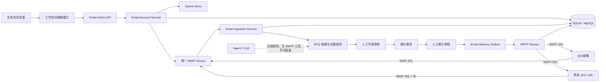
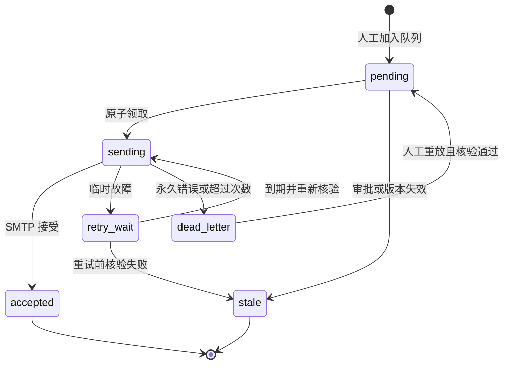

# NanoClaw 邮件改进方案

> 文档状态：M0-M5 已完成本地实现；M6 账户/Outbox 代码完成，真实 MySQL 验收、MySQL 入站与正文加密仍待环境/治理确认  
> 适用仓库：`E:\agent\nanoclaw`  
> 编写时间：2026-07-23 14:26:50 +08:00  
> 目标：在当前工作空间前端增加可配置邮箱窗口，支持 QQ、网易 163 和网易 126 邮箱，并补齐受控邮件发送数据层与完整数据流。

## 1. 方案结论

当前项目不需要重写邮件收取链路。仓库已经具备 QQ、网易 163/126 共用的只读 IMAP Source、MIME 解析、UID 游标、SQLite 幂等入库、RFQ 抽取、人工确认状态和 QQ 脱敏通知 Outbox。建议在此基础上：

1. 在主工作空间 `channels/web_ui/` 增加独立“邮箱”窗口，不放入客户门户，也不先改独立的 `test2/frontend`；
2. 把单组环境变量升级为可管理多个邮箱账户的配置模型，但授权码不得明文进入数据库、浏览器存储、日志或 API 响应；
3. QQ、网易共享 IMAP/SMTP 实现，以 provider preset 处理差异，不复制三套渠道代码；
4. 增加 Web 人工审核和受审批约束的 SMTP Outbox，只有业务员明确点击后才能入队；
5. Agent、邮件正文和 LLM 均无权读取授权码或直接调用 SMTP；不确定字段继续保持 `pending_confirmation`；
6. 先完成本地 SQLite 闭环，再实现 MySQL Repository 对等能力，不能把已有 MySQL DDL 当作已联通的数据层。

## 2. 当前实现与差距

### 2.1 已实现

| 能力 | 代码证据 | 当前边界 |
|---|---|---|
| QQ/网易只读收件 | `channels/email/imap_source.py` | 已有 `qq`、`netease_163`、`netease_126` 预设；网易登录后发送 IMAP `ID` |
| 邮件配置 | `agent/business/email_config.py`、`.env.example` | 仅一组进程环境变量，凭据不从 `config.json` 读取 |
| MIME 安全解析 | `channels/email/mime_parser.py` | 解析正文和附件元数据，受大小与附件数限制 |
| 幂等、游标、租约、审核审计 | `agent/business/email_repository.py` | SQLite 已实现；MySQL 入站只有加密目标 DDL，正文 KMS/对象存储未确定，运行时未启用 |
| 工作区账户自动收件 | `managed_email_ingestion.py`、`email_trade_classifier.py` | 已接入健康且启用收件的 SQLite 账户；仅明确外贸询盘/RFQ 进入本地确定性解析 |
| RFQ 保守抽取 | `email_ingestion.py`、`rfq_extractor.py` | 完整模型、紧凑模型、确定性降级；不确定字段待确认 |
| QQ 内部提醒 | `email_notification.py`、`channels/qq.py` | 是 QQ Bot 脱敏通知，不是 QQ 邮箱 SMTP |
| 工作空间前端 | `channels/web_ui/index.html`、`static/app.js`、`static/app.css` | 同页 SPA 已有对话、汇率、知识库和业务工作台 |
| 邮件工作台视觉区 | `index.html` 的 `opsView` | 明确只是预览，未接审批、邮件或认证写操作 |
| 受控 SMTP Outbox | `email_delivery_repository.py`、`email_delivery_service.py`、`delivery_worker.py`、`delivery_runtime.py`、`smtp_sender.py` | M4 Outbox 与真实 SMTP_SSL worker 已接入；当前 `.env` 已打开 worker，但尚无账户和真实网络验收 |
| MySQL 账户与 Outbox | `mysql_email_account_repository.py`、`mysql_email_delivery_repository.py`、`004_email_delivery.mysql.sql` | 运行代码与迁移已实现；当前机器无 MySQL，真实合同 smoke 待执行 |

### 2.2 尚未实现

| 缺口 | 影响 |
|---|---|
| 邮箱配置 API、账户表和密钥存储 | 前端不能新增、启停、测试或轮换 QQ/网易账户 |
| 配置对象只表达 IMAP | 没有 SMTP、发件开关和发件人配置 |
| 主程序只加载一组账户 | 不能同时连接 QQ 和网易，不能独立控制账户 |
| Web 邮件审核接口 | 目前只能 CLI 确认，不能在工作空间闭环 |
| MySQL 入站正文治理未定 | `002` 要求密文/对象引用，但 KMS、对象存储、轮换和删除责任人未确定，不能安全启用入站 MySQL Worker |
| M4 可操作发件界面 | 待发送页可选择健康发件账户与精确白名单收件人，经勾选确认和最终确认后入队；投递页显示状态并可人工重试 dead-letter |

### 2.3 对参考文档的映射修正

`NANOCLAW_FRONTEND_EMAIL_DOC.md` 的设计思想可以复用，但它来自另一份源码，不能照抄路径：

- 文档中的 `channels/email.py` 在当前仓库已拆为 `channels/email/`；
- 当前 `channels/qq.py` 是 QQ Bot 渠道，不是 QQ 邮箱适配器；
- 真实 SMTP 循环已接入主进程；`business_outbox`、`can_send_quote()` 仍是旧文档命名，当前实现使用 `ops_email_delivery` 和 Repository 门禁；
- 现有邮件模块刻意保持“只读收件、人工确认、禁止自动回信”，外发应作为独立受控模块，不能把 `EmailSource` 变成可回复的聊天 Channel；
- 当前工作空间是 `channels/web_ui/`；`test2/frontend` 是可移植同级包，不作为首个落点。

## 3. 目标架构



入站链路只负责收件、解析、抽取和人工确认；出站链路只消费已确认、已审批且内容哈希一致的发送快照。

## 4. Provider 与账户设计

### 4.1 服务端预设

| provider | IMAP | SMTP | 规则 |
|---|---|---|---|
| `qq` | `imap.qq.com:993` | `smtp.qq.com:465` | 使用邮箱授权码，不使用 QQ 登录密码 |
| `netease_163` | `imap.163.com:993` | `smtp.163.com:465` | IMAP 登录后保留现有 `ID` 握手 |
| `netease_126` | `imap.126.com:993` | `smtp.126.com:465` | IMAP 登录后保留现有 `ID` 握手 |

主机由服务端 preset 返回。前端不能任意提交主机名，避免服务端请求伪造。自定义服务器若后续开放，需要主机 allowlist、DNS/IP 校验和管理员开关。

### 4.2 `EmailAccountConfig`

```text
account_id              内部 UUID，不用邮箱地址作主键
display_name            工作空间显示名称
provider                qq / netease_163 / netease_126
address                 完整邮箱地址
secret_ref              服务端密钥引用，不是授权码
folder                  默认 INBOX
inbound_enabled         是否只读收件
outbound_enabled        是否允许人工受控发件
poll_seconds            30-3600 秒
sender_name             发件显示名
allowed_senders         可选入站白名单
allowed_recipients      必需的出站白名单；空集合表示禁止外发
status                  disabled / validating / healthy / degraded / auth_failed
last_checked_at         最近连接检查时间
last_error_code         脱敏稳定错误码
config_version          乐观锁版本
created_at / updated_at 审计时间
```

支持多个账户；每个 `account_id + folder` 保持独立游标，现有幂等键继续使用 `account_id + folder + UIDVALIDITY + UID`。

### 4.3 授权码保存

1. 浏览器仅在新增或轮换时提交一次，必须通过回环地址或 HTTPS；
2. API 只返回 `credential_configured`，永不回显授权码；
3. 本地 Windows 推荐 Windows Credential Manager 或 DPAPI 加密文件，数据库只保存 `secret_ref`；
4. 密钥存储未完成时，只允许授权码在本次进程内使用，重启后重填，不得降级为数据库明文；
5. 现有环境变量作为迁移入口，先显示为只读 legacy account，确认后再迁移；
6. 日志、审计、WebSocket、会话和 `.env.example` 均不得包含真实授权码。

## 5. 工作空间邮箱窗口

### 5.1 页面结构

在 `channels/web_ui/index.html` 左侧导航增加 `data-view="email"` 的“邮箱”按钮，在主舞台增加 `emailView`。页面属于内部工作空间，不出现在客户门户。

建议包含四个页签：

1. **账户配置**：账户列表、新增/编辑、启停、授权码轮换；
2. **收件审核**：主题、脱敏发件人、抽取字段、证据、缺失项和确认动作；
3. **待发送**：列出邮件字段待确认、报价阻塞、待业务审批和已批准待入队状态；只有当前有效的已审批报价才允许人工选择账户并核对收件人后入队；
4. **投递记录**：展示 pending/sending/retry/accepted/dead-letter/stale，不展示授权码或堆栈。

### 5.2 配置表单

| 字段 | 后端规则 |
|---|---|
| 邮箱类型 | QQ、网易 163、网易 126，不接受自由文本 |
| 显示名称 | 1-50 字符，仅工作空间使用 |
| 邮箱地址 | 按 provider 校验邮箱域名与格式 |
| 授权码 | `password` 输入；编辑页留空表示不更换；永不回显 |
| 收件文件夹 | 首版固定 `INBOX` |
| 轮询间隔 | 30-3600 秒，默认 60 秒 |
| 启用收件 | 默认开启 |
| 启用发件 | 默认关闭；非空收件人白名单是前置条件 |
| 发件人名称 | 默认 `NanoClaw Sales`，拒绝换行注入 |
| 白名单 | 每行一个邮箱，服务端规范化、校验和去重 |

“测试连接”默认只做 TLS、认证、只读 `EXAMINE INBOX`；若启用发件，只做 SMTP 连接和认证，不发送邮件。真实测试邮件必须单独按钮、明确收件人并二次确认。

### 5.3 交互与隐私

- 保存携带 `config_version`，并禁用重复提交；
- `auth_failed` 只显示稳定错误码与建议，不回显第三方原始错误；
- 删除默认是停用/软删除，有历史数据时不得物理删除；
- 启用发件、扩大白名单、真实测试邮件均二次确认；
- 授权码不得写入 `localStorage`、`sessionStorage` 或 URL；
- 中、英、德文案沿用当前翻译机制。

## 6. 后端 API

除公开的 provider 元数据外，所有 `/api/email/*` 管理端点均须通过内部鉴权；浏览器请求还须通过 Origin 校验。产生业务写入后必须同时记录审计。

| 方法 | 路径 | 用途 |
|---|---|---|
| GET | `/api/email/providers` | QQ/网易预设和字段约束 |
| GET/POST | `/api/email/accounts` | 查询脱敏账户 / 新增账户 |
| PATCH | `/api/email/accounts/{account_id}` | 修改配置或轮换授权码 |
| POST | `/api/email/accounts/{account_id}/test` | 测试 IMAP/SMTP，不发邮件 |
| POST | `/api/email/accounts/{account_id}/enable` | 启用账户 |
| POST | `/api/email/accounts/{account_id}/disable` | 停用账户并停止新任务 |
| GET | `/api/email/inbound` | 分页查询入站邮件与审核状态 |
| GET | `/api/email/inbound/{email_id}` | 查询邮件、字段和证据 |
| POST | `/api/email/inbound/{email_id}/confirm` | 提交人工确认与审计 |
| GET | `/api/email/sendable-quotes` | 查询当前可发送审批版本 |
| POST | `/api/email/deliveries` | 创建不可变发送快照并入队 |
| GET | `/api/email/deliveries` | 查询投递状态 |
| POST | `/api/email/deliveries/{delivery_id}/retry` | 人工重放死信并重新核验 |

发送请求只允许提交账户、报价 ID、报价版本、审批键、收件人和可选最大重试次数。主题、正文、报价内容哈希、快照哈希、幂等键和确定性 Message-ID 全部由服务端生成，不能接受浏览器提交任意正文冒充已审批报价。

### 6.1 M0 已实现的契约与鉴权

M0 已在 `channels/email/admin_contracts.py` 固定 `email-admin.v1` 契约，并在 `channels/web.py` 注册上述路由：

- `GET /api/email/providers` 公开返回 QQ、网易 163、网易 126 的非敏感 IMAP/SMTP preset；
- 收件审核端点已由 M3 实现；待发送与投递记录已由 M4 实现；
- 管理令牌只从 `NANOCLAW_EMAIL_ADMIN_TOKEN` 环境变量读取，不读取 `config.json`；
- 客户端使用 `Authorization: Bearer <token>`，服务端以常量时间比较令牌；
- 浏览器携带 `Origin` 时，仅接受工作空间同源或 `NANOCLAW_EMAIL_ADMIN_ALLOWED_ORIGINS` 明确列出的源；无 Origin 的非浏览器客户端仍必须持有 Bearer 令牌；
- 未配置令牌时 fail-closed，不允许把空令牌当作本地免认证；
- M1 账户端点已接入本地 SQLite Repository 与 DPAPI Secret Store；M3 收件审核端点已接入 SQLite 审核服务；M4 待发送/投递端点已接入 SQLite Outbox。

| HTTP | 稳定错误码 | 含义 |
|---:|---|---|
| 503 | `email_admin_auth_not_configured` | 服务端未配置内部管理令牌 |
| 401 | `email_admin_unauthorized` | Bearer 缺失或不匹配 |
| 403 | `email_admin_origin_forbidden` | 浏览器 Origin 非同源且不在 allowlist |
| 503 | `email_reviewer_not_configured` | 服务端未配置可信 M3 审核人，禁止确认 |
| 409 | `email_review_version_conflict` | 审核版本或 ETag 已变化，必须重新载入 |

M0 本身没有账户持久化、密钥存储、IMAP/SMTP 连接测试、Web 审核或真实发送；账户和密钥能力现已由 M1 实现，Web 审核由 M3 实现，真实 SMTP_SSL worker 现已接入并由环境开关控制。

### 6.2 M1 已实现的账户与密钥边界

M1 新增 `ops_email_account` 和 `ops_email_account_audit` SQLite 数据层，支持 QQ、网易 163、网易 126 多账户的新增、查询、乐观锁修改、授权码轮换、启用、停用和健康状态记录。数据库只保存不可逆推出授权码的 `secret_ref`；审计只记录动作与字段名，不记录授权码、原始异常或请求正文。

本地 Secret Store 使用 Windows 当前用户作用域 DPAPI，密文原子写入 Git 忽略的 `data/email_secrets.dpapi.json`。运行时不会在 DPAPI 不可用时降级为明文；内存 Secret Store 仅用于隔离测试。连接测试执行 TLS、认证和只读 `EXAMINE INBOX`；账户开启受控发件时额外执行 SMTP TLS 与认证，但不会调用发送命令。

legacy 环境变量不会在进程启动时自动迁移。管理员确认后可显式执行：

```powershell
.venv\Scripts\python.exe -m agent.business.email_account_service --migrate-legacy
```

迁移按 provider + address 幂等，生成新账户 UUID，将授权码写入 DPAPI，并记录 `legacy_migrated` 审计。MySQL 目标表位于 `003_email_accounts.mysql.sql`，M6 已实现 MySQL 账户 Repository；当前环境没有 MySQL 服务和凭据，不能把离线测试当作已联通证据。

### 6.3 M2 已实现的前端边界

M2 已在主工作空间加入独立邮箱窗口、QQ/网易 163/网易 126 Provider 表单、账户列表与健康状态展示、连接测试入口，以及账户配置、收件审核、待发送、投递记录四个页签。界面沿用中英德翻译机制，并覆盖桌面、900px 和 680px 窄屏布局。

管理令牌只保存在页面运行内存，邮箱授权码只在新增或轮换请求中使用；两者均不进入 `localStorage`、`sessionStorage`、URL 或页面回显，页面隐藏/刷新时主动清空。M1 账户 API 已联通；M3 页面可真实读取脱敏列表、受保护详情、预检并显式确认。已确认邮件现由 `EmailQuoteWorkflowService` 按产品唯一匹配、MOQ、库存、确定性价格与运费门禁生成报价草案和待审批记录；邮箱待发送页与业务工作台均可审批，批准后仍须二次确认账户与白名单收件人才进入 M4 Outbox，不会自动发件。

### 6.4 M3 已完成的本地实现边界

M3 的详细设计和实施结果见 `doc/EMAIL_M3_WEB_REVIEW_DESIGN.md`。当前已实现摘要/详情/预检/确认 API、不可变审核版本、服务端可信 reviewer、字段与证据校验、乐观锁、幂等、最小化审计、确认版本门禁，以及工作空间三语响应式审核界面。

本地 SQLite 审核闭环已经运行；浏览器不能自报 reviewer，必须配置服务端 `NANOCLAW_EMAIL_REVIEWER_ID` 才能确认。任何待确认字段、陈旧 ETag、重复键冲突或失效 review 均 fail-closed。M3 不创建报价、不审批报价、不进入 Outbox、不启动真实 SMTP；SQLite 明文正文也不代表生产隐私治理完成。MySQL 入站仍因正文加密/对象存储治理未确定而禁用。

工作区保存账户的自动收件由 `NANOCLAW_EMAIL_MANAGED_ACCOUNTS_ENABLED=true` 控制。运行时只轮询 `inbound_enabled=true` 且健康状态为 `healthy` 的账户，并在解析前执行本地外贸 RFQ 分类：必须有明确 RFQ/询价/报价请求意图，同时包含数量单位、Incoterm、交期、规格或价格等商业细节。验证码、安全通知、订阅和普通邮件仅保存正文之外的 UID、原始哈希和分类码，并推进只读 IMAP 游标，不进入 RFQ 审核。当前 `NANOCLAW_EMAIL_REMOTE_EXTRACTION_APPROVED=false`，真实正文不会发送给外部 LLM；自动解析使用保守的 `email-rfq-rules-v1` 确定性规则。详见 `doc/EMAIL_MANAGED_TRADE_INGESTION.md`。

### 6.5 M4 已实现的受控 Outbox 边界

M4 新增 `ops_email_delivery` 与最小化审计表，落地 `pending → sending → accepted/retry_wait/dead_letter/stale/outcome_unknown` 状态机。入队事务和 SMTP 前各自重新核验：账户存在且受控发件开启、账户健康、收件人在精确地址白名单、审批已通过、报价仍为当前版本、审批保存的内容哈希与当前版本一致。主题和正文由服务端从已审批报价版本确定性渲染，浏览器不能提交任意邮件正文。

重复提交同一 `account + quote + version + approval + recipient + content_hash` 只返回同一投递；领取使用 `BEGIN IMMEDIATE` 和条件更新；临时错误指数退避，永久错误或超过次数进入死信，人工重放前再次走完整门禁。SMTP 超时使用 `outcome_unknown`，不会盲目重发。过期 `sending` lease 可恢复为待重试，并在再次领取后重新核验。

`SmtpSslSender` 统一使用 provider preset、TLS 默认上下文、Secret Store 授权码与确定性 Message-ID，且没有注册为 Agent/LLM 工具。主进程现可由 `NANOCLAW_EMAIL_SMTP_WORKER_ENABLED=true` 启动真实 worker，启动时恢复过期 lease，并在每次 SMTP 前重新核验账户、审批、版本、哈希和收件人白名单。当前工作区已打开该开关，但尚无邮箱账户、待发送记录和隔离测试收件人，因此没有进行真实认证或外发，不能宣称 QQ/163/126 真实 SMTP 联调完成。操作步骤见 `doc/EMAIL_REAL_SMTP_RUNBOOK.md`。

### 6.6 M5 已完成的本地闭环边界

M5 新增 `agent.business.email_m5_acceptance` 可执行验收和无网络 `MockSmtpSender`，在临时 SQLite 中串接受保护账户 API、启用、mock 连接测试、当前审批版本查询、重复入队、Worker 二次门禁、mock SMTP 接受和投递 API 查询。QQ、网易 163、网易 126 三个 provider preset 均通过相同闭环；授权码只存在于内存 Secret Store，数据库转储和验收报告均不包含授权码、正文或完整收件人。

详细命令、成功判据和边界见 `doc/EMAIL_M5_LOCAL_ACCEPTANCE.md`。原 M5 fixture 仍用于三种 Provider 的账户到 mock SMTP 合同验收；新增邮件报价审批闭环测试已串联 M3 确认、确定性报价、待审批、批准、人工入队、mock accepted 和双端状态回显。两者都不等于真实 SMTP 最终送达，生产外发仍需隔离账户和收件人单独验收。

### 6.7 M6 MySQL 与治理实施边界

M6 已新增 MySQL 账户与投递 Repository，并在 `BUSINESS_DATABASE_BACKEND=mysql` 时由默认服务工厂选择。投递后端使用 MySQL 事务、唯一幂等键和 `FOR UPDATE SKIP LOCKED` 实现与 SQLite 相同的门禁及状态转换。新增 004 正向/回滚迁移、受保护指标 API、默认 dry-run 的终态内容保留期脱敏命令，以及保留状态、哈希、Message-ID 和审计链的治理策略。

当前机器无 MySQL 服务、客户端和凭据，真实 MySQL smoke 被显式跳过；因此 M6 状态是“运行代码与离线合同完成，现场数据库验收待环境”。MySQL 入站正文运行时也未启用：`002` 的密文/对象引用需要先确定 KMS、对象存储、密钥轮换和删除责任人，不能用明文伪装成密文。部署、回滚、指标、保留期和真实合同命令见 `doc/EMAIL_M6_MYSQL_GOVERNANCE.md`。

## 7. 数据层与发送状态机

### 7.1 配置数据

新增 `ops_email_account` 保存非敏感配置，`secret_ref` 只引用系统密钥存储；新增 `ops_email_account_audit` 记录创建、启停、轮换、白名单变更和测试结果，不保存授权码。

现有 `ops_email_sync_cursor` 已按 `account_id + folder` 定位，`ops_inbound_email` 也已保存 provider 和幂等标识，可直接扩展为多账户。

### 7.2 邮件投递 Outbox

建议新增专用 `ops_email_delivery`，或扩展 `ops_outbox_message`，至少具备：

```text
delivery_id / idempotency_key UNIQUE
account_id / quote_id / quote_version / approval_key
recipient / subject / body_snapshot / content_hash
status / attempt_count / max_attempts / next_attempt_at
lease_owner / lease_until
smtp_message_id / smtp_accepted_at / last_error_code
internet_message_id / in_reply_to
created_by / created_at / updated_at
```

SQLite 和 MySQL 由同一 Repository 协议提供：

- `can_send_quote()`：核验审批、当前版本、内容哈希和账户权限；
- `queue_approved_email()`：事务内二次核验并创建不可变快照；
- `claim_delivery()`：原子领取到期任务；
- `mark_smtp_accepted()`：保存 Message-ID 和接受时间；
- `fail_delivery()`：指数退避或死信；
- `requeue_expired_leases()`：恢复进程中断；
- `mark_stale()`：审批撤销、版本变化、哈希不一致或账户停用时停止发送。



`accepted` 只表示 SMTP 服务器接受，不等于客户已阅读或最终送达。

## 8. 完整数据流

### 8.1 配置与启动

```text
工作空间选择 QQ / 网易 163 / 网易 126
  → 输入地址、授权码、开关和白名单
  → 测试只读 IMAP；可选测试 SMTP 认证但不发信
  → 保存非敏感配置与 Secret Store 引用
  → Account Supervisor 为启用账户启动独立轮询任务
  → 前端显示 healthy/degraded/auth_failed
```

### 8.2 收件与审核

```text
邮箱出现新邮件
  → 按账户游标读取 BODY.PEEK[]
  → MIME 规范化、大小限制、附件仅记录元数据
  → 幂等入库成功后推进游标
  → 完整 LLM → 紧凑 LLM → 确定性降级
  → 证据回指与 missing_fields 重算
  → needs_review，可发送脱敏 QQ Bot 提醒
  → 业务员在工作空间确认或修正字段
  → 审计落库；仅合格字段进入报价
```

### 8.3 审批与受控发件

```text
报价生成版本 vN
  → 人工审批绑定 quote_id + vN + content_hash
  → 待发送页列出当前有效审批版本
  → 业务员核对账户、收件人、主题并二次确认
  → 服务端核验账户、白名单、审批、版本与哈希
  → 创建不可变 delivery snapshot，状态 pending
  → Worker 原子领取并在 SMTP 前再次核验
  → SMTP SSL 发送并保存确定性 Message-ID
  → accepted / retry_wait / dead_letter
```

### 8.4 异常恢复

重启后加载启用账户、回收过期 `sending` lease，并从各账户 UID 游标继续收件。`retry_wait` 到期后必须重验审批、版本、哈希和白名单；SMTP 超时导致结果不明时标记 `outcome_unknown`，先人工对账，不能盲目重发。

## 9. 强制安全规则

这些规则必须由服务端确定性代码与数据库约束执行，不能只写在 prompt 或前端：

1. 邮件正文是不可信输入，不能改变系统规则或触发工具；
2. 授权码只在 Secret Store 与连接适配器之间流动，Agent/LLM 永不可见；
3. 收件使用 `BODY.PEEK[]` 和只读文件夹，不标记已读、不移动、不删除；
4. 缺失、冲突或无法精确回指的字段保持 `pending_confirmation`；
5. 未确认不得报价，未审批的当前版本不得进入发送队列；
6. 收件人白名单在入队和 SMTP 前各校验一次；
7. Agent 不注册 SMTP 工具，任何通用 `send()` 均拒绝邮件直发；
8. 唯一幂等键与确定性 Message-ID 防重复，结果不明时先对账；
9. 邮箱、主题和正文日志需脱敏；授权码和全文禁止进入普通日志、分析、RAG 和会话记忆；
10. 配置窗口上线前必须完成内部鉴权，不能只依赖 localhost。

## 10. 分阶段实施

| 阶段 | 内容 | 主要文件 | 验收条件 | 状态 |
|---|---|---|---|---|
| M0 契约与鉴权 | 固定 provider/account/API/错误码，补内部鉴权 | `channels/email/admin_contracts.py`、`channels/web.py`、`test/test_email_admin_m0.py` | 未认证请求拒绝；跨源拒绝；授权码零回显；主测试通过 | 已完成（本地验证） |
| M1 账户与密钥 | 多账户 Repository、Secret Store、legacy env 迁移 | `agent/business/email_*`、migrations、`test/test_email_admin_m1.py` | QQ/163/126 可保存、轮换、停用，DB 无明文密钥 | 已完成（本地 SQLite + Windows DPAPI 验证） |
| M2 配置窗口 | `emailView`、账户表单、测试和健康状态 | `channels/web_ui/`、`test/test_email_admin_m2.py` | 三语、响应式、无浏览器密钥持久化 | 已完成（本地验证；视觉 E2E 受浏览器宿主网络隔离） |
| M3 Web 收件审核 | 列表、证据卡片、字段确认和审计 | `doc/EMAIL_M3_WEB_REVIEW_DESIGN.md`、`channels/web.py`、Repository | 未确认字段不能通过门禁，重复提交幂等 | 已完成（本地 SQLite；不创建报价、不发信） |
| M4 SMTP Outbox | 统一 SMTP、发送快照、审批门禁、lease/retry/dead-letter | sender、delivery runtime/repository、Web UI | Agent 无直发；旧版本 stale；重复点击仅一条 | 已完成运行接线；真实网络验收待隔离账户和收件人 |
| M5 本地闭环 | SQLite + mock SMTP 端到端 | `email_m5_acceptance.py`、`test_email_admin_m5.py`、验收文档 | 配置到 accepted 全链路通过 | 已完成（QQ/163/126 provider mock；无真实网络） |
| M6 MySQL 与治理 | MySQL Repository、迁移、指标、保留与回滚 | MySQL repositories、004 migration/rollback、治理命令与运维文档 | 两后端合同一致；真实外发单独批准 | 代码与离线合同完成；真实 MySQL smoke、入站加密治理待完成 |

推荐顺序为 `M0 → M1 → M2 → M3 → M4 → M5 → M6`。不能先做可点击的发送按钮，再补审批与数据层。

## 11. 测试与验收

| 类别 | 必测场景 |
|---|---|
| Provider | QQ/163/126 preset；网易 ID；错误授权码；超时；证书失败 |
| 配置 | 新增、轮换、并发版本冲突、停用、多账户独立游标、授权码零回显 |
| 入站 | UIDVALIDITY 变化、重复 UID、超限、HTML、附件元数据、重启续传 |
| 审核 | `pending_confirmation` 门禁、证据回指、重复确认、审计、无权限访问 |
| 外发 | 未审批、旧版本、哈希变化、空白名单、白名单外地址、账户停用均拒绝 |
| 幂等 | 重复点击、并发领取、进程崩溃、SMTP 结果不明、死信重放 |
| 前端 | 三语、键盘、移动端、脱敏错误、空/加载/错误状态、授权码不进 storage |
| 数据后端 | SQLite/MySQL 合同测试、迁移回滚、唯一键、lease 事务一致性 |

真实验收必须分开记录：IMAP 读取不等于 SMTP 外发；SMTP 认证不应自动发测试邮件；`accepted` 不等于最终送达；QQ、163、126 各有隔离测试账户后，才能宣称三种邮箱真实联调完成。

## 12. 完成定义与待确认项

### 12.1 完成定义

- 工作空间可配置、测试、启停 QQ、网易 163 和网易 126；
- 授权码不出现在数据库明文、API、浏览器存储、日志、会话和 Git 文件；
- 多账户收件游标、幂等、抽取和审核可恢复；
- 只有当前有效审批版本可由人工加入 SMTP Outbox；
- Worker 发送前再次校验账户、白名单、审批、版本和哈希；
- SQLite 与 MySQL 通过同一合同测试；
- 三类邮箱的 IMAP 与 SMTP 分别有可复核真实验收记录。

### 12.2 实施前需确认

1. 本地授权码是否采用 Windows Credential Manager/DPAPI；
2. 首版是否必须同时管理多个邮箱账户；
3. 收件人白名单由谁维护，是否允许按域名放行；
4. 邮件全文与联系人信息的加密、保留期限和删除责任人；
5. 内部工作空间采用访问口令、用户体系还是反向代理认证；
6. 首次真实 SMTP 验收的隔离测试地址和最终确认人；
7. 是否需要回复原线程；若需要，必须保存并校验 `Message-ID`、`In-Reply-To` 和 `References`。

这些事项未确认前可以安全实施 M0-M3；M4 可完成 mock SMTP 与数据层，但不得默认打开真实外发开关。
