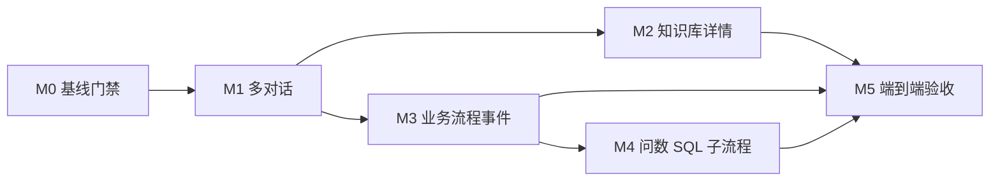
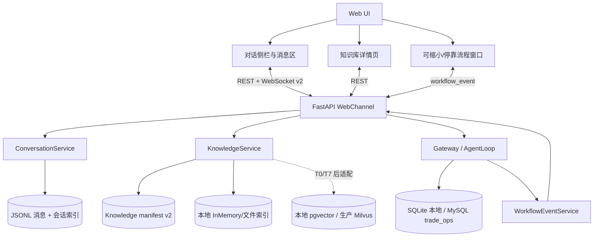
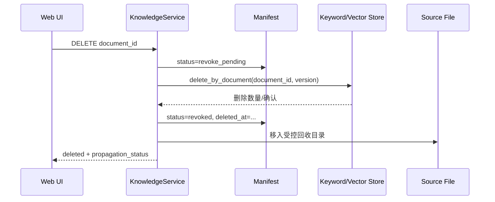
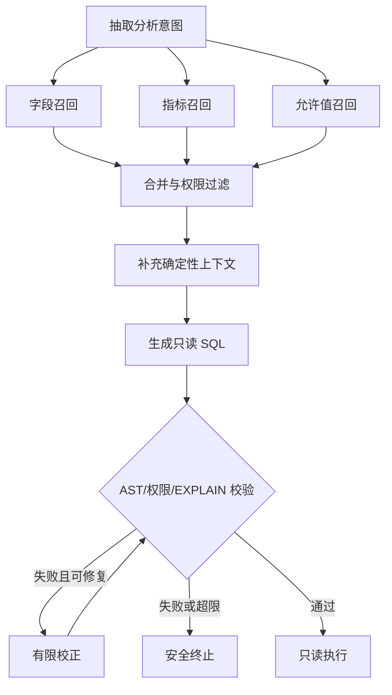

# NanoClaw 项目详细更新计划

> 文档性质：基于当前仓库成果编制的实施计划，不代表下述功能已经实现或部署。  
> 基线日期：2026-07-22（Asia/Shanghai）  
> 适用范围：`E:\agent\nanoclaw` 主项目；`test2/` 只作为可迁移副本和隔离验证对象，不作为主站运行源。  
> 目标主题：多对话管理、知识库详情与删除、外贸询盘/报价/跟单实时流程窗口。

## 1. 结论与推荐实施顺序

当前项目已经具备 Web 对话界面、JSONL 会话持久化、知识文件导入、父子切块、RAG 检索骨架、询盘抽取、产品检索、确定性报价、审批和跟单工具。此次更新不应重写这些能力，而应补齐“可管理、可观察、可恢复”的产品闭环。

推荐顺序如下：

1. **M0：稳定现有基线**——修复测试收集、隐私配置测试和协议兼容性门禁。
2. **M1：多对话管理**——先建立稳定 `conversation_id` 和服务端 API，解决“新建即清空旧对话”的根因。
3. **M2：知识库详情**——复用现有导入与父子切块，增加清单、统计、删除和索引撤回。
4. **M3：业务流程事件流**——为现有业务工具增加结构化事件，再实现可缩小、可停靠的流程窗口。
5. **M4：问数 SQL 子流程（可选）**——仅在外贸分析问数场景启用，不替代询盘、报价与跟单的确定性业务链。
6. **M5：端到端验收与受控发布**——完成迁移、兼容、回滚、性能和隐私验证。



## 2. 当前制作成果与真实差距

### 2.1 已有成果盘点

| 领域 | 当前已有成果 | 主要证据 | 本次可复用部分 |
|---|---|---|---|
| Web 前端 | Cherry Studio 风格对话页、响应式布局、中/英/德切换、明暗主题、汇率页、文件导入菜单 | `channels/web_ui/`、`channels/web.py` | 页面骨架、国际化、主题、WebSocket 连接、消息渲染 |
| 会话 | `SessionManager` 按会话写入 JSONL；`AgentLoop` 可恢复与清空历史 | `session/manager.py`、`agent/loop.py`、`gateway.py` | JSONL 消息格式、历史加载、Agent 会话隔离基础 |
| 知识库导入 | Web API 校验 UTF-8 文本文件、内容哈希去重、原子写 manifest、MCP 查询前增量加载 | `trade_rag/knowledge_repository.py`、`channels/web.py`、`trade_rag/server.py` | 导入校验、文件安全名、内容寻址、manifest、增量索引入口 |
| RAG | 文档加载、父子切块、Mock Embedding、混合召回、Query Rewrite、Rerank、引用与 ACL 骨架 | `trade_rag/`、`test/trade_rag/` | `ParentChildSplitter`、稳定 Parent/Child ID、查询契约 |
| 外贸业务 | RFQ v2 抽取、产品搜索、库存检查、确定性报价、报价版本、审批、跟单工具 | `agent/tools/`、`agent/business/`、`mcp_servers/foreign_trade_inquiry_server.py` | 实际业务节点、状态结果和工具返回值 |
| 邮件询盘 | QQ/网易 IMAP 只读接入、MIME 规范化、确定性降级、人工确认、通知 outbox | `channels/email/`、`agent/business/email_*.py`、`test/email_ingestion/` | 邮件来源事件、询盘状态、幂等与恢复规则 |
| 数据层 | SQLite 本地开发后端、MySQL `trade_ops` 迁移与 Repository 方向 | `agent/business/sqlite_database.py`、`agent/business/mysql_database.py`、`agent/business/migrations/` | 本地演示数据和生产接口边界 |

### 2.2 三项需求的缺口判断

| 用户需求 | 当前状态 | 差距结论 |
|---|---|---|
| 新建、切换、显示和删除多个对话 | **部分具备** | 服务端能存历史，但 Web 会话 ID 由每次 WebSocket 随机生成；“新建对话”实际发送 `clear_conversation` 并删除当前历史；侧栏只有静态占位项，没有清单/切换/删除 API |
| 知识库详情、父子块数量、删除资料 | **部分具备** | 已有导入、去重和父子切块；manifest 尚无块数、索引状态、时间字段；没有列表、详情、删除 API；内存 Store 没有按文档删除能力 |
| 询盘/报价/跟单实时流程小窗 | **业务能力已存在，观察层未实现** | 工具可以完成主要业务节点，但 `AgentLoop`、Gateway 和 WebSocket 没有统一 `workflow_event` 契约、运行实例或前端流程图 |
| 示例中的 SQL 生成/校验/执行流程 | **设计存在，代码未实现** | `DATA_WAREHOUSE_DESIGN.md` 有问数链路设计；当前主业务闭环使用固定工具和 Repository，不应把自由 NL2SQL 直接并入报价流程 |

### 2.3 2026-07-22 验证基线

| 验证项 | 结果 | 处理要求 |
|---|---|---|
| Python 版本 | `3.11.9` | 保持不变 |
| 主项目测试 `pytest -q test` | 67 通过、2 失败、40 个子测试通过 | M0 修复后必须全绿；不得用跳过测试掩盖失败 |
| 整仓 `pytest -q` | 收集失败 | 主项目与 `test2` 同名测试模块冲突，且隔离包导入路径不同；M0 建立明确测试入口 |
| `test2/rag_knowledge_base` 隔离测试 | 22 通过 | 保持隔离执行，不与主项目一次性收集 |
| 当前持久化 Web/渠道会话文件 | 已存在 3 个 JSONL 文件 | 迁移时只建立索引，不改写消息正文 |
| 当前主知识库 manifest | 尚未创建 | M2 需兼容“目录不存在/空知识库”冷启动 |

主测试的两个已知失败为：异步 MCP 测试缺少 pytest 异步运行配置；隐私配置测试受到本机已注入环境变量影响。修复测试时不得打印、复制或写回任何密钥。

### 2.4 当前固定依赖证据

以下版本来自 `uv.lock`，不是按范围猜测：

| 依赖 | 锁定版本 | 用途 |
|---|---:|---|
| `fastapi` | `0.136.1` | HTTP/WebSocket API |
| `uvicorn` | `0.46.0` | Web 服务运行 |
| `websockets` | `15.0.1` | WebSocket 运行依赖 |
| `httpx` | `0.28.1` | HTTP 客户端与测试 |
| `mcp` | `1.27.0` | MCP 服务与工具接入 |
| `openai` | `1.93.0` | OpenAI 兼容模型调用 |
| `pymysql` | `1.1.2` | MySQL Repository |
| `pytest` | `9.1.1` | 测试框架 |
| `pyyaml` | `6.0.2` | 配置解析 |
| `lark-oapi` | `1.6.4` | 飞书渠道 |
| `qq-botpy` | `1.2.1` | QQ 渠道与通知 |

`pyproject.toml` 中仍有若干 `>=` 范围声明，但实际环境由 `uv.lock` 固定；后续新增依赖必须通过 `uv` 解析并更新锁文件，不在计划文档中臆造版本。

## 3. 目标架构



架构约束：

- 动态库存、价格、汇率、报价、审批和跟单状态只以 SQLite/MySQL 结构化业务库为准；RAG 不提供业务真值。
- 对话、知识文档和流程运行必须使用彼此独立的 ID；不再把一次 WebSocket 连接 ID 当作持久业务 ID。
- 本地阶段继续使用受控文件、SQLite、Mock API 和内存索引；生产向量层保持 `VectorStore` 接口，本地目标为 PostgreSQL + `pgvector`，生产目标为 Milvus。
- 外发仍受版本绑定审批门禁控制；本计划不授权真实邮件或消息外发。

## 4. M0：现有基线稳定与契约冻结

### 4.1 任务

| 编号 | 任务 | 修改位置建议 | 验收标准 |
|---|---|---|---|
| M0-1 | 拆分主项目与 `test2` 测试入口 | `pyproject.toml`、测试说明 | 根目录执行的标准命令只收集主项目；`test2` 使用自己的工作目录和 `PYTHONPATH` |
| M0-2 | 配置 pytest 异步测试运行方式 | `pyproject.toml` 或测试文件 | `test/test_mcp.py` 被真实执行并通过，不标记为无条件跳过 |
| M0-3 | 修正隐私配置测试隔离 | `test/test_privacy.py`、配置加载测试夹具 | 测试临时清理/恢复相关环境，输出不包含凭证值 |
| M0-4 | 冻结 WebSocket v2 消息协议 | 新增协议模型与契约测试 | 老的纯文本回复仍能被前端兼容解析；新事件有 `type` 和版本号 |
| M0-5 | 建立更新前快照 | 会话索引迁移脚本的 dry-run 输出 | 只统计文件数和合法性，不读取或打印消息正文 |

### 4.2 完成门槛

- 主项目测试全绿；隔离 RAG 测试保持 22 项通过。
- 日志、测试失败和 API 错误均不输出 API Key、邮箱授权码、QQ/飞书密钥或用户正文。
- 新协议模型和旧纯文本兼容行为有自动化测试。

## 5. M1：多对话管理

### 5.1 目标行为

- 点击“新建对话”创建新的空对话，旧对话及其消息不被覆盖或删除。
- 左侧侧栏展示可访问的对话，按最后活跃时间倒序排列。
- 切换对话后，从服务端加载该对话的可展示历史；刷新浏览器后仍能恢复。
- 删除对话需要二次确认；先软删除，提供短期恢复空间，再由明确清理动作物理删除。
- 删除当前对话后自动切换到最近一个可用对话；没有其他对话时创建空对话。

### 5.2 数据模型

新增会话元数据索引，消息正文继续使用现有 JSONL：

```json
{
  "conversation_id": "uuid",
  "owner_id": "local",
  "title": "客户 A 报价讨论",
  "channel": "web",
  "message_file": "uuid.jsonl",
  "created_at": "2026-07-22T12:00:00Z",
  "updated_at": "2026-07-22T12:05:00Z",
  "deleted_at": null,
  "version": 1
}
```

实现要求：

- `conversation_id` 使用 UUID，由服务端生成，不从标题或文件名推导。
- `owner_id=local` 只是当前单用户本地模式的显式边界；未来接入登录后必须替换为真实主体并执行所有权校验。
- 元数据索引采用临时文件 + 原子替换；单进程用锁保护，后续多进程部署迁移到数据库事务。
- 消息读取只返回前端需要的 `role/content/timestamp`，默认不把工具调用参数和结果完整暴露到 UI。
- 原有 `workspace/sessions/*.jsonl` 采用“建立索引、不改写正文”的一次性迁移；无法确定归属的非 Web 会话不显示在 Web 侧栏。

### 5.3 服务端 API

| 方法 | 路径 | 作用 | 关键规则 |
|---|---|---|---|
| `POST` | `/api/conversations` | 新建对话 | 返回稳定 ID；不清空任何旧会话 |
| `GET` | `/api/conversations` | 查询清单 | 分页、搜索、按 `updated_at` 倒序；默认排除已删除 |
| `GET` | `/api/conversations/{id}` | 查询元数据 | 校验所有权和删除状态 |
| `GET` | `/api/conversations/{id}/messages` | 加载历史 | 分页；展示层字段白名单 |
| `PATCH` | `/api/conversations/{id}` | 重命名 | 标题长度限制、去控制字符 |
| `DELETE` | `/api/conversations/{id}` | 软删除 | 写 `deleted_at`，关闭对应活跃运行，不直接擦除正文 |
| `POST` | `/api/conversations/{id}/restore` | 恢复 | 仅恢复保留期内记录 |

WebSocket 连接后，客户端先发送：

```json
{"type":"conversation.bind","protocol_version":2,"conversation_id":"uuid"}
```

后续聊天请求携带 `conversation_id` 和客户端生成的 `request_id`。Gateway 的稳定会话键改为 `web:{owner_id}:{conversation_id}`，WebSocket 连接 ID 只负责路由当前连接。

### 5.4 前端任务

1. 将 `state` 扩展为 `conversations`、`activeConversationId`、`messagesByConversation` 和分页状态。
2. 首次进入时加载清单；为空则创建一个新对话。
3. 侧栏由 API 数据渲染，不保留静态假数据；支持搜索、选中态、空态和加载失败重试。
4. 新建对话只调用 `POST /api/conversations`；移除当前 `clear_conversation` 的破坏性语义。
5. 切换时取消旧对话未完成的视觉等待状态，绑定新 ID，再加载历史。
6. 删除按钮仅在悬停/更多菜单显示，避免误触；确认文案明确“进入回收状态”。
7. 对话附件上下文按 `conversation_id` 隔离，不能在切换对话后串用。
8. 中/英/德补齐新文案；键盘操作和移动端侧栏必须可用。

### 5.5 并发与异常规则

- 同一对话同时开两个标签页时，服务端以消息 ID/请求 ID 去重，按服务端时间排序。
- 切换对话期间收到旧对话回复时，写入旧对话存储并更新未读标记，不渲染到当前消息区。
- 删除时若有正在运行的 Agent，先标记取消；无法取消的结果不得写到新对话。
- JSONL 尾行损坏时跳过该行并记录匿名错误码，不让整个对话无法打开。

### 5.6 验收场景

- 新建 A、B 两个对话，在各自发送消息，来回切换 10 次后内容无串线。
- 刷新页面、断开并重连 WebSocket 后仍回到上次选中对话。
- 删除 B 后 A 不受影响；恢复 B 后消息完整。
- 旧版 JSONL 会话可被索引，但 QQ/CLI 会话不会错误显示为 Web 对话。
- 路径穿越、伪造 ID 和越权 owner 请求均返回稳定错误，不泄露文件路径。


在左侧主导航新增“知识库”入口。详情页分为：

- 顶部：导入按钮、总文档数、已发布数、父块总数、子块总数、索引异常数。
- 列表：文件名、类型、大小、状态、导入时间、父块数、子块数、索引版本、操作菜单。
- 详情抽屉：文档 ID、内容哈希短值、解析器版本、切块参数、错误码、更新时间；默认不展示原文全文。
- 空状态：提示支持的 TXT/Markdown/HTML/JSON/CSV 和 5 MiB 上限。

### 6.2 manifest v2

在现有条目上新增：

```json
{
  "schema_version": "knowledge-import-v2",
  "document_id": "web-...",
  "version": 1,
  "original_name": "guide.md",
  "size_bytes": 10240,
  "content_hash": "sha256",
  "status": "published",
  "index_status": "ready",
  "parent_count": 8,
  "child_count": 31,
  "splitter_version": "parent-child-v1",
  "parser_version": "stdlib-1",
  "created_at": "2026-07-22T12:00:00Z",
  "updated_at": "2026-07-22T12:00:02Z",
  "deleted_at": null,
  "last_error_code": null
}
```

统计原则：

- 导入时只运行一次规范化和父子切分，并将同一结果交给索引与计数，避免“页面统计”和“真实索引”采用两套切块逻辑。
- 父块数取 `ParentChildSplitter.split()` 的第一项长度，子块数取第二项长度。
- 任何切块参数或算法版本变化都必须提升 `splitter_version` 并触发受控重建，不能悄悄覆盖旧计数。
- v1 manifest 首次读取时可惰性补算统计；补算失败则显示 `index_status=failed`，不伪造为 0。

### 6.3 API

| 方法 | 路径 | 作用 | 关键规则 |
|---|---|---|---|
| `GET` | `/api/knowledge/documents` | 文档清单和汇总 | 分页、状态筛选、文件名搜索 |
| `GET` | `/api/knowledge/documents/{id}` | 文档详情 | 不返回存储绝对路径，不默认返回全文 |
| `POST` | `/api/knowledge/import` | 沿用现有导入 | 返回父/子块数量和索引状态；内容哈希去重 |
| `DELETE` | `/api/knowledge/documents/{id}` | 删除/撤回 | 先撤回搜索，再删除索引，最后处理源文件 |
| `POST` | `/api/knowledge/documents/{id}/retry-index` | 重试索引 | 仅处理 failed 状态，保持同一文档版本 |

### 6.4 安全删除流程

删除不是单纯删除一个文件，必须按以下顺序执行：



实现要求：

- 为 `InMemoryVectorStore`、`InMemoryKeywordStore` 和统一 `VectorStore` 增加 `delete_by_document`。
- 本地源文件先移入 `workspace/knowledge_base/trash/`，默认保留 7 天；物理清理是单独维护动作。
- 删除过程中任一步失败，文档必须保持不可搜索，并显示可重试状态。
- 后续 Milvus 使用 collection/alias 与标量过滤实现撤回；必须验证传播完成后才报告成功。
- 引用已删除文档的旧回答仍可显示“来源已撤回”，不能继续提供有效检索链接。

### 6.5 验收场景

- 导入包含多个标题和长段落的 Markdown，页面父块数和子块数与实际 splitter 输出完全一致。
- 相同内容不同文件名再次导入仍命中内容哈希去重，不重复增加统计。
- 删除后立即检索，结果中不再出现该文档；重启 MCP/进程后仍不出现。
- 删除中模拟索引失败，文档保持不可搜索且页面显示“撤回待重试”。
- 空知识库、损坏 manifest、文件缺失和超限文件均有可理解、无敏感信息的错误状态。


### 7.4 前端窗口

- 触发条件：当前对话出现受支持的 `workflow.run.created`，左上角弹出小窗。
- 展开态：显示流程名称、当前节点、总进度、节点图、等待人工确认项和最近安全事件。
- 缩小态：仅显示图标、业务类型、当前节点和进度环。
- 停靠态：可停靠右侧，不覆盖发送按钮和移动端主要操作区。
- 状态持久化：窗口位置、大小、缩小状态按浏览器保存；运行数据以服务端为准。
- 多运行：同一对话存在多个询盘时按 `run_id` 切换，禁止把两个报价进度合并。
- 可访问性：键盘可操作、颜色之外另有图标/文字状态、失败节点提供错误码和重试入口。

### 7.5 API/协议补充

| 方法/通道 | 路径或消息 | 作用 |
|---|---|---|
| `GET` | `/api/conversations/{id}/workflow-runs` | 查询该对话运行列表 |
| `GET` | `/api/workflow-runs/{run_id}/events?after_sequence=N` | 断线补拉事件 |
| `POST` | `/api/workflow-runs/{run_id}/cancel` | 取消允许取消的运行 |
| WebSocket | `workflow.event` | 实时推送 |
| WebSocket | `workflow.snapshot` | 绑定对话后的当前状态快照 |

### 7.6 验收场景

- 从一条完整英文询盘创建 run，所有节点顺序、状态和数据库结果一致。
- 缺少数量/单位时停在“待确认”，补充后从正确节点继续，不创建重复 RFQ。
- 报价修改后生成新版本，旧审批不能用于新版本。
- 断网 10 秒后重连，流程事件无丢失、无重复、顺序正确。
- 切换对话时小窗切换到对应运行；旧对话事件不会污染当前窗口。
- 任何错误事件都不暴露凭证、客户完整正文或内部堆栈。


## 8. M4：问数 SQL 子流程（可选扩展）

用户提案中的“抽取关键词—召回元数据—生成/校验/执行 SQL”适用于外贸数据分析问数，不适合作为询盘报价主流程。建议在 M1-M3 稳定后，以独立 `workflow_type=trade_data_analysis` 实施。

### 8.1 子流程

1. **抽取关键词与分析意图**：识别时间范围、主体、维度、指标和过滤条件。
2. **召回字段信息**：只从批准的元数据清单召回表与字段。
3. **召回指标信息**：只使用已登记的指标定义、粒度和计算口径。
4. **召回字段取值**：从允许索引的低敏字段值中召回，禁止扫描任意敏感列。
5. **合并与过滤**：执行数据集授权、表/列 allowlist、粒度一致性和时间范围校验。
6. **增加确定性上下文**：补充数据库方言、只读限制、行数上限和查询超时。
7. **生成 SQL**：只生成单条 SELECT/CTE 查询；不允许 DDL、DML、存储过程和多语句。
8. **校验与有限校正**：AST 校验、权限校验、复杂度限制、`EXPLAIN`；最多有限次数校正，每次重新完整校验。
9. **执行与结果约束**：使用只读账号、超时、行数/字节上限；返回数据与 SQL 哈希进入审计。



### 8.2 MVP 收敛原则

- 第一版优先实现固定 Repository 方法和参数化 SQL，覆盖高频 Top-N、汇总和状态查询。
- 只有固定查询无法覆盖且元数据/权限契约齐全时，才开放受限 SQL 生成。
- SQL 校验、执行和权限必须在服务器端；流程图只是观察界面。
- 当前 `trade_dw`、`trade_metadata` 及其同步任务尚未实现，因此 M4 不得在这些前置条件完成前标为“已完成”。


## 9. M5：集成、迁移、测试与发布

### 9.1 测试矩阵

| 层级 | 必测内容 | 最低门槛 |
|---|---|---|
| 单元测试 | 会话 ID/索引、软删除、manifest v2、父子计数、Store 删除、事件状态机 | 新增核心分支全覆盖；既有测试无回退 |
| 契约测试 | REST、WebSocket v2、错误码、国际化字段 | 请求/响应 schema 固定；旧纯文本兼容 |
| 集成测试 | ConversationService + Gateway + AgentLoop；KnowledgeService + RAG；业务工具 + 事件 | 重启后数据一致；失败可恢复 |
| 浏览器 E2E | 新建/切换/删除对话、知识导入/删除、流程窗缩小/停靠 | Chromium 主路径全通过；移动宽度 smoke 通过 |
| 安全测试 | 越权 ID、路径穿越、恶意文件名、HTML 脚本、日志脱敏、SQL 注入 | 高危用例阻断率 100% |
| 性能测试 | 100 个对话清单、1000 条消息分页、100 个知识文档、事件重连 | 本地常用操作 P95 < 500ms；首次索引另行展示进度 |
| 恢复测试 | manifest 中断、JSONL 尾行损坏、索引删除失败、WebSocket 断线 | 不丢已确认业务状态；可重试且无重复副作用 |

### 9.2 数据迁移

1. 先 dry-run 扫描现有 JSONL 文件，只输出匿名统计和错误数量。
2. 为可识别的 Web 会话建立 conversation 索引；正文文件保持只读原位或复制到新目录，首版不原地重写。
3. manifest v1 自动升级为 v2；升级前保留备份，升级失败继续按 v1 只读运行。
4. 新旧 WebSocket 协议保留一个发布周期兼容层，确认前端已更新后再移除 `clear_conversation` 旧事件。
5. 迁移脚本必须可重复执行、支持 `--dry-run`，并通过 ID/哈希保证幂等。

### 9.3 灰度与回滚

- 功能开关建议：`WEB_MULTI_CONVERSATION_ENABLED`、`KNOWLEDGE_ADMIN_ENABLED`、`WORKFLOW_EVENTS_ENABLED`。
- 先开启多对话读路径，再开启写路径；知识删除先启用撤回、不立即物理清理；流程事件先记录后展示。
- 回滚时保留新数据文件，只关闭新入口；不得用回滚脚本删除用户对话或知识原文件。
- 生产适配前分别验证 PostgreSQL + `pgvector` 和 Milvus 的相同删除、过滤、排序与 ID 契约。


## 10. 工作分解、依赖与预计工作量

以下为单人顺序实施的工程量估算，不是承诺日期；并行开发时仍需遵守依赖顺序。

| 阶段 | 主要交付 | 依赖 | 预计工作量 | 状态 |
|---|---|---|---:|---|
| M0 | 测试入口、隐私隔离、协议模型、迁移 dry-run | 无 | 1-2 人日 | 已完成（本地验证） |
| M1-A | ConversationService、元数据索引、迁移、REST API | M0 | 2-3 人日 | 已完成（本地单用户验证） |
| M1-B | 前端侧栏、切换、删除、历史分页、附件隔离 | M1-A | 2-3 人日 | 已完成（静态与契约验证） |
| M2-A | manifest v2、统一切块统计、清单/详情 API | M0 | 2 人日 | 已完成（本地验证） |
| M2-B | Store 删除、撤回传播、回收与重试 | M2-A | 2-3 人日 | 已完成（内存 Store 验证） |
| M2-C | 知识库详情页、国际化和交互 | M2-A | 2 人日 | 已完成（静态与契约验证） |
| M3-A | WorkflowRun/Event 模型、持久化和重连补拉 | M1-A | 2-3 人日 | 已完成（本地验证） |
| M3-B | 询盘/报价/审批/跟单服务端插桩 | M3-A | 2-3 人日 | 已完成（Agent 工具层验证） |
| M3-C | 流程窗口、停靠/缩小、多 run 切换 | M3-A、M3-B | 3 人日 | 已完成（静态与协议验证） |
| M4 | 固定问数方法；可选受限 SQL 状态机 | M3、真实元数据契约 | 4-8 人日 | 固定查询 MVP 已完成；NL2SQL 前置未满足 |
| M5 | 全量回归、E2E、安全、性能、迁移演练、文档 | M1-M3（及获批的 M4） | 3-4 人日 | 已完成（本地受控发布验证；真实浏览器视觉/生产适配待完成） |

建议首个可演示版本范围为 **M0 + M1 + M2-A/M2-C + M3-A/M3-C 的 Mock 事件**；第二个版本再接真实业务工具事件和知识撤回传播。


## 11. 交付物清单

### 11.1 代码

- 会话模型、服务、迁移器、REST API 和 WebSocket v2 绑定。
- 知识库 manifest v2、统计、列表/详情/删除、Store 删除接口。
- WorkflowRun/Event 模型、事件仓储、广播与断线补拉。
- 对话侧栏、知识库详情页、实时流程窗口和三语言文案。

### 11.2 测试

- 主项目与 `test2` 隔离测试配置。
- 会话、知识库、事件状态机、API/WebSocket 契约测试。
- 浏览器 E2E、安全和迁移/回滚测试。

### 11.3 文档

- 更新 `README.md` 的启动、测试和功能说明。
- 更新 `docs/project/PROJECT_PROGRESS.md` 与 `docs/project/PROJECT_CHANGELOG.md`。
- 新增 Web API/协议说明、数据迁移手册和知识删除操作说明。
- 若实施 M4，单独维护受限 SQL 安全契约，不把设计状态写成已部署。

## 12. 风险、阻塞与决策点

| 风险/决策 | 影响 | 默认建议 |
|---|---|---|
| 当前没有 Web 登录/租户体系 | 无法证明多用户所有权边界 | 本期明确本地单用户 `owner_id=local`，禁止宣称多租户安全 |
| 会话 JSONL 包含工具消息 | UI 直接展示可能泄露内部参数 | API 使用展示字段白名单，工具细节仅保留在受控审计层 |
| manifest 与索引双写 | 中断会造成状态不一致 | 采用状态机、原子 manifest 和可重复 reconcile |
| 内存索引重启丢失 | 删除/统计可能与运行时不同步 | manifest 为权威清单，启动时按状态重建；生产适配持久 Store |
| SQLite 与 MySQL Repository 尚未完全对齐 | 业务事件状态可能分叉 | 先定义统一服务结果契约，再分别做后端适配测试 |
| 用户示例倾向 NL2SQL | 可能扩大安全和实现范围 | 作为独立可选 M4；默认业务链继续固定工具 + 参数化 SQL |
| 真实外发与生产数据授权未完成 | 无法做生产闭环 | 保持 mock/outbox；需单独授权与审批后再扩展 |

实施 M1-M3 不需要用户再次决定技术方向；开始 M4 前必须确认真实 `trade_dw` 表结构、指标口径、字段/数据集授权、只读账号和允许查询范围。

## 13. 完成定义（Definition of Done）

只有同时满足以下条件，才可把本次更新标记为“已完成”：

- 新建对话不会覆盖或删除旧对话，切换、刷新、断线重连和删除/恢复均通过自动化验收。
- 知识库页面显示的父块、子块数量与实际索引输入一致；删除后所有检索路径立即不可召回该文档。
- 询盘、报价、审批、跟单流程事件与数据库/工具真实状态一致，断线后可补拉且不重复。
- 未确认字段不能自动报价，未经当前版本审批不能外发，金额计算不由 LLM 或前端决定。
- 主项目测试、隔离 RAG 测试、浏览器 E2E、安全测试和迁移回滚演练全部通过。
- 文档准确区分已实现、仅本地验证、待生产适配和未授权外部动作。

## 14. 本轮状态

M0-M5 的本地受控发布范围已实施，其中 M4 仅为固定查询 MVP。M5 增加三个可回滚功能开关及 `/api/capabilities`，关闭入口不会删除会话、知识或流程数据；manifest v1 首次升级前创建 `manifest.v1.backup.json`，写入失败恢复 v1 原文件。新增统一 M5 验收覆盖发布开关、迁移备份/失败恢复、越权 ID/路径穿越/恶意文件名/HTML 数据安全、100 会话/1000 消息/100 文档及 P95 < 500ms 本地性能门槛。主项目 107 项测试和 40 个子测试、隔离 RAG 22 项通过；当前工作区迁移 dry-run 为 3 个合法 JSONL/33 条合法记录、2 个已有索引/0 个待索引，未输出正文。真实本地服务 `/api/capabilities` 返回 200，但 Codex 内置浏览器与宿主本地端口隔离，Chrome 控制未连接，因此真实 Chromium 桌面/移动视觉 E2E 未计为通过。PostgreSQL+pgvector、生产 Milvus 删除传播、7 天物理清理、真实 MySQL/生产数据与外部动作仍未执行，不满足生产发布条件。
